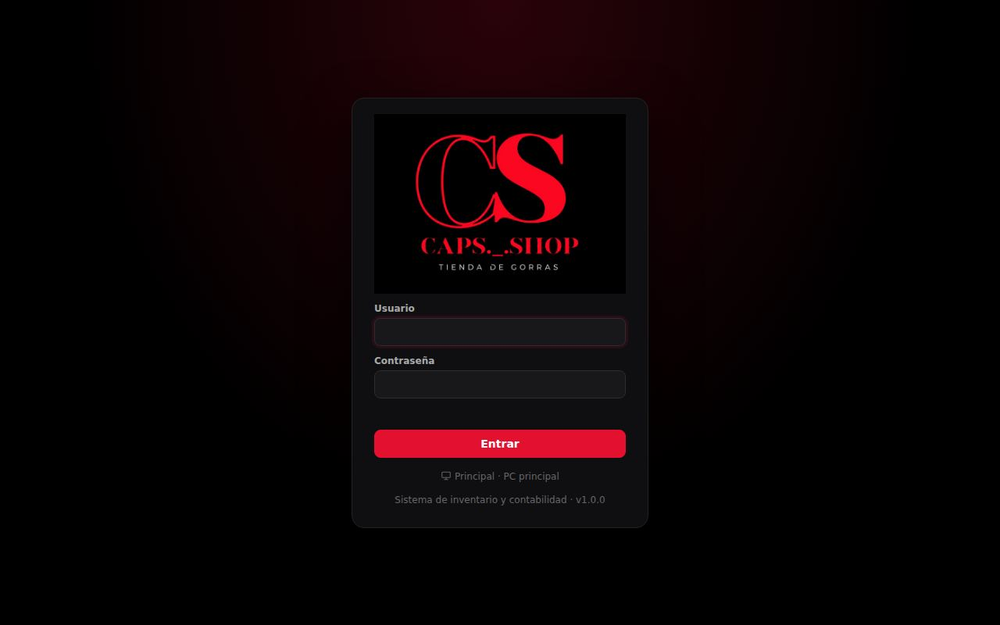
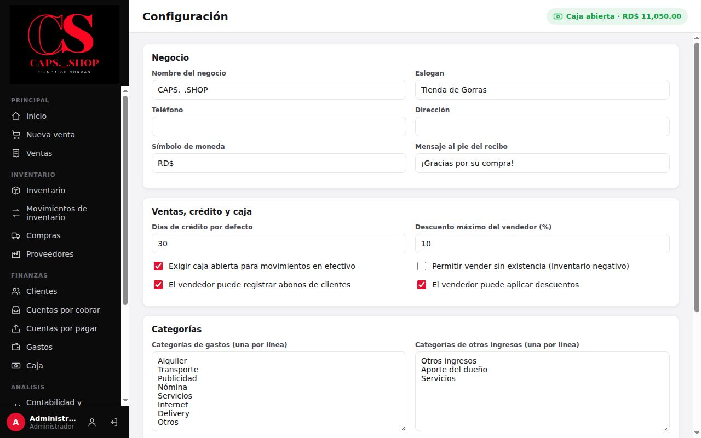

# 1. Primeros pasos

**Para qué sirve:** dejar el sistema instalado, con contraseñas propias, configurado y con los datos iniciales cargados.
**Quién:** Administrador (el dueño). Se hace una sola vez.

> **Varias computadoras:** si la tienda tendrá más de una, haga esta página en la **PC principal**: la que siempre está encendida y guarda los datos. Después conecte las demás siguiendo [Varias computadoras en red](13-varias-computadoras.md). Si es una sola computadora, esa es la principal.

## 1.1 Requisitos de la computadora

- Windows 10 u 11 de 64 bits.
- 500 MB libres en disco.
- No necesita internet para funcionar. Solo se necesita para descargar el instalador.
- Opcional: lector de código de barras USB (funciona como teclado) e impresora para los recibos.

## 1.2 Instalar

1. Descargue el instalador `CAPS-Shop-Setup-X.Y.Z.exe` de la versión más reciente: <https://github.com/kelvinjose14/CS-SHOP/releases/latest>. Después, el programa avisa solo cuando hay una versión nueva ([Soporte, 14.4](14-soporte-y-recuperacion.md#144-instalar-una-versión-nueva)).
2. Abra el archivo.
3. Si Windows muestra **"Windows protegió su PC"**, pulse **Más información** y luego **Ejecutar de todas formas**. El aviso sale porque el instalador aún no tiene firma digital (pendiente en [Objetivos](../producto/objetivos.md), O4).
4. Elija la carpeta de instalación y termine. Se crea el acceso directo **CAPS Shop** en el escritorio y en el menú Inicio.
5. Abra CAPS Shop. La primera vez sale **Configurar esta computadora**: elija **Esta es la PC principal**, escriba un nombre para la computadora (por ejemplo "Caja" u "Oficina") y pulse **Configurar como PC principal**. El programa se reinicia ([detalle](13-varias-computadoras.md#132-preparar-la-pc-principal)).

   Si ya tenía la versión 1.0.0 instalada, instale la nueva encima: esta pantalla no sale y la computadora queda como principal con todos sus datos.

Los datos se guardan en `%APPDATA%\CAPS Shop\data`. Desinstalar el programa **no** borra los datos.

## 1.3 Entrar por primera vez

El sistema viene con dos usuarios:

| Usuario | Contraseña inicial | Perfil |
|---|---|---|
| `admin` | `admin123` | Administrador |
| `vendedor` | `vendedor123` | Vendedor |

1. Escriba el usuario y la contraseña y pulse **Entrar**.
2. La primera vez, el sistema pide cambiar la contraseña: escriba la **Contraseña actual**, la **Nueva contraseña (mínimo 6)** y repítala. Pulse **Guardar y continuar**.
3. Haga lo mismo con el usuario `vendedor` y entregue la nueva contraseña a la persona que venderá.

Para cambiar la contraseña más adelante, use el ícono de persona al pie del menú izquierdo. Para salir, use el ícono de salida al lado.

## 1.4 Configurar el negocio

Vaya a **Configuración** (menú **Sistema**).

1. En **Negocio**, complete el nombre, eslogan, teléfono, dirección, símbolo de moneda y el mensaje al pie del recibo. Estos datos salen en el recibo.
2. En **Ventas, crédito y caja**, revise:
   - **Días de crédito por defecto** (30): fecha de vencimiento que se propone en ventas y compras a crédito.
   - **Descuento máximo del vendedor (%)** (10).
   - **Exigir caja abierta para movimientos en efectivo** (activado). Se recomienda dejarlo así.
   - **Permitir vender sin existencia** (desactivado). Se recomienda dejarlo así.
   - **El vendedor puede registrar abonos de clientes** y **El vendedor puede aplicar descuentos**.
3. En **Categorías**, ajuste las categorías de gastos y de otros ingresos, una por línea.
4. Pulse **Guardar configuración**.

Más detalle en [Configuración y respaldos](11-configuracion-y-respaldos.md).

## 1.5 Cargar los datos iniciales

Siga este orden. Cada paso usa lo que se cargó en el anterior.

| Paso | Dónde | Qué registrar | Página del manual |
|---|---|---|---|
| 1 | **Proveedores** → **Nuevo proveedor** | A quién le compra la mercancía | [Compras y proveedores](05-compras-y-proveedores.md) |
| 2 | **Inventario** → **Nuevo producto**, o **Importar** desde Excel si son muchos | Cada gorra: una ficha por combinación de modelo, color y talla | [Inventario](04-inventario.md), [4.7](04-inventario.md#47-importar-productos-desde-excel-administrador) |
| 3 | Existencias que ya tiene | Escriba la **Existencia inicial** al crear cada producto (o la columna **Existencia** al importar); o, si quiere que quede como compra, déjela en 0 y registre una **Compra** | [Inventario](04-inventario.md) |
| 4 | **Clientes** → **Nuevo cliente** | Clientes frecuentes y los que compran a crédito | [Clientes y cobros](06-clientes-y-cobros.md) |
| 5 | Deudas que ya existían antes del sistema | En cada cliente y proveedor → **Saldo inicial**. No cuenta como venta ni compra | [Clientes, 6.1](06-clientes-y-cobros.md#saldo-inicial-administrador), [Proveedores, 5.1](05-compras-y-proveedores.md#51-proveedores) |
| 6 | **Usuarios** → **Código de recuperación** | Guárdelo fuera de la tienda | [Usuarios, 10.4](10-usuarios-y-permisos.md#código-de-recuperación) |
| 7 | **Configuración** → **Impresora de recibos de esta PC** | La impresora de tickets y el ancho del papel, en cada computadora | [Configuración, 11.8](11-configuracion-y-respaldos.md#118-impresora-de-recibos-de-esta-pc) |

## 1.6 Lista del primer día

- [ ] Contraseñas de `admin` y `vendedor` cambiadas.
- [ ] Configuración guardada (nombre del negocio, teléfono, dirección).
- [ ] Proveedores registrados, con su **saldo inicial** si se les debía algo.
- [ ] Todas las gorras registradas con precio al detalle, precio por mayor y stock mínimo.
- [ ] Existencias cargadas: en **Inventario**, las unidades en existencia coinciden con un conteo físico.
- [ ] Clientes con deuda registrados, con su **saldo inicial**.
- [ ] **Código de recuperación** del administrador impreso y guardado fuera de la tienda.
- [ ] Recibo de prueba impreso en cada computadora con impresora (**Configuración** → **Imprimir prueba**).
- [ ] Primera copia de seguridad guardada en una memoria USB (**Configuración** → **Crear copia de seguridad…**).
- [ ] Caja abierta con el efectivo real del día ([Caja](07-caja.md)).
