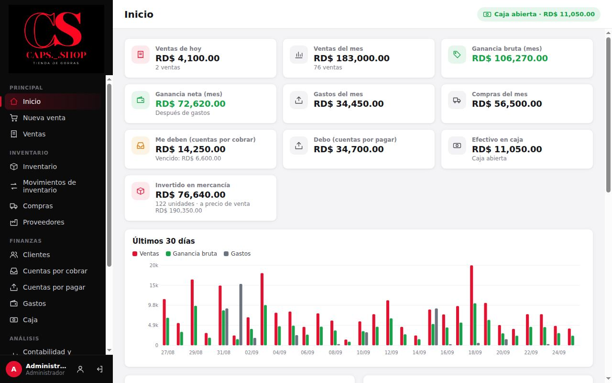

# 2. Rutina diaria

**Para qué sirve:** el orden de trabajo de un día normal en la tienda, de la apertura al cierre.
**Quién:** Vendedor y Administrador. Cada paso indica quién lo hace.

## 2.1 El día en una tabla

| Hora típica | Qué se hace | Quién | Dónde | Detalle |
|---|---|---|---|---|
| Al abrir | Abrir la caja con el efectivo que hay | Vendedor | **Caja** → **Abrir caja** | [Caja](07-caja.md) |
| Al llegar mercancía | Registrar la compra | Administrador | **Compras** → **Nueva compra** | [Compras](05-compras-y-proveedores.md) |
| Todo el día | Vender | Vendedor | **Nueva venta** | [Ventas](03-ventas.md) |
| Cuando un cliente paga | Registrar el abono | Vendedor (si está permitido) o Administrador | **Cuentas por cobrar** → **Abonar** | [Clientes y cobros](06-clientes-y-cobros.md) |
| Cuando se paga algo | Registrar el gasto | Administrador | **Gastos** → **Registrar gasto** | [Gastos](08-gastos-e-ingresos.md) |
| Si se lleva dinero al banco | Registrar el retiro | Vendedor o Administrador | **Caja** → **Retiro** | [Caja](07-caja.md) |
| Al cerrar | Contar el efectivo y cerrar la caja | Vendedor | **Caja** → **Cerrar caja** | [Caja](07-caja.md) |
| Cuando quiera | Revisar cómo va el negocio | Administrador | **Inicio**, **Contabilidad y ganancias** | [Contabilidad](09-contabilidad-y-reportes.md) |

## 2.2 La pantalla de Inicio

Al entrar, el administrador ve **Inicio**:

- **Ventas de hoy** y **Ventas del mes**.
- **Ganancia bruta (mes)** y **Ganancia neta (mes)**, esta última ya con los gastos descontados.
- **Gastos del mes** y **Compras del mes**.
- **Me deben (cuentas por cobrar)**, con lo vencido, y **Debo (cuentas por pagar)**.
- **Efectivo en caja** (si la caja está abierta) o el efectivo del último cierre.
- **Invertido en mercancía**: el valor del inventario al costo y a precio de venta.
- **Últimos 30 días**: gráfico de ventas, ganancia bruta y gastos.
- **Gorras más vendidas (mes)** y **Por reponer** (agotadas o en su stock mínimo).
- **Respuestas rápidas**: las preguntas del dueño contestadas en una línea, más abajo en la página.

El vendedor ve una versión reducida, sin costos, ganancias, compras ni gastos. El vendedor entra directo a **Nueva venta**.

La píldora verde arriba a la derecha (**Caja abierta · RD$ …**) muestra en todo momento el efectivo esperado en caja. Si dice **Caja cerrada**, púlsela para ir a abrirla.

## 2.3 Lista diaria

**Al abrir**
- [ ] Contar el efectivo de la gaveta.
- [ ] **Caja** → **Abrir caja** con ese monto.

**Durante el día**
- [ ] Cada venta en **Nueva venta**; nada se anota aparte.
- [ ] Cada abono de cliente en **Cuentas por cobrar**.
- [ ] Cada salida de efectivo que no sea gasto (depósito al banco, retiro del dueño) en **Caja** → **Retiro**.

**Al cerrar**
- [ ] Contar el efectivo.
- [ ] **Caja** → **Cerrar caja**, escribir lo contado y revisar la **Diferencia**.
- [ ] Si hubo faltante o sobrante, escribir el motivo en **Nota**.

**Una vez por semana (administrador)**
- [ ] Revisar **Por reponer** en Inicio y hacer los pedidos.
- [ ] Revisar **Cuentas por cobrar** vencidas y llamar a esos clientes.
- [ ] Revisar **Cuentas por pagar** que están por vencer.
- [ ] Guardar una copia de seguridad en una memoria USB ([Respaldos](11-configuracion-y-respaldos.md)).
