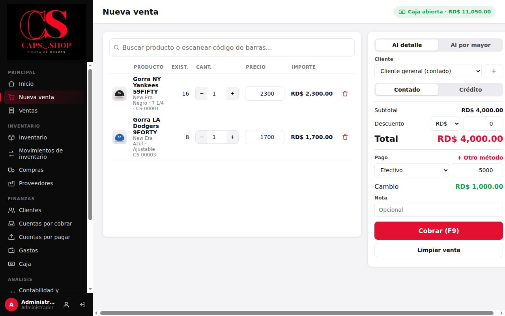
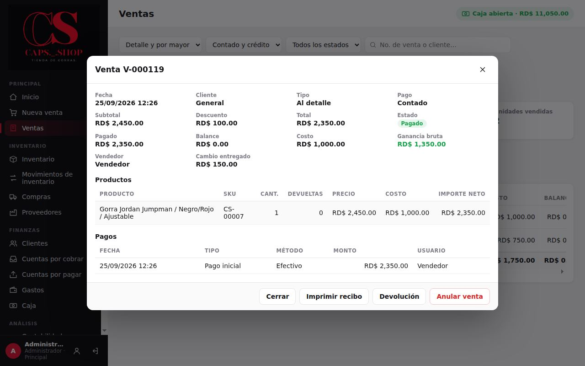

# 3. Ventas

**Para qué sirve:** cobrar a los clientes, imprimir el recibo, consultar ventas anteriores y corregirlas con devoluciones o anulaciones.

**Quién:**

| Acción | Vendedor | Administrador |
|---|:---:|:---:|
| Vender (detalle o por mayor, contado o crédito) | ✔ | ✔ |
| Aplicar descuento | ✔ hasta el máximo configurado (10 % por defecto) | ✔ sin límite |
| Cambiar el precio de un producto en la venta | ✘ | ✔ |
| Ver el historial de ventas | ✔ (sin costos) | ✔ |
| Registrar abonos | ✔ si está permitido en Configuración | ✔ |
| Devoluciones y anulaciones | ✘ | ✔ |

## 3.1 Hacer una venta

Menú **Principal** → **Nueva venta**.

1. **Agregar productos.** En el buscador:
   - Con lector de código de barras: escanee la etiqueta y el producto se agrega solo. El lector escribe el código y pulsa Enter.
   - A mano: escriba parte del nombre, marca, color, talla o SKU. Elija con el ratón, o con las flechas y Enter.
   - Si escanea el mismo producto otra vez, sube la cantidad.
2. **Ajustar cantidades** con **−** y **+**, o escribiendo el número. El ícono de papelera quita la línea.
3. **Tipo de venta:** **Al detalle** o **Al por mayor**. Al cambiarlo, todos los precios pasan a la lista correspondiente.
4. **Cliente:** déjelo en **Cliente general (contado)** o elija uno. Con el botón **+** registra un cliente nuevo sin salir de la venta.
5. **Contado** o **Crédito**:
   - Crédito exige un cliente y muestra la **Fecha de vencimiento**, que se propone según los días de crédito configurados.
   - En crédito, el pago es un **Abono inicial (opcional)**.
6. **Descuento:** elija **RD$** o **%** y escriba el valor.
7. **Pago:**
   - Elija el método (**Efectivo**, **Tarjeta**, **Transferencia** u **Otro**) y escriba el **monto recibido**.
   - Si deja el monto vacío, se cobra el total exacto con ese método.
   - Para pagos mixtos (por ejemplo, parte en efectivo y parte con tarjeta), pulse **+ Otro método**.
   - El sistema muestra el **Cambio** o lo que **Falta**. En crédito muestra lo que **Queda a crédito**.
8. Pulse **Cobrar (F9)** o la tecla F9.
9. Aparece **Venta registrada** con el número (por ejemplo **V-000120**), el total y el cambio. Pulse **Imprimir recibo** si el cliente lo quiere, y **Nueva venta** para seguir.

**Limpiar venta** borra la venta en curso sin registrarla.

### Qué cambia en el sistema
- **Inventario:** baja la existencia de cada producto vendido y queda un movimiento "Venta" en su historial.
- **Caja y flujo de dinero:** entra el dinero cobrado. Si fue en efectivo, suma a la caja abierta; el cambio entregado se descuenta.
- **Crédito:** si fue a crédito, el saldo pendiente queda en **Cuentas por cobrar** del cliente.
- **Ganancias:** la venta guarda el costo de cada gorra en ese momento, para calcular la ganancia real ([Reglas de negocio](../producto/reglas-de-negocio.md)).
- **Historial:** queda registrada la venta con fecha, hora y usuario.

### El recibo
Incluye nombre, eslogan, dirección y teléfono del negocio, número de venta, fecha, tipo de venta, cliente, vendedor, productos, subtotal, descuento, total, pagos, cambio, saldo pendiente y fecha de vencimiento. Al pie lleva el mensaje configurado y la frase **"Documento sin valor fiscal"**; el sistema no emite comprobantes fiscales.

Si esta computadora tiene elegida su **impresora de recibos** ([Configuración, 11.8](11-configuracion-y-respaldos.md#118-impresora-de-recibos-de-esta-pc)), el recibo sale directo, sin ventana, en papel de 80 o 58 mm. Con **Imprimir el recibo al cobrar** activado, sale solo al registrar la venta. Si no hay impresora elegida, se abre la ventana de impresión de Windows para elegirla.

## 3.2 Consultar ventas

Menú **Principal** → **Ventas**.

- Filtre por período (**Hoy**, **Semana**, **Mes**, **Año**, **Rango**), por tipo (detalle o por mayor), por pago (contado o crédito) y por estado. También puede buscar por número de venta o cliente.
- Arriba ve el total vendido, lo vendido al detalle y al por mayor, las unidades y, para el administrador, la ganancia bruta.
- **Exportar** guarda la lista en un archivo CSV que abre Excel.
- Pulse una venta para ver su detalle.

En el detalle están los productos, los pagos y las devoluciones, y los botones:
- **Imprimir recibo**.
- **Registrar abono**: solo si la venta tiene saldo pendiente.
- **Devolución**: solo el administrador.
- **Anular venta**: solo el administrador, y solo si la venta no tiene devoluciones.

Estados de una venta: **Pagado**, **Parcial** (abonada en parte), **Pendiente** (a crédito sin abonos) y **Anulada**.

## 3.3 Devolución (administrador)

Úsela cuando el cliente devuelve una o varias gorras de una venta.

1. **Ventas** → abra la venta → **Devolución**.
2. Escriba cuántas unidades devuelve de cada producto. El valor usa el **precio neto cobrado**, que ya incluye el descuento.
3. Elija el **Método de reembolso**.
4. Deje marcado **Reingresar la mercancía al inventario** si la gorra está en buen estado. Desmárquelo si está dañada.
5. Escriba el **Motivo** (obligatorio), por ejemplo "Talla incorrecta".
6. Pulse **Registrar devolución**.

### Qué cambia en el sistema
- **Deuda y reembolso:** si la venta tenía deuda, el valor devuelto **primero rebaja la deuda**. Solo lo que sobra se reembolsa al cliente con el método elegido.
- **Inventario:** si se reingresa, la existencia sube. Si no se reingresa, el costo de esa gorra queda como pérdida en las ganancias.
- **Ventas del período:** bajan en el valor devuelto.

## 3.4 Anular una venta (administrador)

Úsela cuando la venta se registró por error.

1. **Ventas** → abra la venta → **Anular venta**.
2. Escriba el motivo y confirme.

### Qué cambia en el sistema
- **Inventario:** toda la mercancía vuelve al inventario.
- **Dinero cobrado:** todo lo cobrado sale como devolución de dinero, con el mismo método de cada pago. Si hubo efectivo, la caja debe estar abierta.
- **Estado:** la venta queda como **Anulada**. Deja de contar en ventas y ganancias, pero sigue visible en el historial.
- **Límite:** una venta con devoluciones no se puede anular.

## 3.5 Errores comunes

| Mensaje | Qué pasa | Qué hacer |
|---|---|---|
| **La caja está cerrada. Abra la caja antes de registrar movimientos en efectivo.** | Se intentó cobrar en efectivo sin caja abierta | Ir a **Caja** → **Abrir caja**, o cobrar con otro método |
| **Existencia insuficiente de "…" (disponible: N).** | Se quiere vender más de lo que hay | Revisar la cantidad; si el inventario está mal, el administrador lo ajusta ([Inventario](04-inventario.md)) |
| **"…" está agotado.** | El producto tiene existencia 0 | Igual que el anterior |
| **Las ventas a crédito requieren un cliente.** | Crédito con "Cliente general" | Elegir o crear el cliente |
| **El pago recibido (…) es menor que el total (…).** | En contado, falta dinero | Corregir el monto o agregar otro método |
| **Sólo se puede dar cambio sobre pagos en efectivo.** | Se pagó de más con tarjeta o transferencia | Escribir el monto exacto en ese método |
| **El descuento máximo permitido es N%.** | El vendedor superó su límite | Bajar el descuento o pedir al administrador |
| **Sólo el administrador puede cambiar el precio de un producto en la venta.** | El vendedor cambió un precio | Usar el precio de lista |
| **El abono inicial no puede ser mayor que el total.** | En crédito, el abono supera el total | Corregir el monto |
| **Sólo puede devolver N de "…".** | Se quiere devolver más de lo vendido (o ya devuelto) | Corregir la cantidad |
| **La venta tiene devoluciones; no se puede anular.** | Se intenta anular una venta con devoluciones | Hacer una devolución por lo que falta |
