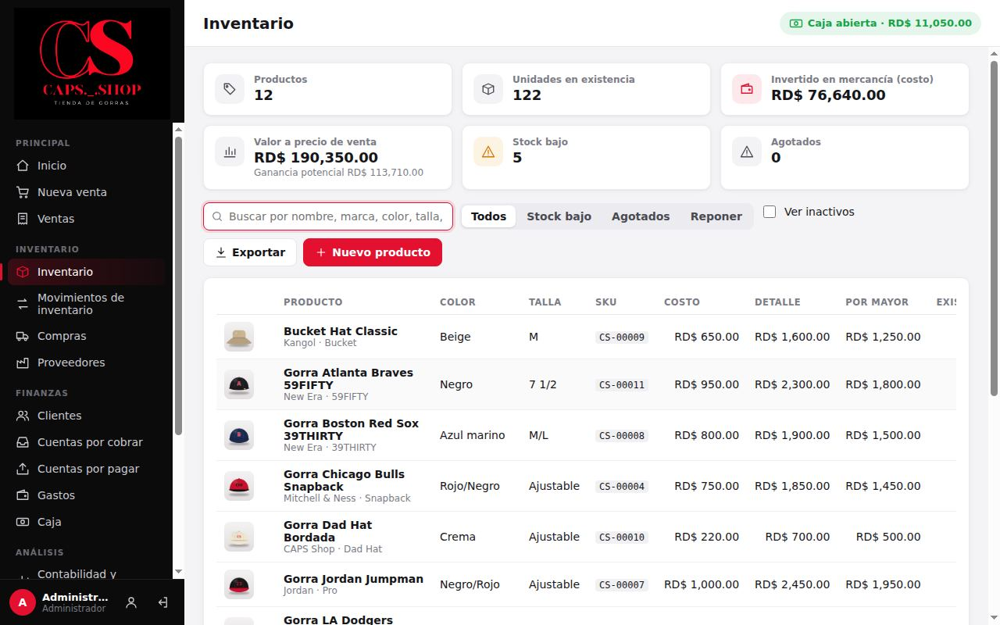
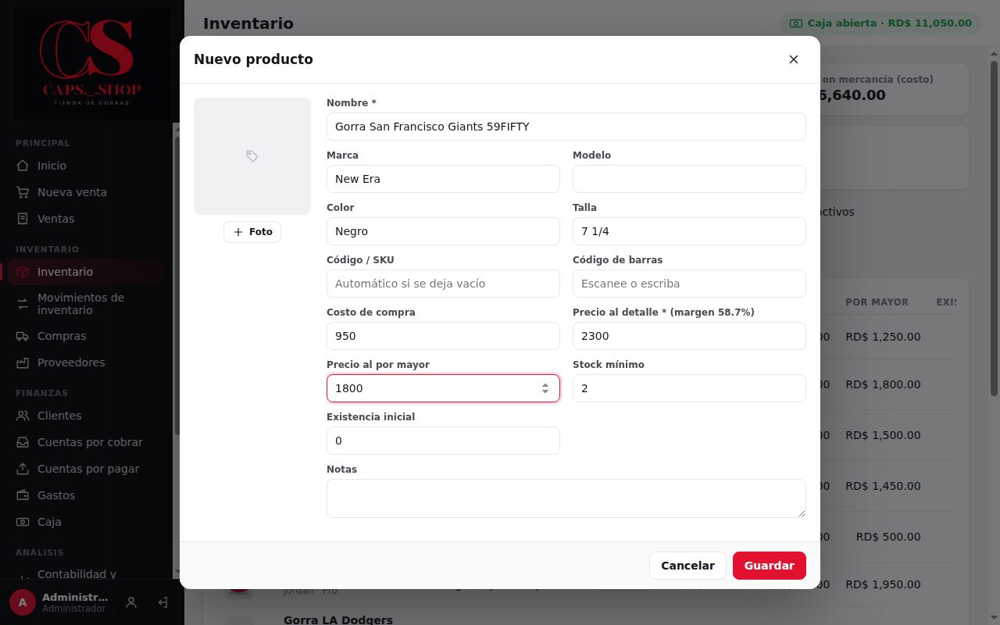
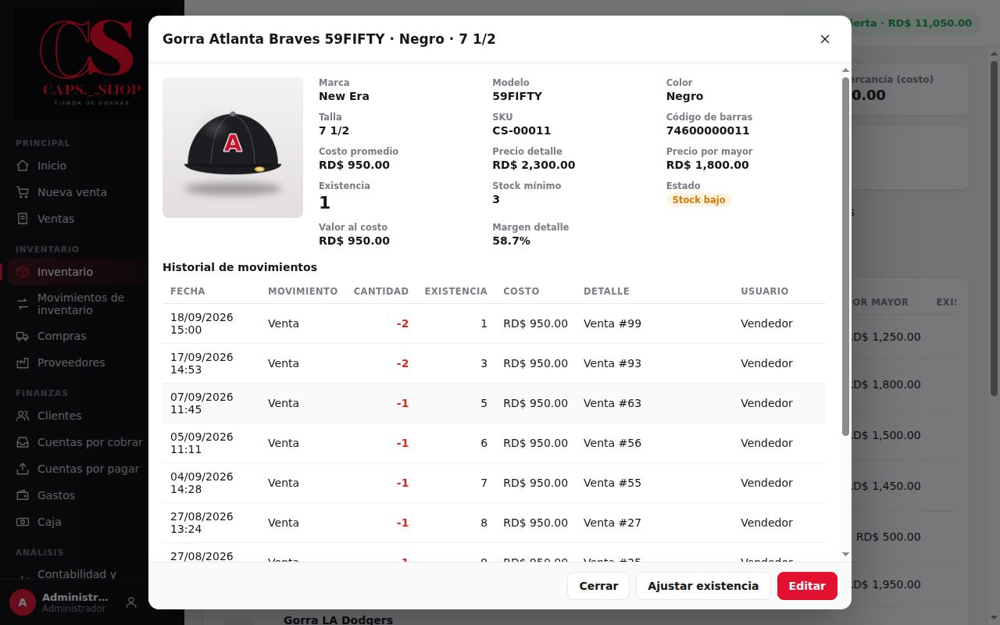
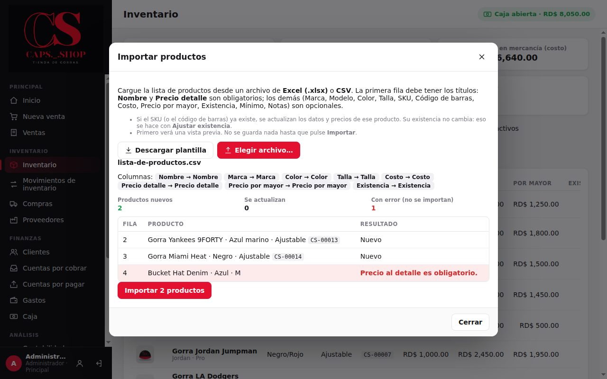
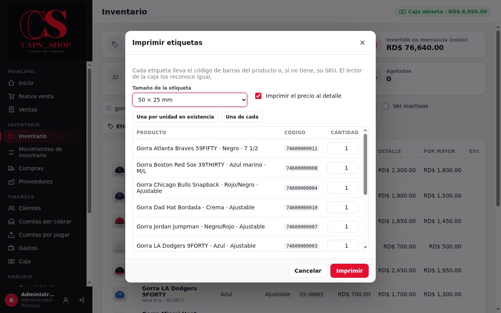
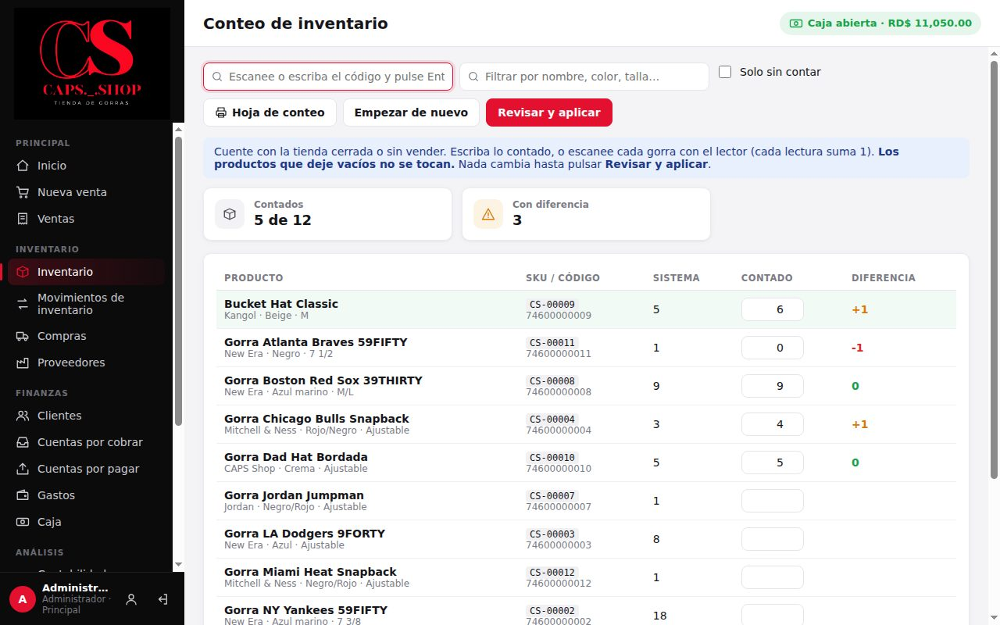

# 4. Inventario

**Para qué sirve:** tener cada gorra registrada con su foto, códigos, costo y precios, y saber en todo momento cuánto hay, cuánto vale y qué hay que reponer.

**Quién:**

| Acción | Vendedor | Administrador |
|---|:---:|:---:|
| Consultar productos, existencias y movimientos | ✔ (sin costos) | ✔ |
| Crear y editar productos, cambiar precios | ✘ | ✔ |
| Ajustar existencias | ✘ | ✔ |

## 4.1 La lista de inventario

Menú **Inventario** → **Inventario**.

- **Resumen:**
  - **Productos** y **Unidades en existencia**.
  - **Invertido en mercancía (costo)**: solo lo ve el administrador.
  - **Valor a precio de venta**, con la ganancia potencial.
  - Cuántos productos tienen **Stock bajo** y cuántos están **Agotados**.
- **Buscar:** por nombre, marca, color, talla, SKU o código de barras.
- **Filtros:**
  - **Todos**.
  - **Stock bajo**: existencia mayor que 0 pero igual o menor que el mínimo.
  - **Agotados**: existencia 0.
  - **Reponer**: los dos anteriores juntos.
- **Ver inactivos** muestra los productos dados de baja.
- **Exportar** guarda la lista en CSV (Excel). El archivo incluye el stock mínimo y el valor al costo de cada producto.
- **Estado de cada producto:** **Normal**, **Stock bajo** o **Agotado**. Debajo de la existencia se ve el mínimo.

## 4.2 Crear un producto (administrador)

**Inventario** → **Nuevo producto**.

Cree una ficha por cada combinación que se vende por separado: modelo, color y talla. Por ejemplo, "NY Yankees 59FIFTY Negro 7 1/4" y "NY Yankees 59FIFTY Azul marino 7 3/8" son dos productos.

| Campo | Obligatorio | Nota |
|---|:---:|---|
| **Nombre** | ✔ | Ej. "Gorra NY Yankees 59FIFTY" |
| **Marca**, **Modelo**, **Color**, **Talla** | | Ayudan a buscar y salen en el recibo |
| **Código / SKU** | | Si lo deja vacío, el sistema asigna uno: `CS-00001`, `CS-00002`… No se puede repetir |
| **Código de barras** | | Escanéelo con el lector. No se puede repetir |
| **Costo de compra** | | Luego se actualiza solo con cada compra ([costo promedio](../producto/reglas-de-negocio.md#1-costo-de-cada-gorra-costo-promedio)) |
| **Precio al detalle** | ✔ (en pantalla) | Al escribirlo se muestra el margen. Aviso: si se deja vacío, hoy el sistema lo guarda en 0 sin avisar ([brecha anotada](../producto/objetivos.md#o5-brechas-funcionales)); revíselo siempre |
| **Precio al por mayor** | | Si queda vacío se guarda en 0: complételo si vende por mayor |
| **Stock mínimo** | | Cuando la existencia llega a este número, el producto aparece en **Por reponer** |
| **Existencia inicial** | | Solo al crear. Úsela para cargar lo que ya tiene |
| **Foto** | | Botón **Foto**. La imagen se reduce automáticamente |
| **Notas** | | Texto libre |

Pulse **Guardar**.

## 4.3 Ver y editar un producto

Pulse un producto de la lista.

El detalle muestra:
- Los datos del producto.
- El costo promedio y el valor al costo (solo el administrador).
- El margen al detalle.
- El **Historial de movimientos**: cada entrada y salida con fecha, cantidad, existencia resultante, detalle y usuario.

- **Editar:** cambia datos y precios. Cada cambio de costo o precio queda en **Historial de movimientos** (menú **Análisis**) con el valor anterior y el nuevo. La existencia no se edita aquí: se cambia con compras, ventas o ajustes.
- **Dar de baja:** en **Editar**, desmarque **Producto activo**. El producto deja de salir en ventas y búsquedas, pero conserva su historial. No se borran productos.
  - Si todavía tiene existencia, el sistema lo avisa: esas unidades **siguen contando en el valor del inventario** (en el Inicio, "… de productos desactivados"), porque la mercancía sigue en la tienda. Si ya no están, haga antes un [ajuste de existencia](#44-ajustar-la-existencia-administrador) con el motivo.

## 4.4 Ajustar la existencia (administrador)

Úselo cuando el conteo físico no coincide con el sistema, o cuando sale mercancía que no es venta (dañada, regalo, muestra).

Abra el producto → **Ajustar existencia**:

- **Entrada (+):** suma unidades.
- **Salida (−):** resta unidades.
- **Conteo físico:** escriba la **Existencia real contada** y el sistema calcula la diferencia.
- **Motivo:** obligatorio.

Pulse **Aplicar ajuste**. El ajuste queda en los movimientos del producto y en el historial.

> El ajuste cambia las unidades, pero no registra dinero. Si la mercancía se compró, use **Compras**. Si se vendió, use **Nueva venta**.

## 4.5 Movimientos de inventario

Menú **Inventario** → **Movimientos de inventario**. Muestra todas las entradas y salidas de todos los productos. Se puede filtrar por período, por tipo y por producto, y exportar.

| Tipo | Lo genera | Efecto |
|---|---|---|
| Inventario inicial | Existencia inicial al crear el producto | + |
| Compra | **Compras** | + |
| Venta | **Nueva venta** | − |
| Devolución de cliente | **Devolución** con reingreso | + |
| Ajuste manual / Entrada / Salida | **Ajustar existencia** | + o − |
| Anulación de venta | **Anular venta** | + |
| Anulación de compra | **Anular compra** | − |

## 4.6 Qué reponer

- **Inicio** → **Por reponer**: los productos agotados y los que están en su stock mínimo o por debajo.
- **Inventario** → filtro **Reponer**: la misma lista con todos los datos.
- Para decidir cuánto pedir, compare con **Reportes** → **Productos más vendidos** ([Contabilidad y reportes](09-contabilidad-y-reportes.md)).

## 4.7 Importar productos desde Excel (administrador)

Para cargar muchos productos de una vez, por ejemplo al empezar.

1. **Inventario** → **Importar**.
2. Si no tiene una lista, pulse **Descargar plantilla**: es un archivo CSV que se abre en Excel, con los títulos y un ejemplo.
3. Prepare la lista en Excel. La **primera fila** lleva los títulos:
   - obligatorios: **Nombre** y **Precio detalle**;
   - opcionales: **Marca**, **Modelo**, **Color**, **Talla**, **SKU**, **Código de barras**, **Costo**, **Precio por mayor**, **Existencia**, **Mínimo** y **Notas**. Otras columnas se ignoran.
4. Guárdela como **Libro de Excel (.xlsx)** o **CSV**. Los archivos `.xls` viejos no se leen: guárdelos de nuevo como `.xlsx`.
5. **Elegir archivo…** muestra una **vista previa**: cuántos productos son nuevos, cuántos se actualizan y cuáles tienen error, con la **fila** de Excel y el motivo. Todavía no se guardó nada.
6. Corrija los errores en Excel y vuelva a elegir el archivo, o pulse **Importar** para cargar solo las filas correctas.

- Si una fila trae un **SKU** que ya existe (o, sin SKU, un **código de barras** que ya existe), se **actualizan** los datos y precios de ese producto; lo que la fila deja vacío no se toca. La existencia de un producto que ya estaba **no cambia**: use **Ajustar existencia**.
- Los precios pueden venir como `1500`, `1,500.00` o `1.500,00`.
- La importación queda en el **Historial de movimientos**.

## 4.8 Etiquetas de código de barras

Para las gorras que no traen código de barras, o para poner el precio.

1. **Inventario** → busque los productos (la búsqueda y los filtros eligen cuáles salen) → **Etiquetas**. Para uno solo, ábralo y pulse **Etiquetas**.
2. Elija el **tamaño**: 50 × 25, 40 × 30 o 60 × 40 mm, y si lleva el **precio al detalle**.
3. Escriba cuántas etiquetas de cada uno, o pulse **Una por unidad en existencia**.
4. **Imprimir** abre la ventana de impresión: elija la impresora de etiquetas (o una normal con hojas de etiquetas).

Cada etiqueta lleva el nombre, color y talla, el código de barras (Code 128) y el precio. Si el producto no tiene código de barras, se imprime su **SKU**: el lector de la caja lo reconoce igual al vender.

## 4.9 Conteo de inventario (administrador)

Para contar muchas gorras de una vez y corregir todas las diferencias juntas: al cargar la mercancía el primer día, cada semana o cuando la existencia no cuadra.

1. **Inventario** → **Conteo**.
2. Cuente con la tienda cerrada o sin vender. Hay tres formas, y se pueden mezclar:
   - **con el lector:** escanee cada gorra en **Escanee o escriba el código**. Cada lectura suma 1;
   - **a mano:** escriba lo contado en la columna **Contado**;
   - **en papel:** **Hoja de conteo** imprime la lista (con el filtro que tenga puesto) para contar con lápiz y después escribirlo.
3. La columna **Diferencia** muestra en rojo lo que falta y en naranja lo que sobra. **Solo sin contar** ayuda a ver lo que queda.
4. **Revisar y aplicar** muestra el resumen: cuántas unidades faltan y sobran, y cuánto es al costo. Escriba el **Motivo** (por ejemplo "Conteo semanal") y pulse **Aplicar**.

- **Los productos que deje vacíos no se tocan.** Para revisar solo 10 gorras, cuente esas 10.
- Si cierra el programa a mitad del conteo, al volver pregunta si quiere **seguir** con ese conteo: lo contado se guarda en esta computadora.
- Si se vendió o compró una gorra **mientras se contaba**, esa gorra no se ajusta y el resumen pide volver a contarla. Las demás sí se aplican.
- Cada diferencia queda en **Movimientos de inventario** como **Conteo de inventario**, y el conteo completo en el **Historial de movimientos**.

## 4.10 Errores comunes

| Mensaje | Qué hacer |
|---|---|
| **Ya existe un producto con ese SKU.** | Use otro código o deje el campo vacío para que se asigne uno |
| **Ya existe un producto con ese código de barras.** | Ese código ya pertenece a otro producto: búsquelo en la lista |
| **Nombre es obligatorio.** | Escriba el nombre |
| **Precio al detalle es obligatorio.** / **Precio al detalle debe ser mayor que cero.** | Todo producto necesita su precio al detalle, para no venderlo en 0 |
| **No se encontró la columna "Nombre" en la primera fila.** | Al importar, la primera fila del Excel debe tener los títulos. Use la plantilla |
| **El SKU se repite: ya está en la fila N.** | Al importar, dos filas son el mismo producto. Deje una |
| **La existencia cambió mientras se contaba (era N, ahora M). Vuelva a contarlo.** | En el conteo, esa gorra se vendió o compró mientras se contaba. Cuéntela de nuevo en un conteo nuevo |
| **La existencia no cambia con este ajuste.** | El conteo es igual a la existencia actual: no hace falta ajustar |
| **Existencia insuficiente de "…" (disponible: N).** | Una **Salida** no puede dejar la existencia en negativo |
| **Motivo es obligatorio.** | Escriba el motivo del ajuste |
