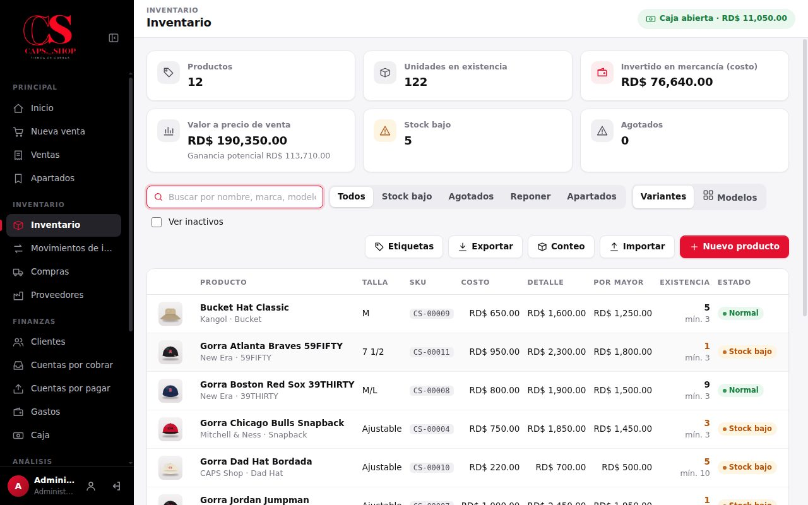
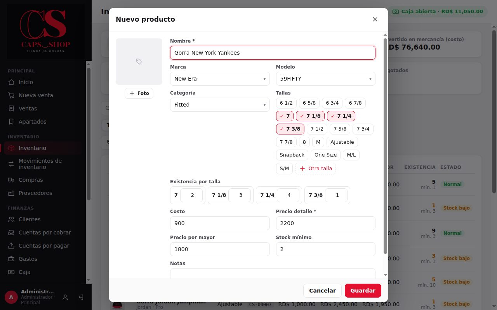
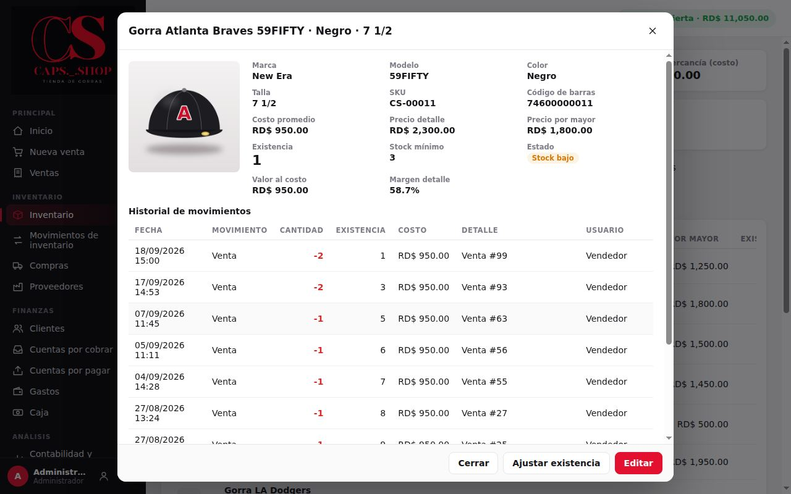
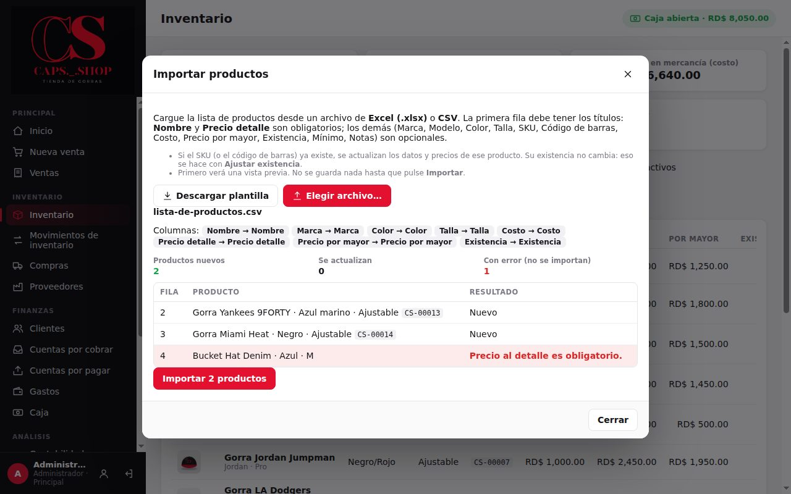
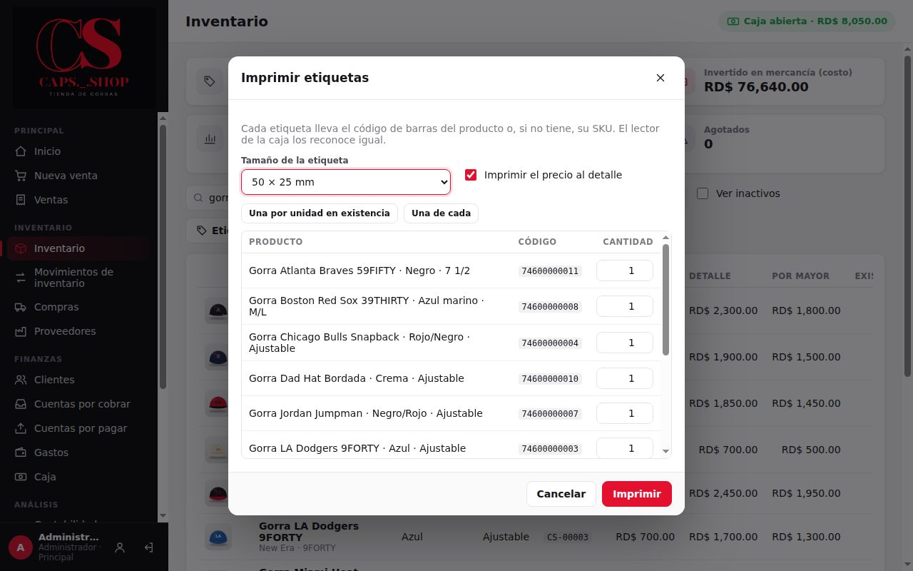
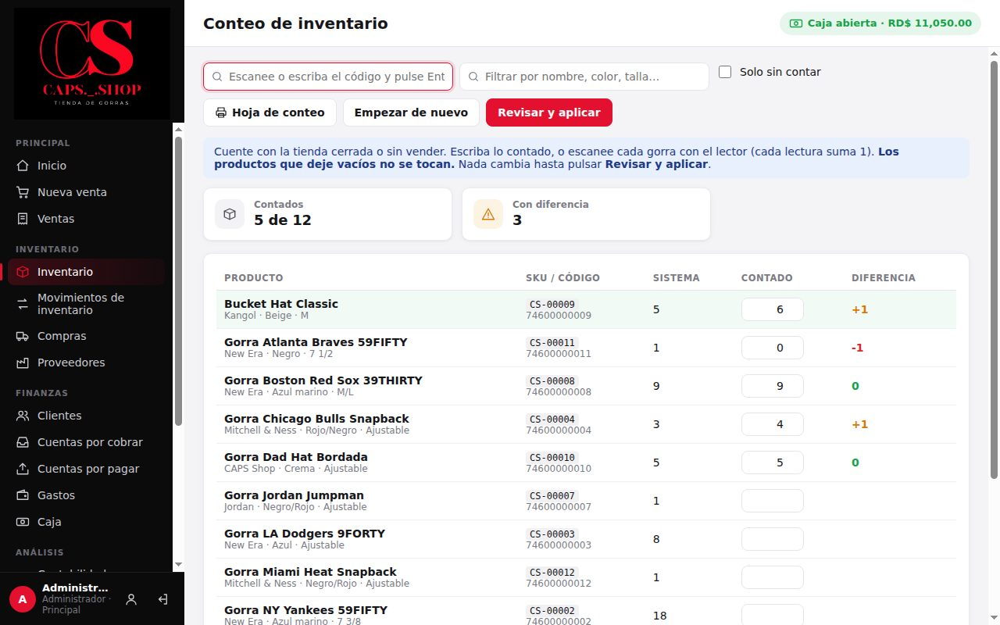
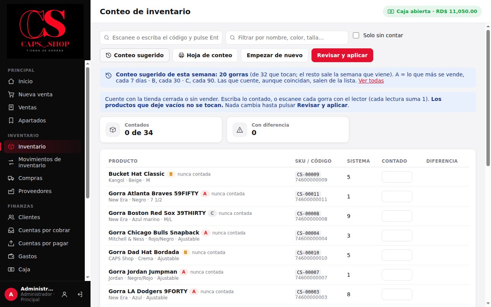
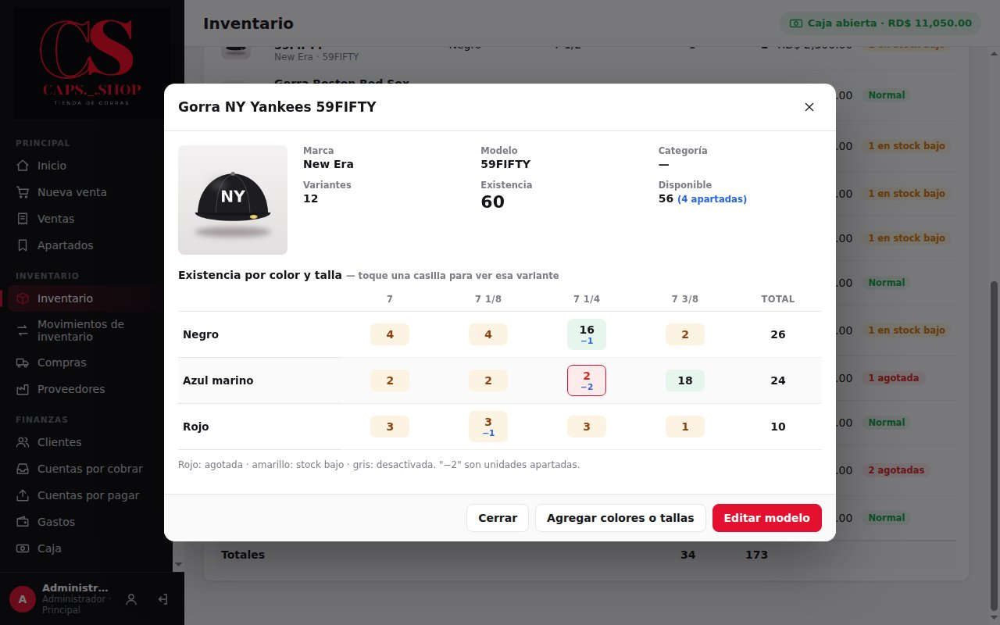

# 4. Inventario

**Para qué sirve:** tener cada gorra registrada con su foto, códigos, costo y precios, y saber en todo momento cuánto hay, cuánto vale y qué hay que reponer.

**Quién:**

| Acción | Vendedor | Administrador |
|---|:---:|:---:|
| Consultar productos, existencias y movimientos | ✔ (sin costos) | ✔ |
| Crear y editar productos, cambiar precios | ✘ | ✔ |
| Ajustar existencias | ✘ | ✔ |

## 4.1 La lista de inventario

Menú **Inventario** → **Inventario**.

- **Resumen:**
  - **Productos** y **Unidades en existencia**.
  - **Invertido en mercancía (costo)**: solo lo ve el administrador.
  - **Valor a precio de venta**, con la ganancia potencial.
  - Cuántos productos tienen **Stock bajo** y cuántos están **Agotados**.
- **Buscar:** por nombre, marca, color, talla, SKU o código de barras.
- **Filtros:**
  - **Todos**.
  - **Stock bajo**: existencia mayor que 0 pero igual o menor que el mínimo.
  - **Agotados**: existencia 0.
  - **Reponer**: los dos anteriores juntos.
- **Ver inactivos** muestra los productos dados de baja.
- **Exportar** guarda la lista en Excel, con formato ([9.6](09-contabilidad-y-reportes.md#96-exportar-a-excel)). El archivo incluye el stock mínimo, lo apartado, lo disponible y el valor al costo de cada producto. Se puede volver a importar tal cual.
- **Estado de cada producto:** **Normal**, **Stock bajo** o **Agotado**. Debajo de la existencia se ve el mínimo.

## 4.2 Crear un producto (administrador)

**Inventario** → **Nuevo producto**. Un solo formulario sirve para una gorra suelta o para un modelo con varios colores y tallas.

| Campo | Obligatorio | Cómo se llena |
|---|:---:|---|
| **Nombre** | ✔ | Ej. "Gorra New York Yankees 59FIFTY" |
| **Marca** | | Escriba parte del nombre y elija de la lista (New Era, Mitchell & Ness, '47 Brand, Nike…). Si no está, **+ Crear nueva marca** la agrega y la deja elegida |
| **Modelo** | | Ej. 59FIFTY, 9FORTY |
| **Categoría** | | Elija de la lista: Fitted, Snapback, Trucker, Dad Hat, Strapback, Adjustable, Beanie, Visera u Otro. **+ Crear nueva categoría** agrega otra. Sirve para ver ventas y utilidad por categoría en el [dashboard ejecutivo](09-contabilidad-y-reportes.md#91-dashboard-ejecutivo) |
| **Colores** | | Un clic en cada color que tiene (quedan marcados con ✓). **+ Agregar nuevo color** crea otro, con su nombre y su color |
| **Tallas** | | Un clic en cada talla (6 1/2 a 8, Ajustable, Snapback, One Size). **+ Agregar talla** crea otra |
| **Variantes e inventario** | | Una fila por cada color y talla marcados. Escriba las unidades que tiene de cada una (0 si todavía no llegan) y, si quiere, su código de barras. Abajo se ve el **stock total** |
| **Costo de compra** | | Luego se actualiza solo con cada compra ([costo promedio](../producto/reglas-de-negocio.md#1-costo-de-cada-gorra-costo-promedio)) |
| **Precio al detalle** | ✔ | Al escribirlo se muestra el margen |
| **Precio al por mayor** | | Si queda vacío se guarda en 0: complételo si vende por mayor |
| **Stock mínimo** | | De cada variante. Cuando una llega a este número, aparece en **Por reponer** |
| **Foto** | | Botón **Foto**. La imagen se reduce automáticamente |
| **Notas** | | Texto libre |

Pulse **Guardar**. Se crea una **variante** por cada combinación de color y talla, cada una con su SKU (`CS-00001`, `CS-00002`…), su código de barras y su existencia ([4.10](#410-modelos-con-colores-y-tallas-administrador)).

- **Sin color ni talla** (por ejemplo, una visera lisa): no marque nada; se guarda como una sola gorra.
- **Gorra ajustable:** marque la talla **Ajustable** u **One Size**; no hace falta ninguna talla numérica.
- **Solo tallas o solo colores:** marque solo esos; hay una fila por cada uno.

## 4.3 Ver y editar un producto

Pulse un producto de la lista.

El detalle muestra:
- Los datos del producto.
- El costo promedio y el valor al costo (solo el administrador).
- El margen al detalle.
- El **Historial de movimientos**: cada entrada y salida con fecha, cantidad, existencia resultante, detalle y usuario.

**Editar producto** abre el mismo formulario de 4.2 con todas sus variantes:
- cambie nombre, marca, modelo, categoría, precios, stock mínimo o notas: se aplican a **todas las variantes**;
- **marque un color o una talla nueva**: aparecen las filas nuevas para escribir su existencia;
- **desmarque un color o una talla**: sus variantes aparecen tachadas como **Se desactiva**. No se borran, porque tienen ventas y movimientos; dejan de salir en la venta. Si todavía tienen existencia, el sistema lo avisa: siguen contando en el valor del inventario. Si ya no están en la tienda, haga antes un [ajuste de existencia](#44-ajustar-la-existencia-administrador). Si vuelve a marcarlo, se reactivan;
- la existencia de las variantes que ya existen no se edita aquí: se cambia con compras, ventas o ajustes.

**Editar esta variante** cambia solo esa combinación: su SKU, código de barras, costo, precios propios (por ejemplo, una talla 8 más cara), color, talla, foto o si está activa. Cada cambio de costo o precio queda en **Historial de movimientos** (menú **Análisis**) con el valor anterior y el nuevo.

## 4.4 Ajustar la existencia (administrador)

Úselo cuando el conteo físico no coincide con el sistema, o cuando sale mercancía que no es venta (dañada, regalo, muestra).

Abra el producto → **Ajustar existencia**:

- **Entrada (+):** suma unidades.
- **Salida (−):** resta unidades.
- **Conteo físico:** escriba la **Existencia real contada** y el sistema calcula la diferencia.
- **Motivo:** obligatorio.

Pulse **Aplicar ajuste**. El ajuste queda en los movimientos del producto y en el historial.

> El ajuste cambia las unidades, pero no registra dinero. Si la mercancía se compró, use **Compras**. Si se vendió, use **Nueva venta**.

## 4.5 Movimientos de inventario

Menú **Inventario** → **Movimientos de inventario**. Muestra todas las entradas y salidas de todos los productos. Se puede filtrar por período, por tipo y por producto, y exportar.

| Tipo | Lo genera | Efecto |
|---|---|---|
| Inventario inicial | Existencia inicial al crear el producto | + |
| Compra | **Compras** | + |
| Venta | **Nueva venta** | − |
| Devolución de cliente | **Devolución** con reingreso | + |
| Ajuste manual / Entrada / Salida | **Ajustar existencia** | + o − |
| Anulación de venta | **Anular venta** | + |
| Anulación de compra | **Anular compra** | − |

## 4.6 Qué reponer

- **Inicio** → **Por reponer**: los productos agotados y los que están en su stock mínimo o por debajo.
- **Inventario** → filtro **Reponer**: la misma lista con todos los datos.
- Para decidir cuánto pedir, compare con **Reportes** → **Productos más vendidos** ([Contabilidad y reportes](09-contabilidad-y-reportes.md)).

## 4.7 Importar productos desde Excel (administrador)

Para cargar muchos productos de una vez, por ejemplo al empezar.

1. **Inventario** → **Importar**.
2. Si no tiene una lista, pulse **Descargar plantilla**: es un libro de Excel con los títulos y un ejemplo. Si prefiere CSV, elíjalo en **Tipo** al guardar.
3. Prepare la lista en Excel. La **primera fila** lleva los títulos:
   - obligatorios: **Nombre** y **Precio detalle**;
   - opcionales: **Marca**, **Modelo**, **Categoría**, **Color**, **Talla**, **SKU**, **Código de barras**, **Costo**, **Precio por mayor**, **Existencia**, **Mínimo** y **Notas**. Otras columnas se ignoran.
4. Guárdela como **Libro de Excel (.xlsx)** o **CSV**. Los archivos `.xls` viejos no se leen: guárdelos de nuevo como `.xlsx`.
5. **Elegir archivo…** muestra una **vista previa**: cuántos productos son nuevos, cuántos se actualizan y cuáles tienen error, con la **fila** de Excel y el motivo. Todavía no se guardó nada.
6. Corrija los errores en Excel y vuelva a elegir el archivo, o pulse **Importar** para cargar solo las filas correctas.

- Si una fila trae un **SKU** que ya existe (o, sin SKU, un **código de barras** que ya existe), se **actualizan** los datos y precios de ese producto; lo que la fila deja vacío no se toca. La existencia de un producto que ya estaba **no cambia**: use **Ajustar existencia**.
- Los precios pueden venir como `1500`, `1,500.00` o `1.500,00`.
- La importación queda en el **Historial de movimientos**.

## 4.8 Etiquetas de código de barras

Para las gorras que no traen código de barras, o para poner el precio.

1. **Inventario** → busque los productos (la búsqueda y los filtros eligen cuáles salen) → **Etiquetas**. Para uno solo, ábralo y pulse **Etiquetas**.
2. Elija el **tamaño**: 50 × 25, 40 × 30 o 60 × 40 mm, y si lleva el **precio al detalle**.
3. Escriba cuántas etiquetas de cada uno, o pulse **Una por unidad en existencia**.
4. **Imprimir** abre la ventana de impresión: elija la impresora de etiquetas (o una normal con hojas de etiquetas).

Cada etiqueta lleva el nombre, color y talla, el código de barras (Code 128) y el precio. Si el producto no tiene código de barras, se imprime su **SKU**: el lector de la caja lo reconoce igual al vender.

## 4.9 Conteo de inventario (administrador)

Para contar muchas gorras de una vez y corregir todas las diferencias juntas: al cargar la mercancía el primer día, cada semana o cuando la existencia no cuadra.

1. **Inventario** → **Conteo**.
2. Cuente con la tienda cerrada o sin vender. Hay tres formas, y se pueden mezclar:
   - **con el lector:** escanee cada gorra en **Escanee o escriba el código**. Cada lectura suma 1;
   - **a mano:** escriba lo contado en la columna **Contado**;
   - **en papel:** **Hoja de conteo** imprime la lista (con el filtro que tenga puesto) para contar con lápiz y después escribirlo.
3. La columna **Diferencia** muestra en rojo lo que falta y en naranja lo que sobra. **Solo sin contar** ayuda a ver lo que queda.
4. **Revisar y aplicar** muestra el resumen: cuántas unidades faltan y sobran, y cuánto es al costo. Escriba el **Motivo** (por ejemplo "Conteo semanal") y pulse **Aplicar**.

- **Los productos que deje vacíos no se tocan.** Para revisar solo 10 gorras, cuente esas 10.
- Si cierra el programa a mitad del conteo, al volver pregunta si quiere **seguir** con ese conteo: lo contado se guarda en esta computadora.
- Si se vendió o compró una gorra **mientras se contaba**, esa gorra no se ajusta y el resumen pide volver a contarla. Las demás sí se aplican.
- Cada diferencia queda en **Movimientos de inventario** como **Conteo de inventario**, y el conteo completo en el **Historial de movimientos**.

### Conteo sugerido de la semana (conteo cíclico)

En vez de contar toda la tienda de una vez, cada semana se cuenta una parte. **Conteo sugerido** deja en la lista solo lo que toca contar esta semana (20 gorras; se cambia en **Configuración** → **Gorras por conteo cíclico**). Cada gorra lleva su letra:

| Letra | Qué gorras son | Se cuenta |
|---|---|---|
| **A** | Las que más venden: juntas hacen el 80% de lo vendido en los últimos 90 días | Cada 7 días |
| **B** | El 15% siguiente | Cada 30 días |
| **C** | El resto, y las que tienen existencia pero no se venden | Cada 90 días |

Primero salen las A y, dentro de cada letra, las que más tiempo llevan sin contarse. Al lado dice cuándo se contó por última vez. Cuente y aplique como siempre: **las que cuente salen de la lista aunque coincidan**, y vuelven cuando les toque. **Ver todas** quita el filtro.

## 4.10 Modelos con colores y tallas (administrador)

Una gorra que se vende en varios colores y tallas es un **modelo** (el producto); cada combinación (Negro 7 1/4, Rojo 7…) es una **variante** con su propio SKU, código de barras, existencia y stock mínimo. Se venden, compran, apartan y cuentan por variante: el sistema sabe exactamente cuántas hay de cada color y talla. La existencia del modelo es la suma de sus variantes.

Se crea y se edita con **Nuevo producto** y **Editar producto** ([4.2](#42-crear-un-producto-administrador) y [4.3](#43-ver-y-editar-un-producto)). Un modelo no puede tener dos veces la misma combinación: el sistema no lo permite.

**Ver un modelo:** en **Inventario**, **Modelos** agrupa las variantes (colores, tallas, existencia total y apartadas). Al abrir un modelo, o **Ver modelo** desde una variante, se ve la cuadrícula:

- cada casilla es la existencia de esa combinación: **rojo** agotada, **amarillo** stock bajo, **gris** desactivada, y **−2** son unidades apartadas;
- un clic en una casilla abre esa variante (para ajustar, editar o imprimir su etiqueta);
- **Editar producto** abre el formulario con todas las variantes.

**Marcas, categorías, colores y tallas** son listas del sistema (**Configuración → Catálogo de productos**, [11.1](11-configuracion-y-respaldos.md#111-configuración)): así no hay "Snapback" y "snapback", ni "7 1/4" y "7-1/4". Al actualizar a la versión 1.7, lo que ya estaba escrito en los productos pasa a estas listas solo, con la primera forma en que se escribió.

## 4.11 Errores comunes

| Mensaje | Qué hacer |
|---|---|
| **Ya existe un producto con ese SKU.** | Use otro código o deje el campo vacío para que se asigne uno |
| **Ya existe un producto con ese código de barras.** | Ese código ya pertenece a otro producto: búsquelo en la lista |
| **Nombre es obligatorio.** | Escriba el nombre |
| **Precio al detalle es obligatorio.** / **Precio al detalle debe ser mayor que cero.** | Todo producto necesita su precio al detalle, para no venderlo en 0 |
| **No se encontró la columna "Nombre" en la primera fila.** | Al importar, la primera fila del Excel debe tener los títulos. Use la plantilla |
| **El SKU se repite: ya está en la fila N.** | Al importar, dos filas son el mismo producto. Deje una |
| **La existencia cambió mientras se contaba (era N, ahora M). Vuelva a contarlo.** | En el conteo, esa gorra se vendió o compró mientras se contaba. Cuéntela de nuevo en un conteo nuevo |
| **La existencia no cambia con este ajuste.** | El conteo es igual a la existencia actual: no hace falta ajustar |
| **Existencia insuficiente de "…" (disponible: N).** | Una **Salida** no puede dejar la existencia en negativo |
| **Motivo es obligatorio.** | Escriba el motivo del ajuste |
| **La variante … está repetida.** | La misma combinación de color y talla está dos veces. Quite una |
| **Ya existe la variante … de "…".** | Ese producto ya tiene esa combinación de color y talla. Ábralo con **Editar producto** y marque solo lo que falta |
| **Código de color inválido.** | Al agregar un color, elíjalo en el selector de color |
