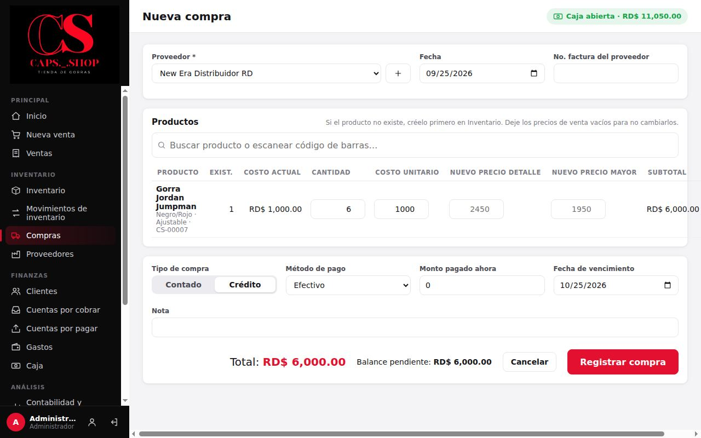
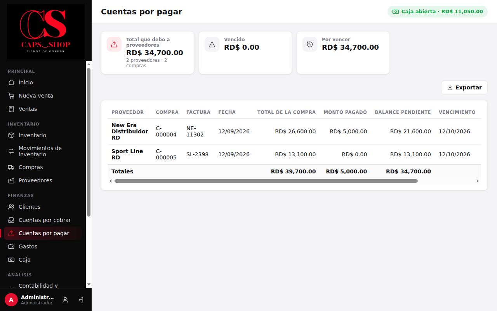

# 5. Compras y proveedores

**Para qué sirve:** registrar la mercancía que entra, para que la existencia y el costo se actualicen solos, y controlar lo que se les debe a los proveedores.

**Quién:** solo el **Administrador**. El vendedor no ve compras, proveedores ni cuentas por pagar.

## 5.1 Proveedores

Menú **Inventario** → **Proveedores**.

- **Nuevo proveedor:** **Nombre** (obligatorio), **Teléfono**, **Correo**, **Dirección** y **Notas**.
- La lista muestra de cada proveedor la **Última compra**, el **Total comprado**, lo **Pagado** y el **Balance pendiente**.
- Al pulsar un proveedor se ve su **Historial de compras** y su **Historial de pagos**, con los botones **Editar** y **Registrar pago**.

## 5.2 Registrar una compra

Menú **Inventario** → **Compras** → **Nueva compra**.

1. **Proveedor:** elíjalo de la lista. Con el botón **+** se crea uno nuevo sin salir de la compra.
2. **Fecha** de la compra y **No. factura del proveedor** (opcional).
3. **Productos:** busque cada gorra (o escanéela) y agréguela. Si el producto no existe, créelo primero en **Inventario**. En cada línea:
   - **Cantidad** y **Costo unitario** (lo que costó cada una).
   - **Nuevo precio detalle** y **Nuevo precio mayor**: solo si quiere cambiar los precios de venta. Déjelos vacíos para mantener los actuales.
4. **Tipo de compra:**
   - **Contado:** se paga todo ahora con el **Método de pago** elegido.
   - **Crédito:** escriba el **Monto pagado ahora** (puede ser 0) y la **Fecha de vencimiento**. Se propone la fecha de la compra más los días de crédito configurados.
5. Revise el **Total** y, en crédito, el **Balance pendiente**. Pulse **Registrar compra**.

### Qué cambia en el sistema
- **Inventario:** sube la existencia de cada producto. Queda un movimiento "Compra" con el costo unitario.
- **Costo:** el costo de cada producto pasa a ser el **costo promedio** entre lo que había y lo que entra ([ejemplo](../producto/reglas-de-negocio.md#1-costo-de-cada-gorra-costo-promedio)).
- **Precios:** si cambió precios de venta, el cambio queda en el historial.
- **Dinero:** lo pagado sale como "Compras de mercancía" en el flujo de dinero. Si se pagó en efectivo, sale de la caja, que debe estar abierta.
- **Deuda:** si fue a crédito, el saldo queda en **Cuentas por pagar**.
- **Ganancias:** la compra **no es un gasto**. Se convierte en inventario y pasa a ser costo cuando la gorra se vende.

## 5.3 Consultar compras

**Compras** muestra las compras del período con total, pagado y balance. Se puede filtrar por estado: **Pendiente**, **Parcial**, **Pagado** o **Anulada**.

Al pulsar una compra se ven sus productos y pagos, con los botones:
- **Registrar pago:** para abonar a esa compra.
- **Anular compra:** para una compra registrada por error. Pide un motivo. Retira del inventario las unidades de esa compra y registra como entrada de dinero lo que se había pagado (reembolso del proveedor). No se puede anular si esas unidades ya se vendieron, porque no hay existencia suficiente.

## 5.4 Cuentas por pagar

Menú **Finanzas** → **Cuentas por pagar**.

- **Resumen:** **Total que debo a proveedores**, **Vencido** y **Por vencer**.
- **Lista:** una fila por compra a crédito con saldo, con los datos de **Proveedor**, **Compra**, **Factura**, **Fecha**, **Total de la compra**, **Monto pagado**, **Balance pendiente**, **Vencimiento** y **Estado**. Las vencidas se marcan en rojo.
- **Pagar:** abre el pago de esa compra.

### Registrar un pago a un proveedor
Hay tres caminos:
- **Cuentas por pagar** → **Pagar**, para una compra específica.
- **Compras** → abrir la compra → **Registrar pago**.
- **Proveedores** → abrir el proveedor → **Registrar pago**. El pago se aplica primero a la compra que vence antes.

En la ventana escriba el **Monto** (se propone el pendiente), el **Método de pago**, la **Fecha** y una **Nota** opcional. Pulse **Registrar pago**.

## 5.5 Errores comunes

| Mensaje | Qué hacer |
|---|---|
| **Seleccione un proveedor.** | Elija el proveedor antes de registrar |
| **Agregue al menos un producto a la compra.** | Busque y agregue productos |
| **El monto pagado no puede ser mayor que el total.** | Corrija el monto pagado ahora |
| **El pago excede el balance pendiente (…).** | El pago supera la deuda: corrija el monto |
| **No hay balance pendiente para pagar.** | Esa compra o proveedor ya está pagado |
| **La caja está cerrada…** | Se pagó en efectivo sin caja abierta: abra la caja o use otro método |
| **Existencia insuficiente de "…" (disponible: N).** al anular | Esas gorras ya se vendieron: no se puede anular la compra completa |
