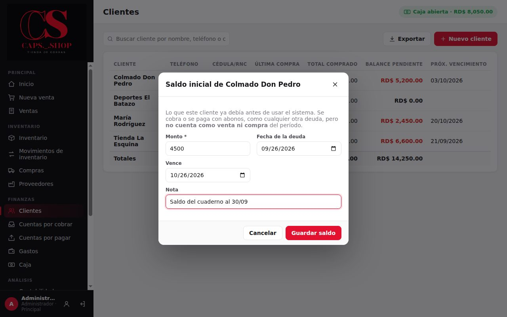
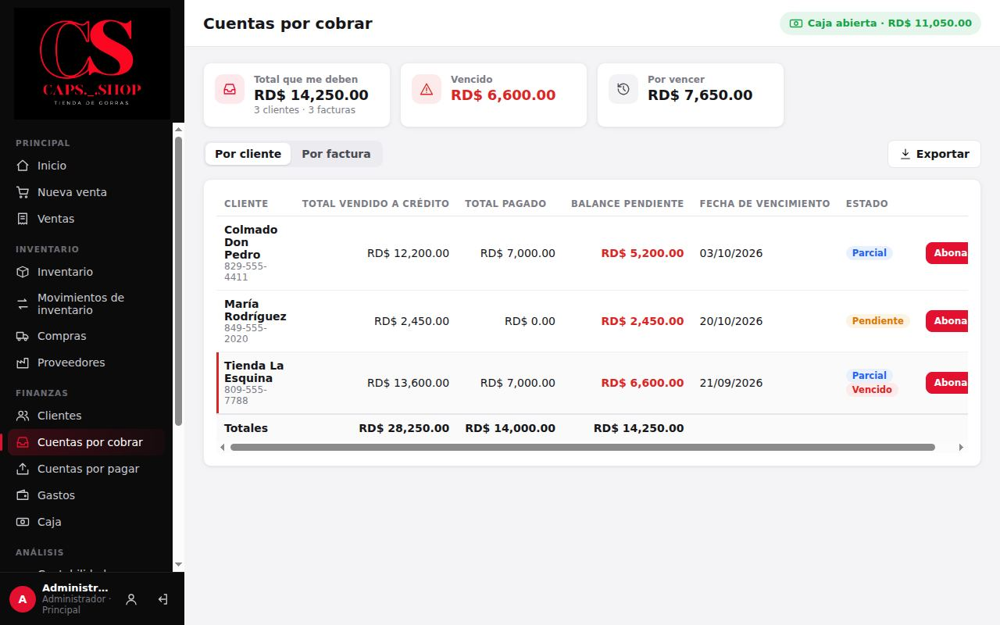
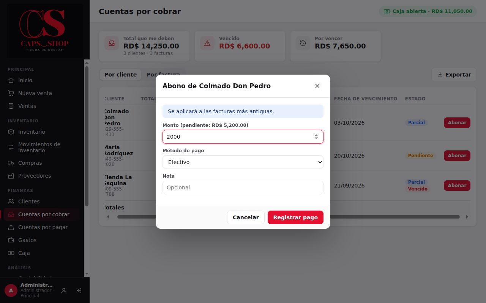

# 6. Clientes y cobros

**Para qué sirve:** registrar clientes, vender a crédito y controlar quién debe, cuánto y cuándo vence.

**Quién:**

| Acción | Vendedor | Administrador |
|---|:---:|:---:|
| Registrar y editar clientes | ✔ | ✔ |
| Vender a crédito | ✔ | ✔ |
| Ver cuentas por cobrar | ✔ | ✔ |
| Registrar abonos | ✔ si **El vendedor puede registrar abonos de clientes** está activado en Configuración | ✔ |

## 6.1 Clientes

Menú **Finanzas** → **Clientes**.

- **Nuevo cliente:** **Nombre** (obligatorio), **Teléfono**, **Cédula / RNC**, **Correo**, **Dirección** y **Notas**. También se puede crear desde **Nueva venta** con el botón **+** junto al cliente.
- La lista muestra de cada cliente la **Última compra**, el **Total comprado**, el **Balance pendiente** y el **Próx. vencimiento**.
- Al pulsar un cliente se ven todas sus compras, su historial de pagos y los botones **Editar** y **Registrar abono**.
- Para dar de baja un cliente, en **Editar** desmarque **Activo**. No se borran clientes.

### Saldo inicial (administrador)

Si un cliente ya le debía antes de usar el sistema (por ejemplo, lo anotado en el cuaderno):
1. Abra el cliente → **Saldo inicial**.
2. Escriba el **Monto**, la **Fecha de la deuda**, cuándo **Vence** y una **Nota**.
3. **Guardar saldo**.

El saldo aparece en **Cuentas por cobrar** marcado como **Saldo inicial** y se cobra con abonos, como cualquier otra deuda. **No cuenta como venta**: no suma a las ventas ni a la ganancia, ni mueve inventario.

## 6.2 Vender a crédito

En **Nueva venta**, elija el cliente, marque **Crédito**, revise la **Fecha de vencimiento** y, si deja un adelanto, escríbalo como **Abono inicial**. Detalle en [Ventas](03-ventas.md#31-hacer-una-venta).

## 6.3 Cuentas por cobrar

Menú **Finanzas** → **Cuentas por cobrar**.

- **Resumen:** **Total que me deben**, **Vencido** y **Por vencer**.
- **Por cliente:** una fila por cliente con saldo:
  - **Total vendido a crédito**.
  - **Total pagado**.
  - **Balance pendiente**.
  - **Fecha de vencimiento**: la más próxima.
  - **Estado**.
- **Por factura:** una fila por cada venta a crédito con saldo.
- **Estados:**
  - **Pendiente**: sin abonos.
  - **Parcial**: con abonos.
  - **Pagado**.
  - **Vencido**: se agrega cuando pasó la fecha de vencimiento y aún hay saldo. Esas filas se marcan en rojo.
- **Exportar** guarda la vista actual en CSV.

## 6.4 Registrar un abono

1. En **Cuentas por cobrar**, pulse **Abonar** en la fila del cliente o de la factura. También puede hacerlo desde el cliente o desde la venta, con **Registrar abono**.
2. Escriba el **Monto** (se propone el saldo completo), el **Método de pago** y una **Nota** opcional.
3. Pulse **Registrar pago**.

- **Abono al cliente** (vista **Por cliente**): se aplica primero a la factura que vence antes, y el resto a las siguientes.
- **Abono a una factura** (vista **Por factura**, o desde la venta): se aplica solo a esa venta.

### Qué cambia en el sistema
- **Deuda:** baja el saldo de la venta o las ventas, y su estado cambia a **Parcial** o **Pagado**.
- **Dinero:** entra como "Abonos de clientes". Si fue en efectivo, suma a la caja abierta.
- **Historial:** queda registrado quién lo recibió y cuándo.

### Anular un abono registrado por error (administrador)

Si se registró un abono equivocado (otro monto, otro cliente, repetido):
1. Abra el cliente (o la venta) → en **Historial de pagos**, pulse **Anular** en ese pago.
2. Escriba el motivo y acepte.

La deuda vuelve a quedar como antes y el dinero sale con el mismo método; si fue en efectivo, sale de la caja de esta computadora. Después registre el abono correcto. Solo se anulan abonos de ventas **a crédito**; el cobro de una venta de contado se corrige anulando la venta ([3.4](03-ventas.md#34-anular-una-venta-administrador)).

## 6.5 Errores comunes

| Mensaje | Qué hacer |
|---|---|
| **No hay balance pendiente para cobrar.** | El cliente ya no debe |
| **El abono excede el balance pendiente (…).** | Corrija el monto: no se puede cobrar de más |
| **No tiene permiso para registrar pagos de clientes.** | El administrador desactivó esta opción para el vendedor |
| **La caja está cerrada…** | Abono en efectivo sin caja abierta: abra la caja |
| **Es el cobro de una venta de contado: para corregirlo, anule la venta.** | Anule la venta completa y vuelva a registrarla |
| **Ese dinero ya se le devolvió al cliente en una devolución…** | El abono ya se compensó con una devolución: no hay que anularlo |
