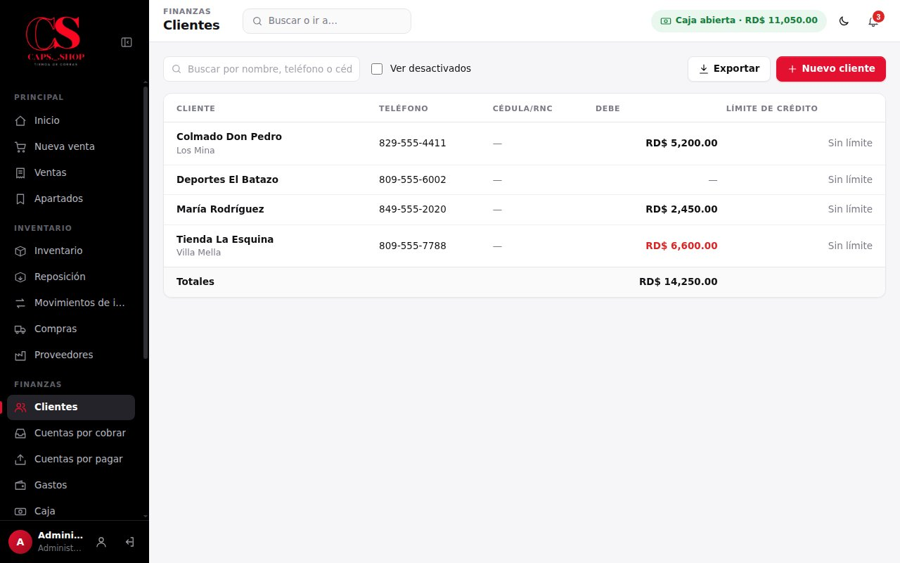
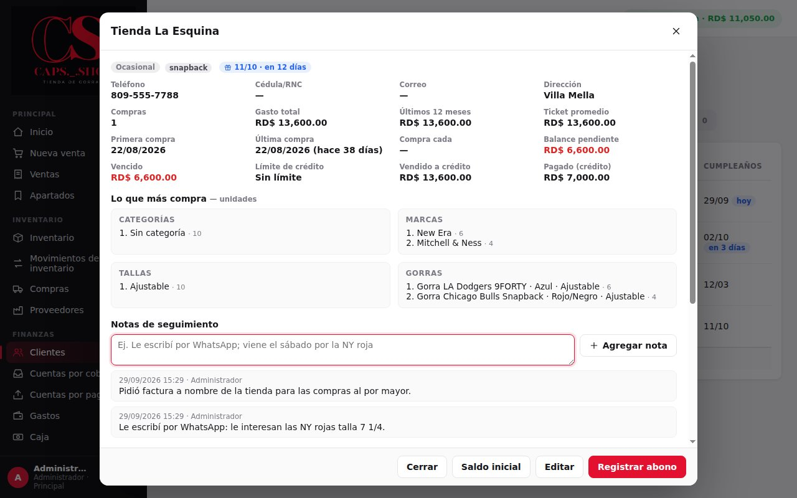
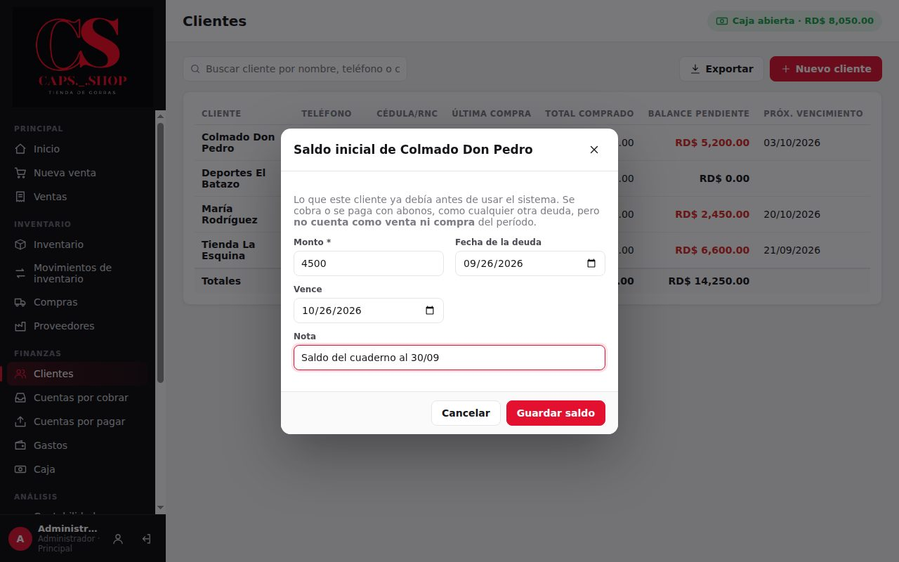
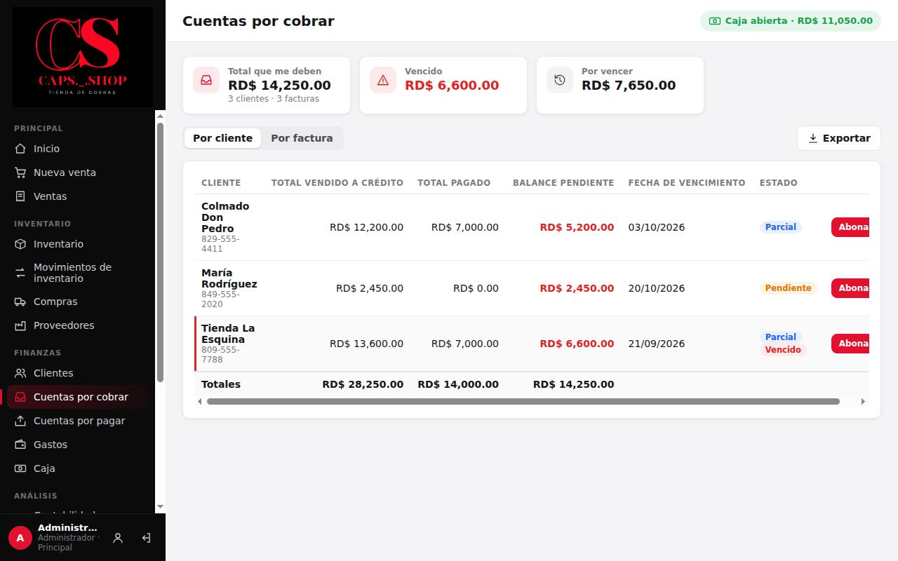
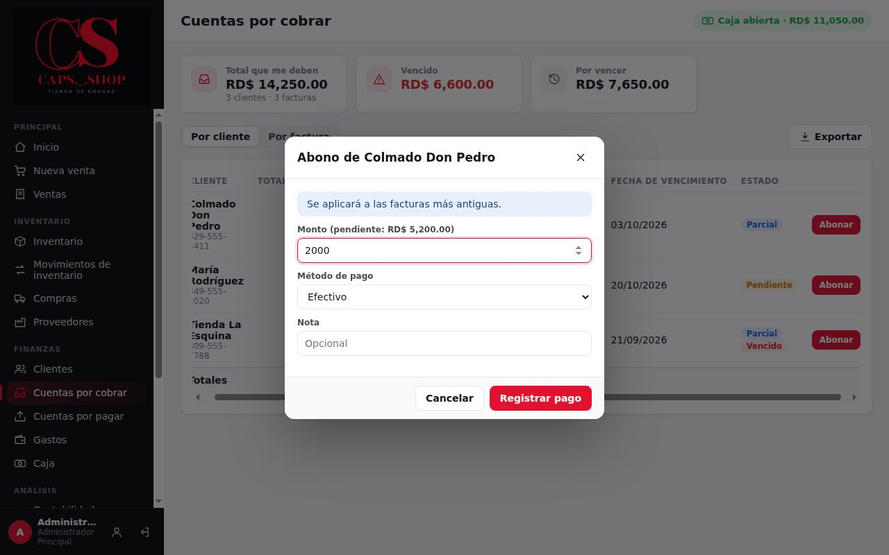

# 6. Clientes y cobros

**Para qué sirve:** conocer a los clientes (qué compran, cada cuánto y quién dejó de venir), vender a crédito y controlar quién debe, cuánto y cuándo vence.

**Quién:**

| Acción | Vendedor | Administrador |
|---|:---:|:---:|
| Registrar y editar clientes, cumpleaños, etiquetas y notas de seguimiento | ✔ | ✔ |
| Ver la ficha del cliente (compras, gasto, frecuencia, lo que más compra) | ✔ sin costos ni utilidad | ✔ |
| Marcar o quitar el VIP a mano | ✘ | ✔ |
| Desactivar o reactivar clientes y ponerles límite de crédito | ✘ | ✔ |
| Autorizar una venta a crédito que pasa el límite o a quien tiene deuda vencida | ✘ | ✔ |
| Vender a crédito | ✔ | ✔ |
| Ver cuentas por cobrar | ✔ | ✔ |
| Registrar abonos | ✔ si **El vendedor puede registrar abonos de clientes** está activado en Configuración | ✔ |

## 6.1 Clientes

Menú **Finanzas** → **Clientes**.

- **Nuevo cliente:** **Nombre** (obligatorio), **Teléfono**, **Cédula / RNC**, **Correo**, **Dirección**, **Cumpleaños** (día y mes, por ejemplo 15/08), **Etiquetas** (separadas por coma: "mayorista, Santiago") y **Notas**. También se puede crear desde **Nueva venta** con el botón **+** junto al cliente.
- La lista muestra de cada cliente su **segmento**, cuántas **compras** hizo, el **gasto total**, el **ticket promedio**, la **última compra** (y hace cuántos días), lo que **debe** y su **cumpleaños**. La ★ marca a los VIP; debajo del nombre van sus etiquetas.
- Arriba se filtra por **segmento** (con cuántos hay en cada uno) y por **etiqueta**; el buscador también encuentra por etiqueta.
- **Cumpleaños** muestra quién cumple en los próximos 30 días. **Copiar teléfonos** copia los teléfonos de los clientes que se están viendo, para pegarlos en WhatsApp o en una lista de difusión. **Exportar** los guarda en Excel con todos los datos.
- Al pulsar un cliente se abre su **ficha** ([ver abajo](#la-ficha-del-cliente)).

**Segmentos** (el sistema los calcula solo, con las ventas que no son saldos iniciales):

| Segmento | Quién es |
|---|---|
| **Nuevo** | Empezó a comprar en los últimos 30 días y todavía no tiene 3 compras en el año |
| **Frecuente** | 3 compras o más en los últimos 12 meses |
| **Ocasional** | Compra de vez en cuando |
| **En riesgo** | Lleva sin comprar más del doble de lo que normalmente tarda entre compras (al menos 45 días) |
| **Perdido** | Lleva sin comprar más del triple de lo normal (al menos 90 días) |
| **Sin compras** | Registrado, pero todavía no ha comprado |

**VIP:** el cliente que compró **RD$ 25,000 o más en los últimos 12 meses** (se cambia en **Configuración** → **Cliente VIP**; 0 = sin VIP automático). El administrador puede marcarlo a mano en **Editar** → **Cliente VIP**: **Automático**, **Sí, siempre** o **No**.

> Para recuperar clientes: filtre **En riesgo** o **Perdidos**, pulse **Copiar teléfonos** y escríbales con una oferta. Anote en la ficha lo que respondió cada uno.
- **Límite de crédito** (administrador): en **Editar**, lo máximo que el cliente puede deber. **0 = sin límite** (así se crean).
- **Dar de baja un cliente** (administrador): en **Editar** desmarque **Activo**. No se borran clientes.
  - No se puede si el cliente **debe**: primero cobre o anule lo pendiente.
  - A un cliente desactivado **no se le vende**. Para verlo, marque **Ver desactivados** en la lista; para volver a venderle, márquelo **Activo** otra vez.

### La ficha del cliente

- **Arriba:** el segmento, la ★ VIP, sus etiquetas y su cumpleaños (y cuánto falta, si es pronto).
- **Números:** compras, gasto total, gasto de los últimos 12 meses, ticket promedio, primera y última compra, **cada cuántos días compra**, lo que debe, lo vencido y su límite de crédito.
- **Lo que más compra:** las categorías, marcas, tallas y gorras que más lleva, en unidades. Sirve para ofrecerle lo que le gusta.
- **Apartados activos**, si tiene.
- **Notas de seguimiento:** escriba lo que se habló ("le escribí; viene el sábado") y pulse **Agregar nota**. Quedan con la fecha y quién la escribió, la más nueva primero.
- Después, todas sus **compras** y su **historial de pagos**, como antes.

El vendedor ve la misma ficha: son montos de lo que el cliente pagó, nunca costos ni utilidad.

### Saldo inicial (administrador)

Si un cliente ya le debía antes de usar el sistema (por ejemplo, lo anotado en el cuaderno):
1. Abra el cliente → **Saldo inicial**.
2. Escriba el **Monto**, la **Fecha de la deuda**, cuándo **Vence** y una **Nota**.
3. **Guardar saldo**.

El saldo aparece en **Cuentas por cobrar** marcado como **Saldo inicial** y se cobra con abonos, como cualquier otra deuda. **No cuenta como venta**: no suma a las ventas ni a la ganancia, ni mueve inventario.

## 6.2 Vender a crédito

En **Nueva venta**, elija el cliente, marque **Crédito**, revise la **Fecha de vencimiento** y, si deja un adelanto, escríbalo como **Abono inicial**. Detalle en [Ventas](03-ventas.md#31-hacer-una-venta).

Junto al nombre del cliente se ve cuánto **debe**, cuánto tiene **vencido** y su **límite**. La venta a crédito **se detiene** si:
- el cliente tiene deuda **vencida** (se puede apagar en Configuración → **Vender a crédito a quien tiene deuda vencida solo con autorización del administrador**);
- o si, con lo que queda a crédito en esta venta, pasaría su **límite de crédito**.

El vendedor ve el motivo y no puede seguir: puede cobrar de contado, pedir un abono inicial mayor o llamar al administrador. El administrador ve el motivo y puede pulsar **Autorizar venta**; la autorización queda en el historial de movimientos.

**Ejemplo:** Ana tiene límite de RD$ 1,000 y debe RD$ 800. Una gorra de RD$ 400 a crédito se detiene (debería RD$ 1,200). Con un abono inicial de RD$ 300, quedan RD$ 100 a crédito y pasa.

## 6.3 Cuentas por cobrar

Menú **Finanzas** → **Cuentas por cobrar**.

- **Resumen:** **Total que me deben**, **Vencido** y **Por vencer**.
- **Por cliente:** una fila por cliente con saldo:
  - **Total vendido a crédito**.
  - **Total pagado**.
  - **Balance pendiente**.
  - **Fecha de vencimiento**: la más próxima.
  - **Estado**.
- **Por factura:** una fila por cada venta a crédito con saldo.
- **Estados:**
  - **Pendiente**: sin abonos.
  - **Parcial**: con abonos.
  - **Pagado**.
  - **Vencido**: se agrega cuando pasó la fecha de vencimiento y aún hay saldo. Esas filas se marcan en rojo.
- **Exportar** guarda la vista actual en Excel ([9.6](09-contabilidad-y-reportes.md#96-exportar-a-excel)).

## 6.4 Registrar un abono

1. En **Cuentas por cobrar**, pulse **Abonar** en la fila del cliente o de la factura. También puede hacerlo desde el cliente o desde la venta, con **Registrar abono**.
2. Escriba el **Monto** (se propone el saldo completo), el **Método de pago** y una **Nota** opcional.
3. Pulse **Registrar pago**.

- **Abono al cliente** (vista **Por cliente**): se aplica primero a la factura que vence antes, y el resto a las siguientes.
- **Abono a una factura** (vista **Por factura**, o desde la venta): se aplica solo a esa venta.

### Qué cambia en el sistema
- **Deuda:** baja el saldo de la venta o las ventas, y su estado cambia a **Parcial** o **Pagado**.
- **Dinero:** entra como "Abonos de clientes". Si fue en efectivo, suma a la caja abierta.
- **Historial:** queda registrado quién lo recibió y cuándo.

### Anular un abono registrado por error (administrador)

Si se registró un abono equivocado (otro monto, otro cliente, repetido):
1. Abra el cliente (o la venta) → en **Historial de pagos**, pulse **Anular** en ese pago.
2. Escriba el motivo y acepte.

La deuda vuelve a quedar como antes y el dinero sale con el mismo método; si fue en efectivo, sale de la caja de esta computadora. Después registre el abono correcto. Solo se anulan abonos de ventas **a crédito**; el cobro de una venta de contado se corrige anulando la venta ([3.4](03-ventas.md#34-anular-una-venta-administrador)).

## 6.5 Errores comunes

| Mensaje | Qué hacer |
|---|---|
| **No hay balance pendiente para cobrar.** | El cliente ya no debe |
| **El abono excede el balance pendiente (…).** | Corrija el monto: no se puede cobrar de más |
| **No tiene permiso para registrar pagos de clientes.** | El administrador desactivó esta opción para el vendedor |
| **La caja está cerrada…** | Abono en efectivo sin caja abierta: abra la caja |
| **Es el cobro de una venta de contado: para corregirlo, anule la venta.** | Anule la venta completa y vuelva a registrarla |
| **Ese dinero ya se le devolvió al cliente en una devolución…** | El abono ya se compensó con una devolución: no hay que anularlo |
| **… tiene … vencido. Solo el administrador puede autorizar otra venta a crédito.** | Cobre de contado, o pida al cliente que abone lo vencido, o al administrador que autorice |
| **… con esta venta debería … y su límite de crédito es …** | Pida un abono inicial mayor, o que el administrador autorice o suba el límite |
| **… está desactivado: no se le puede vender.** | El administrador puede reactivarlo en Clientes (marque **Ver desactivados**) |
| **… debe …: no se puede desactivar hasta que salde su cuenta.** | Cobre o anule lo pendiente antes de desactivarlo |
| **Solo el administrador puede desactivar o reactivar clientes.** | Pídaselo al administrador |
| **Fecha de vencimiento no puede ser anterior al …** | El vencimiento debe ser la fecha de la venta o una posterior |
