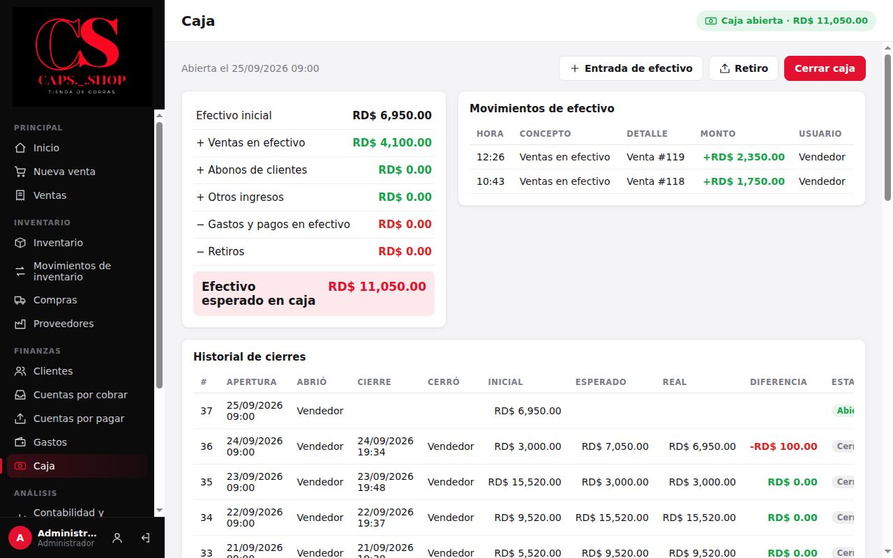
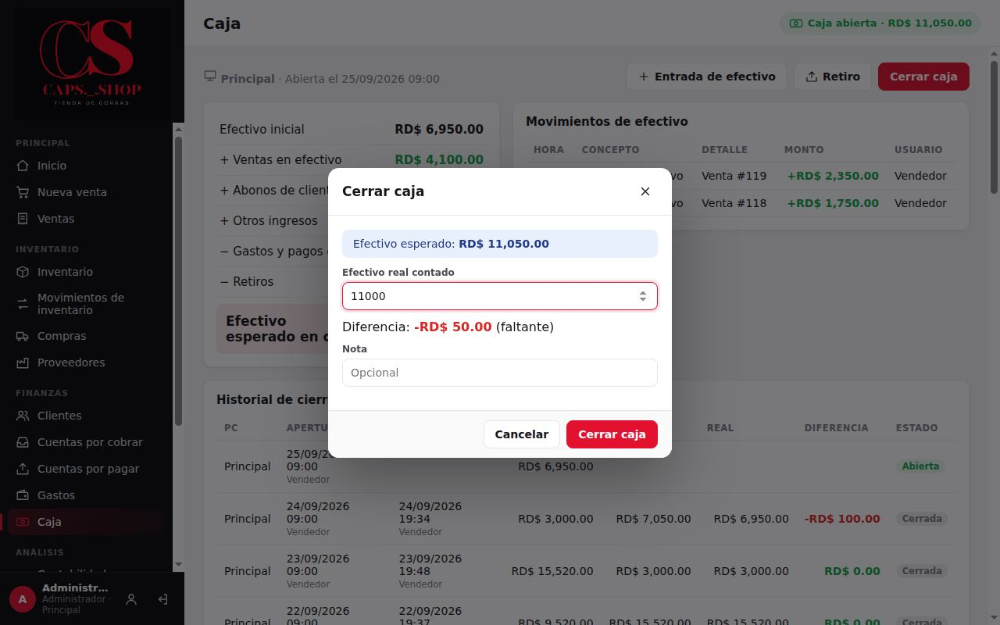
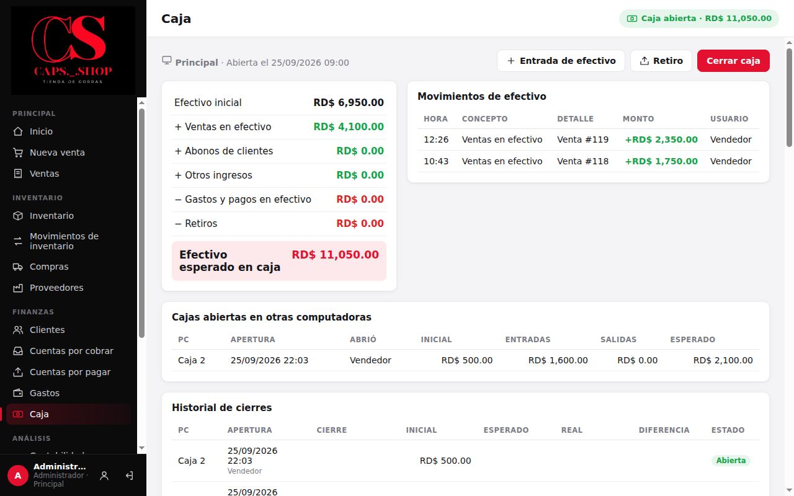

# 7. Caja

**Para qué sirve:** controlar el efectivo de la gaveta. Se abre con el dinero que hay, el sistema suma y resta cada movimiento en efectivo, y al cerrar se compara lo esperado con lo contado.

**Cada computadora tiene su propia caja** ([Varias computadoras](13-varias-computadoras.md#134-la-caja-de-cada-computadora)): lo que se cobra en efectivo en una PC entra en la caja de esa PC. La pantalla muestra el nombre de la computadora arriba a la izquierda.

**Quién:**

| Acción | Vendedor | Administrador |
|---|:---:|:---:|
| Abrir y cerrar caja, entradas de efectivo y depósitos al banco | ✔ | ✔ |
| Retiros (dinero que sale del negocio) | ✘ | ✔ |
| Ver el historial de cierres y las cajas abiertas en otras computadoras | ✘ | ✔ |
| Revisar los depósitos al banco contra el estado de cuenta | ✘ | ✔ |

> Solo el **efectivo** pasa por la caja. Los cobros y pagos con tarjeta o transferencia no cambian la caja; se ven en [Flujo de dinero](09-contabilidad-y-reportes.md#92-flujo-de-dinero).

## 7.1 Abrir la caja

Menú **Finanzas** → **Caja**. Si está cerrada, dice **La caja de esta computadora está cerrada** y muestra el resultado del último cierre de esta computadora.

1. Cuente el efectivo de la gaveta.
2. Escriba el monto en **Efectivo inicial**. Se propone lo contado en el último cierre.
3. Si el monto **no es lo contado en el último cierre**, aparece **Faltan** o **Sobran RD$ …** y hay que escribir el **motivo**. Por ejemplo: "El dueño se llevó RD$ 800 para el banco".
4. Pulse **Abrir caja**.

Con la caja cerrada el dinero no debería cambiar. Si cambió, el motivo queda en la caja (debajo de **Efectivo inicial**), en el **Historial de cierres** y en el **Historial de movimientos**.

Con la opción **Exigir caja abierta para movimientos en efectivo** activada (así viene), **no se puede** mover efectivo sin caja abierta **en la computadora que se usa**: ni cobrar, ni abonar, ni pagar gastos o compras. Si en una computadora sin gaveta (por ejemplo la de la oficina) hay que pagar algo en efectivo, regístrelo desde la computadora que tiene la caja.

## 7.2 Durante el día

La caja abierta muestra:

| Línea | Qué suma o resta |
|---|---|
| **Efectivo inicial** | Lo que se contó al abrir |
| **+ Ventas en efectivo** | Cobros de ventas en efectivo, ya descontado el cambio |
| **+ Abonos de clientes** | Abonos recibidos en efectivo |
| **+ Otros ingresos** | Otros ingresos en efectivo, **Entradas de efectivo**, reembolsos de compras anuladas y gastos anulados |
| **− Gastos y pagos en efectivo** | Gastos, compras y pagos a proveedores hechos en efectivo |
| **− Depósitos al banco** | Efectivo que se llevó al banco |
| **− Retiros** | Dinero que salió del negocio, por ejemplo lo que se lleva el dueño |
| **− Devoluciones y anulaciones** | Reembolsos de devoluciones y dinero devuelto al anular ventas (solo aparece si hubo) |
| **Efectivo esperado en caja** | El resultado: lo que debería haber en la gaveta |

A la derecha, **Movimientos de efectivo** lista cada uno con hora, concepto, detalle, monto y usuario.

Los tres botones de arriba piden **Monto** y **Descripción**:

| Botón | Para qué | Quién |
|---|---|---|
| **Entrada de efectivo** | Meter dinero que no es venta, por ejemplo sencillo para dar cambio | Todos |
| **Depósito al banco** | Llevar efectivo de la gaveta al banco. En la descripción, anote el banco y el número de la boleta. **No es un gasto:** el dinero sigue siendo del negocio, solo cambia de lugar | Todos |
| **Retiro** | Sacar dinero que sale del negocio, por ejemplo lo que se lleva el dueño | Solo el administrador |

No se puede depositar ni retirar más de lo esperado en caja.

**Si se registró mal una entrada, un depósito o un retiro** (administrador): en **Movimientos de efectivo**, pulse **Anular** en esa fila y escriba el motivo. Se registra el movimiento contrario en la misma caja y la fila queda marcada **Anulado**; después registre el correcto. Solo mientras esa caja esté abierta: una vez cerrada, el error ya quedó en la diferencia del cierre.

## 7.3 Cerrar la caja

1. Cuente el efectivo.
2. **Cerrar caja** → escriba el **Efectivo real contado**.
3. El sistema muestra la **Diferencia**:
   - **(cuadrada)**: coincide.
   - **(faltante)**: hay menos de lo esperado.
   - **(sobrante)**: hay más.
4. Si hay diferencia, explique el motivo en **Nota**.
5. Pulse **Cerrar caja**.

Lo contado al cerrar se propone como efectivo inicial de la próxima apertura.

## 7.4 Depósitos por verificar (administrador)

Cualquier usuario puede registrar un **Depósito al banco**, y la caja cuadra aunque el dinero no llegue al banco. Por eso cada depósito queda **por verificar** hasta que el administrador lo compara con el **estado de cuenta** del banco.

**Caja** → **Depósitos por verificar**. También se llega desde el aviso del **Inicio**: "Hay N depósitos al banco por verificar…".

1. Arriba elija **Por verificar** (así abre), **En el banco**, **No llegaron** o **Todos**, y el período (**Todo**, por defecto).
2. Para cada depósito se ve la fecha, la **PC**, quién lo registró, el detalle (banco y boleta) y el monto.
3. Compárelo con el estado de cuenta:
   - **En el banco:** está. Puede escribir una nota, por ejemplo "Estado de cuenta de octubre". Si lo marcó por error, pulse **Desmarcar**.
   - **No llegó:** no aparece. Escriba el motivo. El monto **se descuenta del banco** y queda en el **Flujo de dinero** como **Depósitos que no llegaron al banco**: dinero que salió del negocio. **No se puede deshacer.**

Todo queda en el historial de movimientos. Un depósito ya revisado no se puede anular en la caja.

> **Recomendación:** revise los depósitos cada semana, o cada vez que llegue el estado de cuenta.

## 7.5 Historial de cierres (administrador)

Si hay otras computadoras con la caja abierta, se ven en **Cajas abiertas en otras computadoras**, con lo que debería haber en cada una.

Debajo, **Historial de cierres** lista cada apertura de todas las computadoras con:
- la **PC**;
- cuándo se abrió y quién abrió; cuándo se cerró y quién cerró;
- el efectivo inicial, el esperado y el real. Si se abrió con otro monto que el del cierre anterior, debajo del inicial sale la diferencia (pase el ratón para ver el motivo);
- la **Diferencia**: en verde si cuadró, rojo si faltó y naranja si sobró.

Al pulsar un cierre se ven todos sus movimientos.

## 7.6 Depósito al banco o retiro

- **Depósito al banco:** en **Flujo de dinero** no cuenta como dinero que entró ni que salió. Se ve aparte, en **Efectivo depositado al banco**, y en **Por método de pago**: baja el efectivo y sube la transferencia.
- **Retiro:** sí cuenta como dinero que salió del negocio.

Así el flujo neto muestra lo que de verdad ganó o gastó la tienda. Los depósitos que se registraron como **Retiro** antes de esta versión siguen contando como salida.

## 7.7 Errores comunes

| Mensaje | Qué hacer |
|---|---|
| **La caja está cerrada. Abra la caja antes de registrar movimientos en efectivo.** | Abra la caja de esta computadora (7.1) |
| **El efectivo inicial (…) no es lo que se contó al cerrar la última caja…** | Escriba el motivo de la diferencia (7.1), o abra con lo contado al cerrar |
| **Ya hay una caja abierta en esta computadora.** | Cada computadora tiene una sola caja abierta a la vez: ciérrela antes de abrir otra |
| **No hay caja abierta.** | Se intentó un depósito, un retiro, una entrada o un cierre sin caja abierta |
| **No hay suficiente efectivo en caja (esperado: …).** | El depósito o el retiro supera lo que debería haber |
| **Descripción es obligatorio.** | Escriba para qué es el movimiento; en un depósito, el banco y la boleta |
| **Solo el administrador puede hacer retiros de caja…** | El vendedor registra el efectivo que va al banco con **Depósito al banco** |
| **Esa caja ya se cerró: el error quedó en la diferencia de ese cierre.** | Un movimiento solo se anula con su caja abierta. Anote la explicación en el historial de cierres |
| **Ese depósito ya se revisó contra el banco: no se puede anular.** | Ya se marcó **En el banco** o **No llegó** (7.4). Si fue marcado **En el banco** por error, desmárquelo antes |
