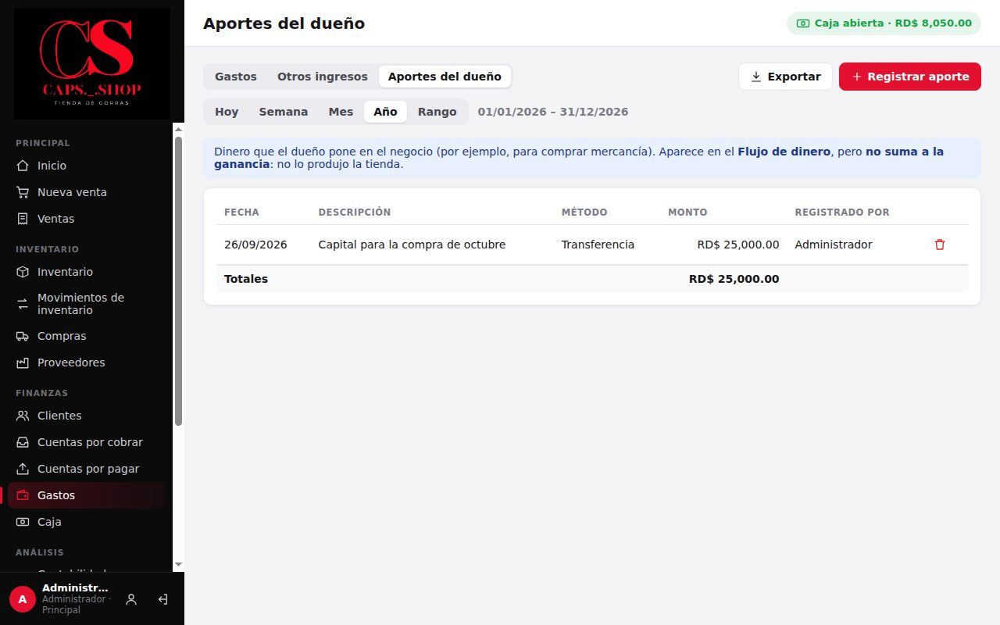

# 8. Gastos e ingresos

**Para qué sirve:** registrar todo lo que el negocio paga que no es mercancía (alquiler, nómina, luz, publicidad, delivery…) y los ingresos que no son ventas. Con eso se calcula la ganancia neta.

**Quién:** solo el **Administrador**.

> **Compra de mercancía ≠ gasto.** Las gorras se registran en **Compras**, no aquí. Si se registran como gasto, la ganancia se descuenta dos veces.

## 8.1 Registrar un gasto

Menú **Finanzas** → **Gastos**.

1. Pulse **Registrar gasto**.
2. Complete los campos:
   - **Categoría:** Alquiler, Transporte, Publicidad, Nómina, Servicios, Internet, Delivery u Otros. Se pueden cambiar en [Configuración](11-configuracion-y-respaldos.md).
   - **Fecha:** puede ser anterior a hoy, pero no futura.
   - **Descripción:** por ejemplo "Luz de agosto".
   - **Monto.**
   - **Método de pago.**
3. Pulse **Guardar**.

### Qué cambia en el sistema
- **Ganancias:** el gasto resta en la ganancia neta del período de su **fecha**.
- **Dinero:** sale como "Gastos" en el flujo de dinero. Si fue en efectivo, sale de la **caja abierta en ese momento**, aunque la fecha del gasto sea anterior.
- **Historial:** queda registrado quién lo anotó y cuándo.

## 8.2 Consultar y anular

- La lista muestra los gastos del período con fecha, categoría, descripción, método, monto, quién lo registró y cuándo. A la derecha está el total por categoría.
- Filtre por período y por categoría. **Exportar** guarda la lista en CSV.
- **Anular:** pulse el ícono de papelera de la fila y escriba el motivo. El gasto deja de contar y su dinero se registra como entrada ("Gastos anulados"). No se borra: queda en el historial.

## 8.3 Otros ingresos

En la misma pantalla, pestaña **Otros ingresos**, se registra el dinero que entra y no es una venta de gorras.
- Ejemplos: un servicio de bordado o la venta de cajas vacías.
- Categorías por defecto: Otros ingresos y Servicios.
- Funciona igual que los gastos: **Registrar ingreso**, filtros y anulación.

Los otros ingresos **suman** en la ganancia neta.

## 8.3.1 Aportes del dueño

Pestaña **Aportes del dueño**: el dinero que el dueño pone en el negocio, por ejemplo para una compra grande.
- **Registrar aporte** pide fecha, monto, método y descripción.
- El aporte aparece en **Flujo de dinero** como dinero que entró, pero **no suma a la ganancia**: no lo produjo la tienda (DT-21).
- Si se registró por error, anúlelo con el ícono de la papelera y un motivo.

Si en una versión anterior registró aportes como **Otros ingresos → Aporte del dueño**, esos siguen sumando a la ganancia. Anúlelos y regístrelos de nuevo aquí si quiere corregir los números.

## 8.4 Errores comunes

| Mensaje | Qué hacer |
|---|---|
| **Monto debe ser mayor que cero.** | Escriba un monto válido |
| **Categoría es obligatorio.** | Elija una categoría |
| **La caja está cerrada…** | Gasto en efectivo sin caja abierta: abra la caja o use otro método |
| **El gasto ya está anulado.** | No se puede anular dos veces |
| **La categoría "…" no está en la lista.** | Solo se usan las categorías de Configuración → **Categorías**: agréguela ahí |
| **Fecha no puede ser posterior a hoy.** | Un gasto, un ingreso o un aporte se registra cuando ya ocurrió |
| **Fecha: la fecha … no existe.** | Revise el día y el mes (por ejemplo, no hay 31 de junio) |
