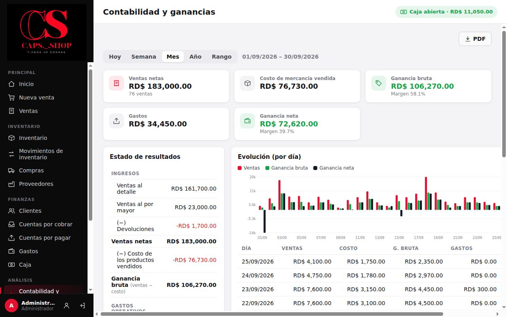
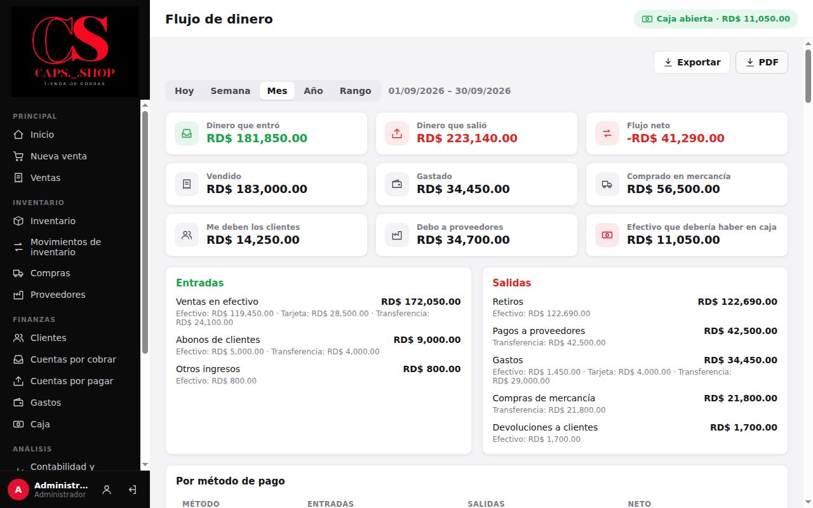
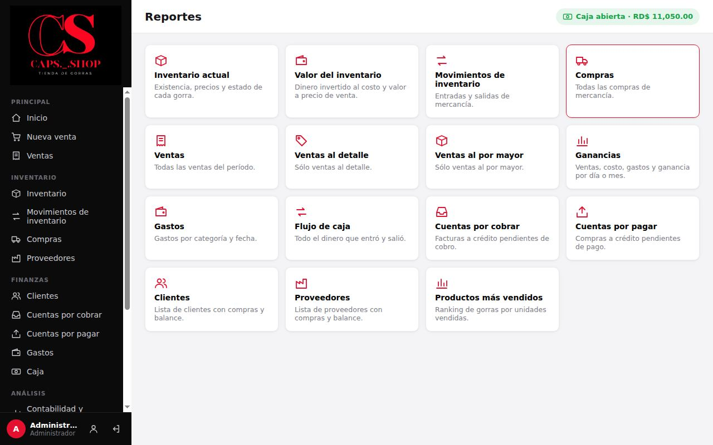
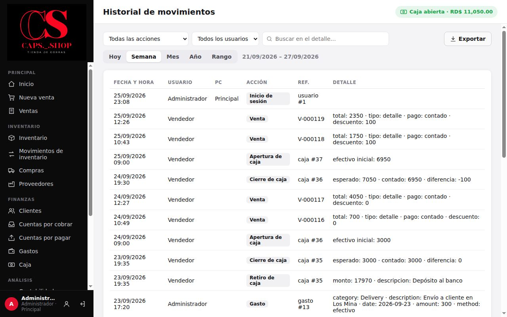

# 9. Contabilidad y reportes

**Para qué sirve:** saber cuánto se ganó de verdad, cuánto dinero entró y salió, y sacar listados para revisar o archivar.

**Quién:** solo el **Administrador**. El vendedor ve en **Inicio** las ventas de hoy y del mes y lo que deben los clientes, sin costos ni ganancias.

## 9.1 Contabilidad y ganancias

Menú **Análisis** → **Contabilidad y ganancias**.



1. Elija el período:
   - **Hoy**.
   - **Semana**: de lunes a domingo.
   - **Mes**.
   - **Año**.
   - **Rango**: dos fechas a elección.
2. Arriba ve **Ventas netas**, **Costo de mercancía vendida**, **Ganancia bruta** (con su margen), **Gastos** y **Ganancia neta** (con su margen).
3. **Estado de resultados:** el desglose línea por línea.
   ```
     Ventas al detalle
   + Ventas al por mayor
   − Devoluciones
   = Ventas netas
   − Costo de los productos vendidos
   = Ganancia bruta
   − Gastos operativos (por categoría)
   + Otros ingresos
   = GANANCIA NETA
   ```
4. **Evolución:** gráfico y tabla de ventas, costo, ganancia bruta, gastos y ganancia neta. Es por día, o por mes si el período dura más de dos meses.
5. **PDF** guarda la página en PDF.

Cómo se calcula cada número, con ejemplos: [Reglas de negocio](../producto/reglas-de-negocio.md#2-ganancia).

**Cómo leerlo:**
- Las **compras de mercancía no aparecen como gasto**. Pasan a costo cuando la gorra se vende.
- Un día puede salir con ganancia neta negativa, por ejemplo el día que se pagó el alquiler. El mes es lo que importa.

## 9.2 Flujo de dinero

Menú **Análisis** → **Flujo de dinero**.



- **Dinero que entró**, **Dinero que salió** y **Flujo neto** del período, con todos los métodos de pago.
- **Datos del período:** **Vendido**, **Gastado** y **Comprado en mercancía**.
- **Datos de hoy** (no dependen del período): **Me deben los clientes**, **Debo a proveedores** y **Efectivo que debería haber en caja**.
- **Entradas** y **Salidas** por concepto, cada uno con el detalle por método.
- **Por método de pago:** entradas, salidas y neto de efectivo, tarjeta, transferencia y otro.
- **Detalle de movimientos:** cada entrada y salida. **Exportar** y **PDF**.

> Los **depósitos al banco** no cuentan como entrada ni salida: el dinero solo cambia de lugar. Se ven en **Efectivo depositado al banco** y en **Por método de pago**. Los **aportes del dueño** sí cuentan como dinero que entró (tarjeta **Aportes del dueño**), pero no como ganancia. En la captura, de una versión anterior, los depósitos registrados como **Retiro** aparecen como salidas. Ver [Caja, 7.5](07-caja.md#75-depósito-al-banco-o-retiro).

## 9.3 Reportes

Menú **Análisis** → **Reportes**.



| Reporte | Qué muestra | Período |
|---|---|---|
| Inventario actual | Existencia, precios y estado de cada gorra | Hoy |
| Valor del inventario | Valor al costo, al detalle y por mayor de lo que hay | Hoy |
| Movimientos de inventario | Entradas y salidas | ✔ |
| Compras | Todas las compras | ✔ |
| Ventas | Todas las ventas | ✔ |
| Ventas al detalle | Solo detalle | ✔ |
| Ventas al por mayor | Solo por mayor | ✔ |
| Ganancias | Ventas, costo, gastos y ganancia por día o mes | ✔ |
| Gastos | Gastos por categoría y fecha | ✔ |
| Flujo de caja | Todo el dinero que entró y salió | ✔ |
| Cuentas por cobrar | Facturas a crédito pendientes | Hoy |
| Cuentas por pagar | Compras a crédito pendientes | Hoy |
| Clientes | Clientes con compras y balance | Hoy |
| Proveedores | Proveedores con compras y balance | Hoy |
| Productos más vendidos | Ranking por unidades, con ventas, costo y ganancia | ✔ |

Dentro de cada reporte:
- **Excel (CSV)** guarda un archivo que abre Excel, con acentos correctos.
- **PDF** guarda el reporte con el logo y el período en el encabezado.
- **Imprimir** lo manda a la impresora.
- **← Todos los reportes** vuelve a la lista.

**Reportes largos:** en pantalla se ven las primeras **1,000 filas**, con el aviso "Se muestran 1,000 de N filas" y el botón **Mostrar todas**. Los **totales**, el **CSV**, el **PDF** y **Imprimir** incluyen siempre **todas** las filas.

## 9.4 Historial de movimientos

Menú **Análisis** → **Historial de movimientos**.



Registro de **todo lo que se hizo**, con fecha, hora y usuario:
- inicios de sesión;
- ventas, compras, pagos y abonos;
- ajustes, devoluciones y anulaciones;
- cambios de precio y de costo, con el valor anterior y el nuevo;
- aperturas, cierres y retiros de caja;
- cambios de usuarios y de configuración.

Se puede filtrar por período, acción y usuario, y buscar en el detalle. No se puede editar ni borrar.

> En los gastos, el detalle aparece hoy con nombres de campo en inglés (`category`, `amount`…). Está anotado para corregir ([Objetivos](../producto/objetivos.md#o5-brechas-funcionales)).
