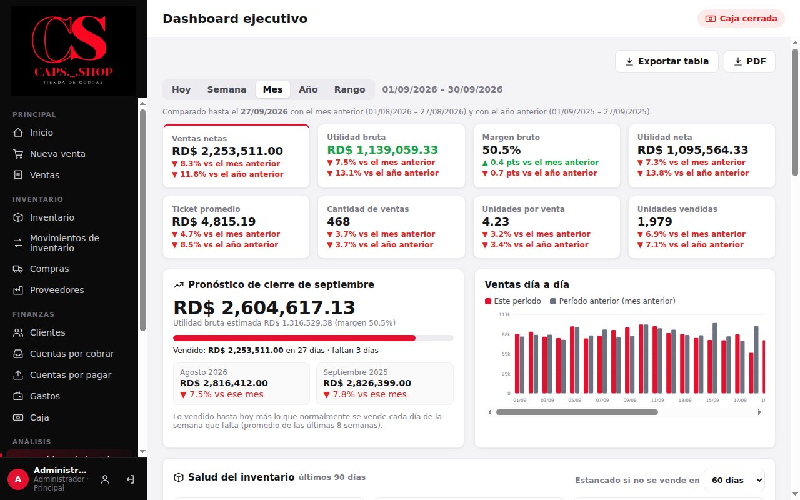
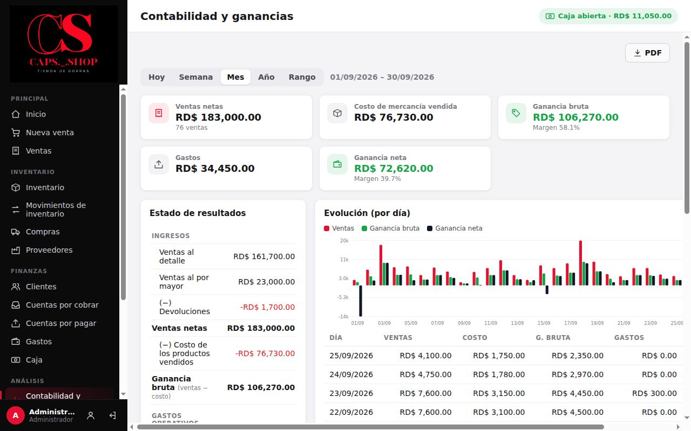
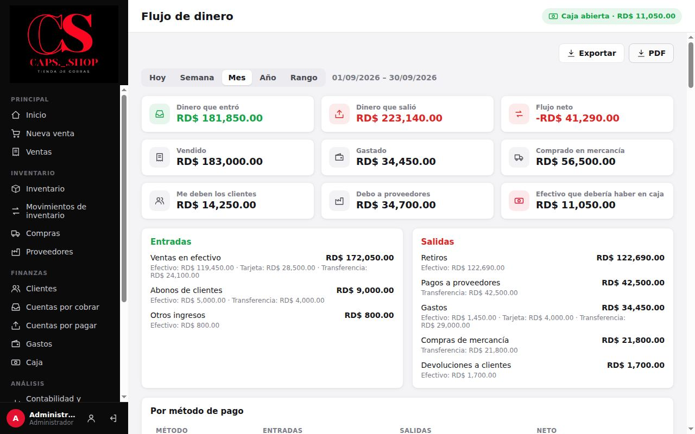
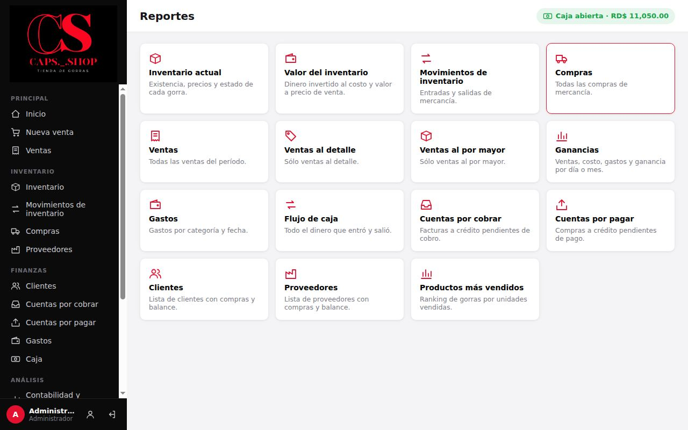
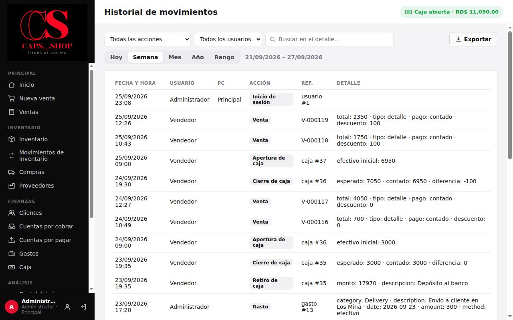
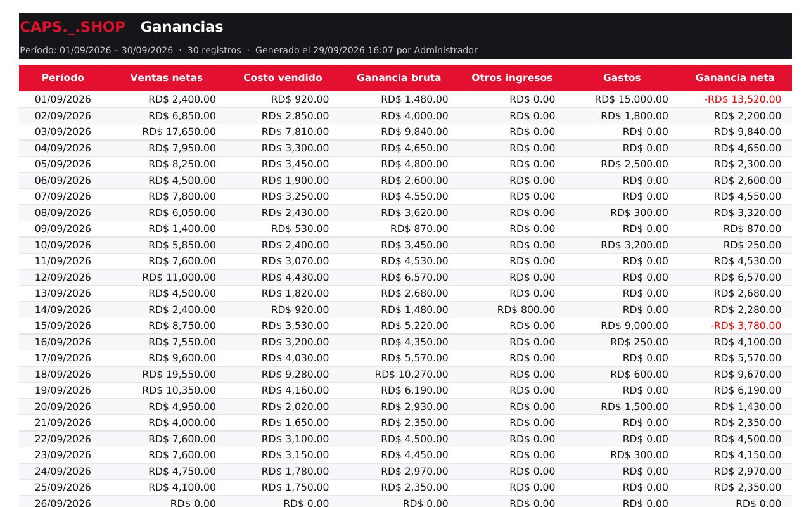

# 9. Contabilidad y reportes

**Para qué sirve:** saber cuánto se ganó de verdad, cuánto dinero entró y salió, y sacar listados para revisar o archivar.

**Quién:** solo el **Administrador**. El vendedor ve en **Inicio** las ventas de hoy y del mes y lo que deben los clientes, sin costos ni ganancias.

## 9.1 Dashboard ejecutivo

Menú **Análisis** → **Dashboard ejecutivo**, o **Dashboard ejecutivo** en la tarjeta "Últimos 30 días" del Inicio.



Responde **cómo va el negocio comparado con antes**, no solo cuánto se vendió. Arriba se elige el período: **Hoy**, **Semana**, **Mes**, **Año** o **Rango**.

**Comparaciones.** Cada indicador dice cuánto subió (▲ verde) o bajó (▼ rojo) contra:
- el período anterior: **ayer**, la semana anterior, **el mes anterior** o el año anterior, según lo elegido;
- el **mismo período del año anterior** (salvo con **Año**, que ya es esa comparación).

Si el período no ha terminado, se compara **hasta el mismo día**: del 1 al 15 de este mes contra del 1 al 15 del mes anterior. La línea debajo del período dice exactamente qué fechas se comparan.

| Indicador | Qué es |
|---|---|
| **Ventas netas** | Lo vendido menos las devoluciones, como en Contabilidad |
| **Utilidad bruta** | Ventas netas menos lo que costaron esas gorras |
| **Margen bruto** | Utilidad bruta ÷ ventas netas. Su cambio se mide en **puntos**: de 50% a 52% son +2 pts |
| **Utilidad neta** | Utilidad bruta menos gastos, más otros ingresos |
| **Ticket promedio** | Lo que deja, en promedio, cada venta |
| **Cantidad de ventas** | Cuántas ventas (recibos) se hicieron |
| **Unidades por venta** | Cuántas gorras lleva, en promedio, cada venta |
| **Unidades vendidas** | Gorras vendidas menos las devueltas |

**Pronóstico de cierre de mes.** Cuánto se venderá este mes si se sigue al ritmo normal:
- suma lo vendido hasta hoy y lo que normalmente se vende **cada día de la semana** que falta (el promedio de los sábados, de los lunes…, de las últimas 8 semanas);
- hoy cuenta lo vendido o lo normal de un día así, lo que sea mayor, porque el día no ha terminado;
- con menos de 2 semanas de historia usa lo vendido por día en lo que va de mes;
- muestra también la utilidad bruta estimada y lo compara con el mes anterior y con el mismo mes del año pasado.

Es una estimación: un día festivo o una promoción la cambian.

**Ventas día a día.** El gráfico pone cada día del período al lado del mismo día del período anterior.

**Salud del inventario** (siempre con los últimos 90 días, para que no dependa del período elegido):

| Dato | Qué dice | Cómo leerlo |
|---|---|---|
| **Rotación** | Cuántas veces al año se vende todo el inventario a este ritmo | Más alto es mejor: la mercancía no se queda parada |
| **Días de inventario** | Cuántos días dura la mercancía de hoy si se sigue vendiendo igual | Si pasa de 180 días se marca en amarillo: sobra mercancía |
| **Productos estancados** | Gorras con existencia que no se venden hace 30, 60, 90 o 180 días (se elige arriba a la derecha) y que llevan al menos ese tiempo en la tienda | Candidatas a promoción o a no volver a comprar |
| **Dinero parado** | Lo que costó la mercancía estancada | Dinero que podría estar en otra cosa |

La lista de estancados muestra las 10 con más dinero parado; **Mostrar todas** trae el resto. Un clic en una abre su ficha.

**Utilidad por…** Las pestañas **Producto**, **Marca**, **Categoría** y **Vendedor** muestran unidades, ventas, costo, utilidad y margen de cada uno, de mayor a menor utilidad:
- por **Producto** se ven las 25 que más dejan; **Mostrar todas** trae el resto;
- por **Vendedor** se agregan la cantidad de ventas y el ticket promedio. Una devolución se resta de quien hizo la venta;
- la **Categoría** se pone en la ficha de cada producto ([manual 4.2](04-inventario.md#42-crear-un-producto-administrador)). Las que no tienen salen como "Sin categoría".

**Exportar tabla** guarda en Excel la pestaña que se está viendo. **PDF** guarda toda la pantalla.

> Solo el administrador ve el dashboard ejecutivo.

## 9.2 Contabilidad y ganancias

Menú **Análisis** → **Contabilidad y ganancias**.



1. Elija el período:
   - **Hoy**.
   - **Semana**: de lunes a domingo.
   - **Mes**.
   - **Año**.
   - **Rango**: dos fechas a elección.
2. Arriba ve **Ventas netas**, **Costo de mercancía vendida**, **Ganancia bruta** (con su margen), **Gastos** y **Ganancia neta** (con su margen).
3. **Estado de resultados:** el desglose línea por línea.
   ```
     Ventas al detalle
   + Ventas al por mayor
   − Devoluciones
   = Ventas netas
   − Costo de los productos vendidos
   = Ganancia bruta
   − Gastos operativos (por categoría)
   + Otros ingresos
   = GANANCIA NETA
   ```
4. **Evolución:** gráfico y tabla de ventas, costo, ganancia bruta, gastos y ganancia neta. Es por día, o por mes si el período dura más de dos meses.
5. **PDF** guarda la página en PDF.

Cómo se calcula cada número, con ejemplos: [Reglas de negocio](../producto/reglas-de-negocio.md#2-ganancia).

**Cómo leerlo:**
- Las **compras de mercancía no aparecen como gasto**. Pasan a costo cuando la gorra se vende.
- Un día puede salir con ganancia neta negativa, por ejemplo el día que se pagó el alquiler. El mes es lo que importa.

## 9.3 Flujo de dinero

Menú **Análisis** → **Flujo de dinero**.



- **Dinero que entró**, **Dinero que salió** y **Flujo neto** del período, con todos los métodos de pago.
- **Datos del período:** **Vendido**, **Gastado** y **Comprado en mercancía**.
- **Datos de hoy** (no dependen del período): **Me deben los clientes**, **Debo a proveedores** y **Efectivo que debería haber en caja**.
- **Entradas** y **Salidas** por concepto, cada uno con el detalle por método.
- **Por método de pago:** entradas, salidas y neto de efectivo, tarjeta, transferencia y otro.
- **Detalle de movimientos:** cada entrada y salida. **Exportar** y **PDF**.

> Los **depósitos al banco** no cuentan como entrada ni salida: el dinero solo cambia de lugar. Se ven en **Efectivo depositado al banco** y en **Por método de pago**. Los **aportes del dueño** sí cuentan como dinero que entró (tarjeta **Aportes del dueño**), pero no como ganancia. En la captura, de una versión anterior, los depósitos registrados como **Retiro** aparecen como salidas. Un depósito que no llegó al banco (marcado en [Depósitos por verificar](07-caja.md#74-depósitos-por-verificar-administrador)) sí es una salida: **Depósitos que no llegaron al banco**. Ver [Caja, 7.6](07-caja.md#76-depósito-al-banco-o-retiro).

## 9.4 Reportes

Menú **Análisis** → **Reportes**.



| Reporte | Qué muestra | Período |
|---|---|---|
| Inventario actual | Existencia, precios y estado de cada gorra | Hoy |
| Valor del inventario | Valor al costo, al detalle y por mayor de lo que hay | Hoy |
| Movimientos de inventario | Entradas y salidas | ✔ |
| Compras | Todas las compras | ✔ |
| Ventas | Todas las ventas | ✔ |
| Ventas al detalle | Solo detalle | ✔ |
| Ventas al por mayor | Solo por mayor | ✔ |
| Ganancias | Ventas, costo, gastos y ganancia por día o mes | ✔ |
| Gastos | Gastos por categoría y fecha | ✔ |
| Flujo de caja | Todo el dinero que entró y salió | ✔ |
| Cuentas por cobrar | Facturas a crédito pendientes | Hoy |
| Cuentas por pagar | Compras a crédito pendientes | Hoy |
| Clientes | Clientes con compras y balance | Hoy |
| Proveedores | Proveedores con compras y balance | Hoy |
| Productos más vendidos | Ranking por unidades, con ventas, costo y ganancia | ✔ |

Dentro de cada reporte:
- **Excel** guarda el reporte en un libro de Excel con formato ([9.6](#96-exportar-a-excel)).
- **PDF** guarda el reporte con el logo y el período en el encabezado.
- **Imprimir** lo manda a la impresora.
- **← Todos los reportes** vuelve a la lista.

**Reportes largos:** en pantalla se ven las primeras **1,000 filas**, con el aviso "Se muestran 1,000 de N filas" y el botón **Mostrar todas**. Los **totales**, el **Excel**, el **PDF** y **Imprimir** incluyen siempre **todas** las filas.

## 9.5 Historial de movimientos

Menú **Análisis** → **Historial de movimientos**.



Registro de **todo lo que se hizo**, con fecha, hora y usuario:
- inicios de sesión;
- ventas, compras, pagos y abonos;
- ajustes, devoluciones y anulaciones;
- cambios de precio y de costo, con el valor anterior y el nuevo;
- aperturas, cierres y retiros de caja;
- cambios de usuarios y de configuración.

Se puede filtrar por período, acción y usuario, y buscar en el detalle. No se puede editar ni borrar.

> En los gastos, el detalle aparece hoy con nombres de campo en inglés (`category`, `amount`…). Está anotado para corregir ([Objetivos](../producto/objetivos.md#o5-brechas-funcionales)).

## 9.6 Exportar a Excel

Los botones **Exportar** de cada lista (ventas, inventario, clientes, compras, gastos, apartados…), **Excel** en los reportes y **Exportar tabla** en el dashboard ejecutivo guardan un **libro de Excel (.xlsx)** listo para leer, imprimir o enviar.



El archivo trae:
- arriba, el **nombre de la tienda** y el **título** de la pantalla o del reporte, el **período** elegido, cuántos registros son, la fecha y quién lo generó;
- los **títulos de las columnas** en rojo, que quedan fijos al bajar, con **filtros** para ordenar o buscar;
- los **montos** con la moneda (RD$) y los negativos en rojo, las **fechas** como fechas de Excel y los **porcentajes** con su signo. Son números de verdad: se pueden sumar o graficar;
- los **códigos** y **SKU** tal como se escribieron: Excel no les quita los ceros ni los convierte en 7.5E+12;
- la fila de **Totales**, igual que en pantalla;
- lo que se ve en pantalla ("Crédito", "Por mayor"), no los códigos internos;
- al imprimir, todo el ancho en una hoja, los títulos repetidos en cada página y el número de página al pie.

**CSV:** en la ventana de guardar, en **Tipo**, se puede elegir **CSV** en lugar de Excel. Sirve para pasar los datos a otro programa. Usa el separador de la región de Windows, o el que se elija en Configuración ([11.1](11-configuracion-y-respaldos.md#111-configuración)).
