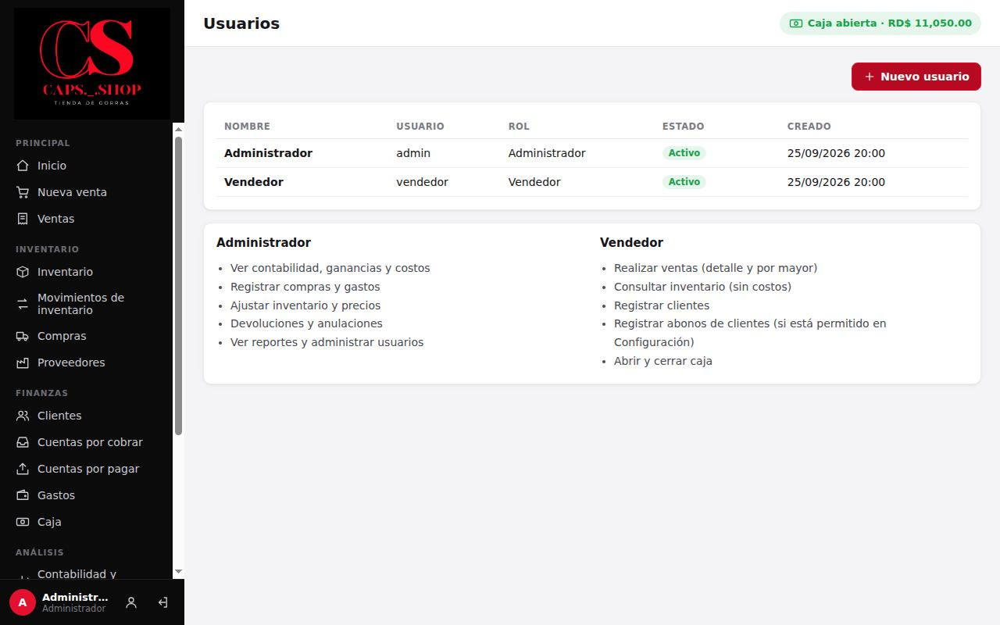
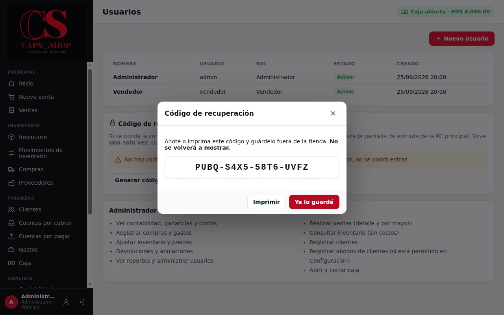
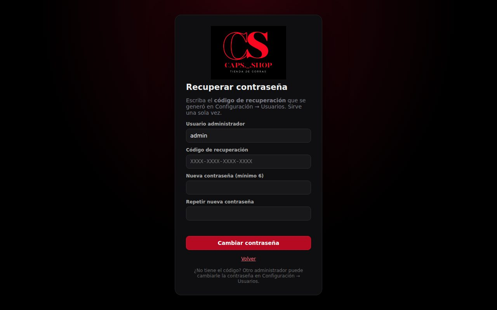

# 10. Usuarios y permisos

**Para qué sirve:** que cada persona entre con su propio usuario, que todo quede registrado a su nombre y que el vendedor no vea costos ni ganancias.

**Quién administra usuarios:** solo el **Administrador**.

## 10.1 Los dos perfiles

| Área | Vendedor | Administrador |
|---|:---:|:---:|
| Inicio (resumen) | Reducido: ventas, lo que deben los clientes, caja e inventario en unidades | Completo |
| Nueva venta | ✔ | ✔ |
| Descuentos | Hasta el máximo configurado, si está permitido | Sin límite |
| Cambiar precio en la venta | ✘ | ✔ |
| Historial de ventas | ✔ sin costos | ✔ |
| Devoluciones y anulaciones de ventas | ✘ | ✔ |
| Inventario y movimientos (consultar) | ✔ sin costos | ✔ |
| Crear o editar productos, ajustar existencias | ✘ | ✔ |
| Compras, proveedores y cuentas por pagar | ✘ | ✔ |
| Clientes (registrar y editar) | ✔ | ✔ |
| Cuentas por cobrar (ver) | ✔ | ✔ |
| Registrar abonos de clientes | ✔ si está permitido | ✔ |
| Caja: abrir, entradas, depósitos al banco y cerrar | ✔ | ✔ |
| Caja: retiros | ✘ | ✔ |
| Historial de cierres de caja | ✘ | ✔ |
| Gastos, otros ingresos y aportes del dueño | ✘ | ✔ |
| Saldos iniciales, importar productos | ✘ | ✔ |
| Imprimir etiquetas | ✔ | ✔ |
| Contabilidad, flujo de dinero y reportes | ✘ | ✔ |
| Historial de movimientos | ✘ | ✔ |
| Usuarios y configuración | ✘ | ✔ |

Los permisos se comprueban en el núcleo del sistema, no solo en la pantalla. Aunque alguien intente una operación no permitida, el sistema la rechaza con **"No tiene permiso para realizar esta operación."**

## 10.2 Crear o editar usuarios

Menú **Sistema** → **Usuarios**.

- **Nuevo usuario:** **Nombre**, **Usuario (para entrar)**, **Rol** y **Contraseña inicial**, de al menos 8 caracteres.
- **Editar:** pulse el usuario.
  - Se puede cambiar el nombre, el usuario y el rol, y activar o desactivar.
  - **Nueva contraseña** restablece la contraseña. Déjela vacía para no cambiarla.
  - Un usuario desactivado ya no puede entrar. Si estaba dentro, se le cierra la sesión en su siguiente acción.
- Al crear un usuario o cambiarle la contraseña, se le pedirá cambiarla la próxima vez que entre.
- El sistema se entrega con dos usuarios, pero se pueden crear más.
- Un administrador no puede quitarse a sí mismo el rol ni desactivarse.

## 10.3 Cambiar la propia contraseña

Cualquier usuario: ícono de persona al pie del menú izquierdo → **Contraseña actual**, **Nueva contraseña** y repetirla → **Guardar**.

## 10.4 Si se olvida una contraseña

- **Vendedor:** el administrador le pone una nueva en **Usuarios**.
- **Administrador:** otro administrador puede ponerle una nueva en **Usuarios**. Si no hay otro, use el **código de recuperación**.

### Código de recuperación

**Genérelo el primer día** y guárdelo fuera de la tienda.
1. **Usuarios** → **Código de recuperación** → **Generar código…**, y escriba su contraseña.
2. Anote o **imprima** el código (por ejemplo `RJUU-QNZ7-95FP-FRV7`). **No se vuelve a mostrar.**
3. Guárdelo en un lugar seguro, fuera de la tienda, y no lo comparta.

Para usarlo:

1. En la **PC principal**, pantalla de entrada → **¿Olvidó la contraseña del administrador?**
2. Escriba el usuario administrador, el código (con o sin guiones) y la contraseña nueva dos veces.
3. Entre con la contraseña nueva.

El código **sirve una sola vez**: después genere otro. Si genera uno nuevo, el anterior deja de servir. Todo queda en el **Historial de movimientos**.

## 10.5 Errores comunes

| Mensaje | Qué hacer |
|---|---|
| **Usuario o contraseña incorrectos.** | Revise mayúsculas y el usuario |
| **La contraseña debe tener al menos 8 caracteres.** | Use una más larga. Las contraseñas que ya existían siguen sirviendo; la regla aplica al ponerlas o cambiarlas |
| **La contraseña actual no es correcta.** | Al cambiarla, escriba bien la actual |
| **Ya existe un usuario con ese nombre de usuario.** | Elija otro |
| **Su usuario fue desactivado.** | Hable con el administrador |
| **No tiene permiso para realizar esta operación.** | La acción es solo para el administrador |
