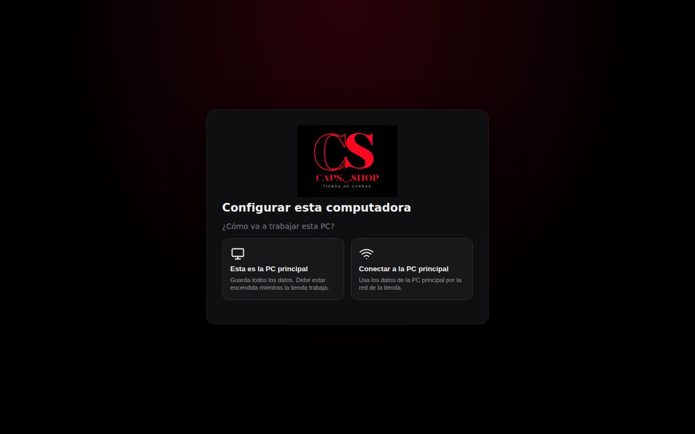
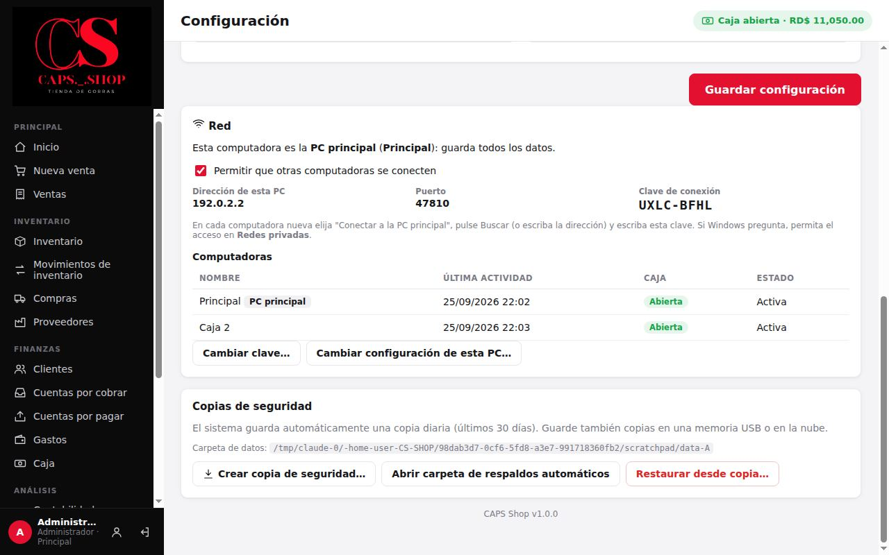
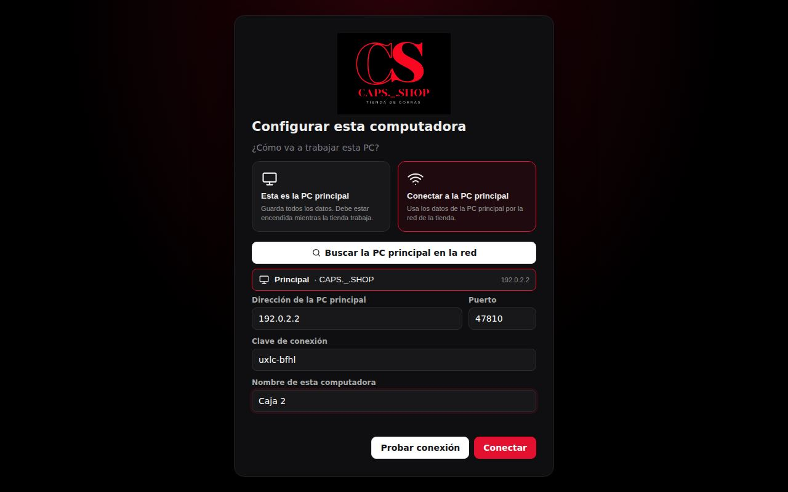
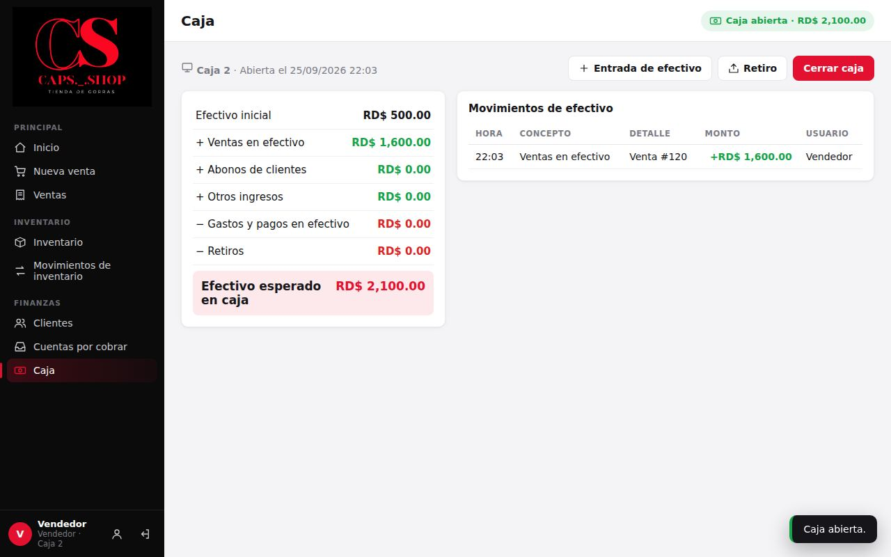
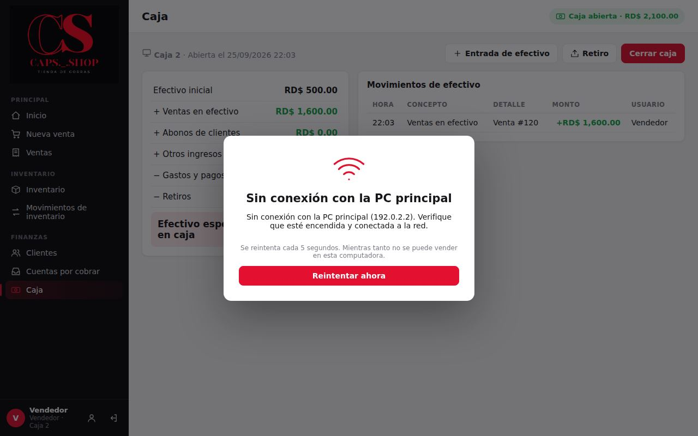

# 13. Varias computadoras en red

**Para qué sirve:** que dos o más computadoras de la tienda trabajen al mismo tiempo con los mismos datos: el mismo inventario, los mismos clientes y los mismos reportes. Cada computadora tiene **su propia caja**.

**Quién:**

| Acción | Vendedor | Administrador |
|---|:---:|:---:|
| Configurar una computadora nueva (la primera vez) | ✔ | ✔ |
| Activar la red, ver o cambiar la clave, renombrar o desactivar computadoras | ✘ | ✔ |
| Volver a configurar una computadora ya configurada | Solo desde la pantalla de entrada, si no hay conexión | ✔ |

## 13.1 Cómo funciona

- **La PC principal** guarda todos los datos: la base, las fotos y los respaldos. También se usa para vender.
- **Las demás computadoras** se conectan a la principal por la red de la tienda (cable o WiFi). No guardan datos propios: todo lo que hacen queda en la principal al instante.
- **No hace falta internet.** Basta con que todas estén en la misma red.
- **La PC principal debe estar encendida** mientras la tienda trabaja. Si se apaga, las demás no pueden trabajar hasta que vuelva (13.6).

Elija como principal la computadora que siempre está encendida, por ejemplo la de la oficina o la caja principal.

## 13.2 Preparar la PC principal

**Si ya usaba CAPS Shop en una computadora**, esa es la principal: sus datos se conservan al actualizar.
1. Entre como administrador → **Sistema** → **Configuración** → sección **Red**.
2. Marque **Permitir que otras computadoras se conecten**.
3. Si Windows pregunta si permite el acceso de CAPS Shop a la red, marque **Redes privadas** y pulse **Permitir acceso**. Hace falta hacerlo una vez, con una cuenta de Windows que sea administradora.

**Si es una instalación nueva**, la primera pantalla es **Configurar esta computadora**:

1. Elija **Esta es la PC principal**.
2. Escriba un **Nombre de esta computadora**, por ejemplo "Oficina".
3. Pulse **Configurar como PC principal**. El programa se reinicia y la red queda activada.
4. Entre con `admin` / `admin123` y siga [Primeros pasos](01-primeros-pasos.md).

En **Configuración → Red** de la principal están los datos para conectar las demás:

| Dato | Para qué |
|---|---|
| **Dirección de esta PC** | Se escribe en las demás si **Buscar** no la encuentra |
| **Puerto** | Normalmente 47810; no hace falta cambiarlo |
| **Clave de conexión** | Se escribe en cada computadora nueva. Solo quien tenga la clave puede conectarse |
| **Computadoras** | Las PCs conectadas, su última actividad y si su caja está abierta |

> **Recomendado:** pida a quien instaló la red que le dé a la PC principal una **dirección fija** en el router. Si cambia de dirección, las demás la vuelven a buscar solas, pero con una dirección fija es más seguro.

## 13.3 Conectar otra computadora

1. Instale CAPS Shop en la computadora, **la misma versión** que tiene la principal.
2. Ábralo. En **Configurar esta computadora** elija **Conectar a la PC principal**.
3. Pulse **Buscar la PC principal en la red** y elija la que aparece. Si no aparece ninguna, escriba la **Dirección** que muestra la principal en Configuración → Red.
4. Escriba la **Clave de conexión**. Da igual si es en mayúsculas o minúsculas.
5. Escriba un **Nombre de esta computadora**, por ejemplo "Caja 2". Ese nombre sale en la caja, en el historial y en la lista de computadoras.
6. Pulse **Probar conexión**. Debe decir **Conexión correcta con "…"**.
7. Pulse **Conectar**. El programa se reinicia.

Desde ahí se entra con los mismos usuarios de la principal. La pantalla de entrada muestra a qué principal está conectada:

## 13.4 La caja de cada computadora

Cada computadora abre y cierra **su propia caja** ([Caja](07-caja.md)):
- El efectivo de una venta o un abono entra en la caja de la computadora donde se cobró.
- Para cobrar en efectivo, la caja de **esa** computadora debe estar abierta.
- Al cerrar, cada una cuadra su propia gaveta.

El administrador ve en **Caja** las **Cajas abiertas en otras computadoras**, y en el **Historial de cierres** la columna **PC**. El **Inicio** suma el efectivo de todas las cajas.

## 13.5 Administrar las computadoras (administrador)

En la PC principal, **Configuración → Red → Computadoras**, pulse una computadora para:
- **cambiarle el nombre**;
- **desactivarla**: deja de funcionar al instante, por ejemplo si se dañó o se la llevaron. Antes debe cerrar su caja. Para usarla otra vez, márquela como **Activa**.

**Cambiar clave…** crea una clave nueva. Úsela si cree que alguien ajeno la conoce. Las computadoras conectadas dejarán de funcionar hasta que se les escriba la clave nueva: en la pantalla de entrada aparece **Configurar esta PC**.

**Cambiar configuración de esta PC…** vuelve a la pantalla **Configurar esta computadora**. Si una computadora conectada pasa a ser principal, usa los datos que tenía guardados antes de conectarse o, si no tenía, empieza vacía. No se lleva los datos de la principal: para eso, restaure una copia ([Configuración y respaldos](11-configuracion-y-respaldos.md)).

## 13.6 Si no hay conexión con la PC principal

La computadora muestra **Sin conexión con la PC principal** y reintenta sola cada 5 segundos. Mientras tanto **no se puede vender** en esa computadora.

1. Revise que la PC principal esté encendida y con CAPS Shop abierto.
2. Revise que las dos computadoras estén conectadas a la red: cable, WiFi, router encendido.
3. Pulse **Reintentar ahora**.

Cuando vuelve la conexión:
- Si la principal se reinició, pide entrar de nuevo con **Su sesión terminó. Vuelva a entrar.**
- Si una operación quedó a medias, sale el aviso **No se pudo confirmar la operación con la PC principal…**. Antes de repetirla, revise en **Ventas** (o donde corresponda) si quedó registrada.

## 13.7 Qué cambia en el sistema

- Cada computadora queda registrada en la principal con su nombre.
- El **Historial de movimientos** guarda desde qué computadora se hizo cada cosa (columna **PC**).
- Las **copias de seguridad** se hacen solo en la PC principal: ahí están todos los datos ([Configuración y respaldos](11-configuracion-y-respaldos.md)).
- Los recibos, los PDF y los archivos de Excel se imprimen y guardan en la computadora donde se piden.

## 13.8 Errores comunes

| Mensaje | Qué hacer |
|---|---|
| **Sin conexión con la PC principal (…). Verifique que esté encendida y conectada a la red.** | 13.6 |
| **Clave de conexión incorrecta. Revísela en la PC principal: Configuración → Red.** | Escriba la clave correcta. Si la cambiaron, en la pantalla de entrada pulse **Configurar esta PC** |
| **La PC principal tiene la versión X y esta computadora la Y. Instale la misma versión en todas las computadoras.** | Instale la misma versión en todas |
| **Esta computadora fue desactivada por el administrador.** | El administrador debe activarla en Configuración → Red |
| **Esta computadora no está registrada en la PC principal. Vuelva a conectarla.** | Pasa si se restauró en la principal una copia anterior a la conexión. Vuelva a configurarla (13.3) |
| **Ese nombre es el de la PC principal. Use otro nombre para esta computadora.** | Elija otro nombre |
| **Demasiados intentos fallidos. Espere un minuto e intente de nuevo.** | Se equivocaron 5 veces con la contraseña en un minuto |
| **Demasiados intentos con una clave incorrecta. Espere un minuto.** | Se probó la clave muchas veces. Espere y escríbala bien |
| **El puerto 47810 está ocupado por otro programa…** (en Configuración → Red de la principal) | Otro programa usa ese puerto. Reinicie la computadora; si sigue, avise al soporte |
| **Buscar** no encuentra ninguna | La principal debe tener marcada **Permitir que otras computadoras se conecten**, y Windows debe permitir **Redes privadas**. Escriba la dirección a mano |
| **Las copias de seguridad se hacen en la PC principal.** | Haga la copia en la PC principal |
