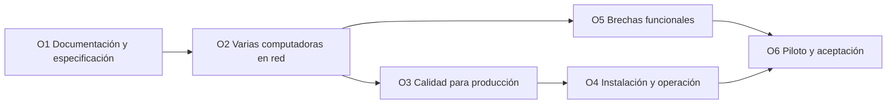

# Objetivos

Hoja de ruta de CAPS Shop hacia producción. El trabajo se hace **por objetivos**:

1. **Un objetivo a la vez**, con meta, entregables y criterio de terminado claros.
2. **Cada objetivo se entrega en uno o más pull requests** revisados. No se une nada con CI en rojo.
3. **Al terminar un objetivo** se actualizan [Requisitos](requisitos.md), [Decisiones](decisiones.md), el manual si cambió algo visible, y el [CHANGELOG](../../CHANGELOG.md).
4. **Las decisiones pendientes** de un objetivo se resuelven **antes** de empezar a programarlo.

## Estado actual (versión 1.0.0 y lo hecho después, sin publicar)

**Lo que está listo:**
- Todas las funciones pedidas: inventario, compras, ventas, clientes, cuentas, gastos, caja, contabilidad, dashboard, 15 reportes, usuarios e historial ([Requisitos](requisitos.md), 100 de 103 cumplen).
- Varias computadoras en red, cada una con su caja (O2), con la red cifrada (O3).
- Pruebas automáticas en cada cambio, en Linux y Windows (O3):
  - 40 de lógica, migración, respaldos, permisos y red;
  - 7 de interfaz con la app real;
  - rendimiento con 3 años de datos;
  - el instalador instalado de verdad.
- Registro de errores y **Guardar diagnóstico** (O3).
- Instalador de Windows generado y publicado automáticamente en GitHub.

**Lo que NO está listo para producción:**

| # | Brecha | Consecuencia | Objetivo |
|---|---|---|---|
| 1 | ~~Funciona en una sola computadora~~ **Resuelto en O2**, pendiente de probar en la red real de la tienda | — | O6 |
| 2 | Instalador probado en CI (Windows Server), pero no en Windows 10/11 de escritorio | Podría haber diferencias en la tienda | O6 |
| 3 | Instalador sin firma digital | Windows muestra una advertencia y puede bloquearlo | O4 |
| 4 | Sin actualización automática | Cada versión nueva hay que instalarla a mano en cada PC | O4 |
| 5 | Respaldos solo en el mismo disco y sin fotos | Si el disco falla, se pierde todo | O4 |
| 6 | ~~Sin registro de errores~~, ~~rendimiento sin medir~~ e ~~interfaz sin pruebas~~ **Resueltos en O3** | — | — |
| 9 | Brechas funcionales (saldos iniciales, depósitos, ticket directo, etc.) | Operación diaria incompleta | O5 |
| 10 | No se ha usado con datos reales | No hay aceptación del cliente | O6 |

**Detalle técnico pendiente:** la etiqueta `v1.0.0` apunta al último commit de la rama de trabajo en lugar del commit de unión en `main`. El código es idéntico. En adelante, las versiones se crean con destino `main` ([Desarrollo y publicación](../tecnico/desarrollo-y-publicacion.md)).

## Mapa

O2 va primero porque cambia la base de todo el sistema. Hacer O3, O4 u O5 antes obligaría a rehacer parte del trabajo.

---

### O1. Documentación y especificación

**Estado:** hecho (PR #2, 25/09/2026).

**Meta:** que el sistema esté documentado y que esté escrito qué queremos, antes de seguir construyendo.

**Entregables:**
- Manual de uso para el dueño y el vendedor ([docs/manual](../manual/)).
- [Requisitos](requisitos.md) numerados con criterio de aceptación y estado.
- [Reglas de negocio](reglas-de-negocio.md) con ejemplos comprobados.
- Estos objetivos y el registro de [Decisiones](decisiones.md).
- Documentación técnica mínima ([docs/tecnico](../tecnico/)).
- README reorganizado y CHANGELOG.

**Terminado cuando:**
- Cada pantalla y cada mensaje de error del sistema están en el manual.
- Los ejemplos de las reglas coinciden con lo que calcula el sistema.
- Los enlaces funcionan.
- El cliente revisó y aprobó requisitos, objetivos y decisiones pendientes.

**Depende de:** nada.

---

### O2. Varias computadoras en red

**Estado:** hecho (PR #3, 25/09/2026). Decisiones: DT-13, DT-14 y DT-15. Diseño: [Red](../tecnico/red.md).

**Meta:** que dos o más computadoras de la tienda trabajen al mismo tiempo sobre los mismos datos.

**Modelo elegido (DT-13):** una **computadora principal** guarda la base de datos y atiende a las demás por la red local de la tienda. Las otras computadoras usan el mismo programa en modo "conectado a la principal". No necesita internet ni tiene costo mensual.

La base técnica ya ayuda: toda la lógica pasa por un único punto (`src/core/api.js`, tabla de operaciones con permisos). Ese punto se puede exponer por la red sin reescribir las reglas.

**Entregables:**
1. **Documento de diseño** con:
   - el modelo elegido;
   - qué pasa si la principal se apaga o se pierde la red;
   - cómo se configura cada PC;
   - la seguridad en la red.
2. **Base de datos** sin la limitación de la memoria (sql.js), con **migración automática** de los datos de la versión 1.0.0. Se usó `node:sqlite` en modo WAL (DT-16). Solo el proceso de la PC principal toca la base y atiende las operaciones de una en una.
3. **Sesiones por computadora:** cada PC con su usuario y su caja (DT-14).
4. **Pantalla para configurar** "esta PC es la principal" o "conectarse a la principal".
5. **Pruebas con 2 PCs** vendiendo a la vez sobre el mismo producto, sin perder ni duplicar existencias.
6. **Actualización** de este documento, del manual (instalación en varias PCs) y de la documentación técnica.

**Terminado cuando:**
- Dos PCs venden al mismo tiempo y ambas ven la misma existencia, la misma caja y los mismos reportes.
- La migración desde 1.0.0 conserva todos los datos.
- Las pruebas de concurrencia pasan en CI.

**Resultado:**

| Entregable | Dónde |
|---|---|
| 1. Diseño | [Red](../tecnico/red.md) |
| 2. Base y migración | `src/core/db.js`, migración 2 en `schema.js`, `test/migration.test.js` |
| 3. Sesiones y caja por PC | `src/core/api.js`, `services/terminals.js`, `test/terminals.test.js` |
| 4. Pantalla de configuración | **Configurar esta computadora** y **Configuración → Red** ([manual 13](../manual/13-varias-computadoras.md)) |
| 5. Pruebas con 2 PCs | `test/network.test.js`: 40 ventas simultáneas desde 2 PCs en CI. A mano: dos instancias de Electron ([Desarrollo](../tecnico/desarrollo-y-publicacion.md#probar-varias-computadoras-en-una-sola-máquina)) |
| 6. Documentación | Manual 1, 7, 11, 12 y 13; requisitos, reglas, decisiones y documentación técnica |

**Queda para otros objetivos:** regla automática del firewall (O4) y prueba en la red real de la tienda (O6). El cifrado de la red se hizo en O3.

**Depende de:** O1, DT-13, DT-14 y DT-15.

---

### O3. Calidad para producción

**Estado:** terminado, en revisión (pull request). Decisión: DT-17.

**Resultado:**

| Entregable | Dónde |
|---|---|
| Pruebas de interfaz en CI | `test/ui/`, en Linux y en Windows ([Desarrollo](../tecnico/desarrollo-y-publicacion.md#pruebas)) |
| Registro de errores y diagnóstico | `src/main/log.js`; **Configuración → Soporte** ([manual 11](../manual/11-configuracion-y-respaldos.md)) |
| Pruebas de migración | `test/migration.test.js`: 1.0.0 → actual, migración fallida, base más nueva |
| Pruebas de copia y restauración | `test/backup.test.js` y `test/ui/setup.test.js` |
| Rendimiento con 3 años | 19,710 ventas; todo por debajo de 1 s tras la migración 3 ([Rendimiento](../tecnico/rendimiento.md)) |
| Revisión de seguridad | [Seguridad](../tecnico/seguridad.md): red cifrada, cambio de contraseña exigido en el núcleo, límite de intentos en la principal y prueba de permisos de todas las operaciones |
| Instalación en Windows | CI instala el `.exe`, usa el programa instalado, reinstala encima y desinstala sin perder datos. **Windows 10/11 de escritorio queda para el piloto (O6)** |

**Meta:** detectar los problemas antes que la tienda.

**Entregables:**
- **Pruebas de interfaz automáticas** en CI, que recorren todas las pantallas y los flujos principales (venta, compra, abono, devolución, cierre de caja) en Windows.
- **Registro de errores** en un archivo dentro de la carpeta de datos, con la opción "Guardar diagnóstico" para el soporte.
- **Pruebas de migración** de la base: abrir datos de versiones anteriores.
- **Pruebas de copia y restauración** completas.
- **Prueba de rendimiento** con 3 años de operación simulada (unas 20,000 ventas): cada pantalla en menos de 1 segundo.
- **Revisión de seguridad** de permisos, contraseñas y de la comunicación en red de O2.
- **Primera instalación probada** en Windows 10 y 11 reales.

**Terminado cuando:**
- CI prueba la lógica y la interfaz en cada cambio.
- Existe un registro de errores.
- La prueba de rendimiento cumple el límite.
- El instalador está probado en Windows real.

**Depende de:** O2, para probar la arquitectura definitiva.

---

### O4. Instalación y operación

**Estado:** pendiente.

**Meta:** instalar, actualizar y respaldar sin depender de un técnico.

**Entregables:**
- **Instalador firmado** con certificado de firma de código (DP-04).
- **Actualización automática** desde GitHub Releases, con aviso al usuario y sin perder datos.
- **Respaldos fuera de la PC**: copia programada a una memoria USB o carpeta en la nube, **incluidas las fotos**, con una alerta si pasan 7 días sin copia externa.
- **Guía de soporte:** cómo recuperar de un respaldo, cómo pasar a otra PC y qué datos pedir cuando algo falla.
- **Versiones siempre con destino `main`** y notas de versión.

**Terminado cuando:**
- Windows no muestra advertencia al instalar.
- Una versión nueva se instala sola en todas las PCs.
- Se restauró con éxito un respaldo externo en una PC nueva.

**Depende de:** O3.

---

### O5. Brechas funcionales

**Estado:** pendiente. Requiere que el cliente apruebe los requisitos nuevos (DP-08).

**Meta:** cerrar lo que falta para la operación diaria real.

| ID | Entregable | Tamaño |
|---|---|---|
| RF-NUE-01 | Carga de saldos iniciales de clientes y proveedores | Mediano |
| RF-NUE-02 | Separar "depósito al banco" de "retiro" en caja, y corregir el flujo de dinero | Pequeño |
| RF-NUE-03 | Recibo directo a la impresora de tickets de 80 mm, sin ventana (DP-06) | Mediano |
| RF-NUE-04 | Etiquetas de código de barras para imprimir | Mediano |
| RF-NUE-05 | Importar productos desde Excel/CSV | Mediano |
| RF-NUE-06 | Recuperar la contraseña del administrador | Pequeño |
| RF-NUE-07 | Exigir el precio al detalle al crear un producto | Pequeño |
| RF-NUE-08 | Historial legible en gastos e ingresos (sin claves en inglés) | Pequeño |
| RF-NUE-09 | Fotos dentro de la copia de seguridad (se hace con O4) | Pequeño |

**Terminado cuando:** cada requisito aprobado está en estado Cumple, con su prueba automática y la página del manual actualizada.

**Depende de:** O2, para no rehacer trabajo, y DP-08.

---

### O6. Piloto en tienda y aceptación

**Estado:** pendiente.

**Meta:** que el cliente use el sistema con datos reales y lo acepte formalmente.

**Entregables:**
- Instalación en las PCs reales de la tienda, siguiendo el manual.
- Carga de los datos reales: productos, existencias, proveedores, clientes y saldos iniciales.
- Capacitación al dueño y al vendedor, con el manual.
- **Una semana de uso** real, con revisión diaria de la caja y del inventario.
- **Lista de aceptación**: cada requisito de [Requisitos](requisitos.md) verificado en la tienda y firmado por el cliente.

**Terminado cuando:** el cliente firma la aceptación, y el sistema pasa a producción como versión 2.0.0.

**Depende de:** O2, O3, O4 y O5.
