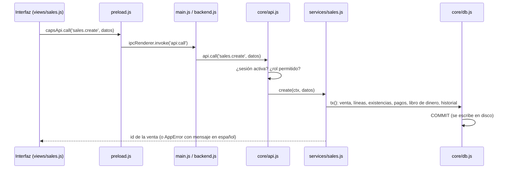

# Arquitectura

CAPS Shop es una aplicación de escritorio **Electron** con base de datos **SQLite** (a través de **`node:sqlite`**, incluido en Node y Electron, sin módulos nativos). Funciona sin internet, en una computadora o en varias de la misma red: una **PC principal** guarda los datos y atiende a las demás ([Red](red.md)).

## Capas

```
src/
  core/        Núcleo: reglas del negocio y base de datos. No depende de Electron.
    api.js       Punto de entrada único: tabla de operaciones con sus permisos
    db.js        Envoltura de node:sqlite: consultas, transacciones (WAL) y copias
    schema.js    Esquema y migraciones (PRAGMA user_version)
    util.js      Fechas, redondeo, validaciones, errores (AppError), estados de cuenta y períodos
    services/
      common.js    Configuración, historial (audit), libro de dinero (ledger), cambios de existencia
      users.js     Usuarios, contraseñas, inicio de sesión y configuración
      products.js  Productos, ajustes, movimientos y resumen de inventario
      purchases.js Proveedores, compras, pagos, anulación y cuentas por pagar
      sales.js     Clientes, ventas, abonos, devoluciones, anulación y cuentas por cobrar
      finance.js   Gastos, otros ingresos y caja
      reports.js   Ganancias, flujo de dinero, dashboard, más vendidos e historial
      terminals.js Computadoras de la tienda (registrar, renombrar, desactivar)
  net/         Red local, sin Electron
    server.js    Servidor HTTP de la PC principal y descubrimiento UDP
    client.js    Cliente de las PCs conectadas: reintentos, sin conexión, búsqueda
    secure.js    Cifrado de la red con la clave de conexión (AES-256-GCM)
  main/        Proceso principal de Electron
    main.js      Ventana, IPC, configurar esta PC, protocolo de fotos, respaldos, CSV/PDF e impresión
    backend.js   Local (PC principal: base en este proceso) o remoto (PC conectada: todo por la red)
    config.js    config.json de esta PC (modo, clave, principal)
    log.js       Registro de errores en <datos>/registros (14 días) para el diagnóstico
    updates.js   Actualizaciones desde GitHub Releases, con aviso (el administrador instala)
    preload.js   Puente seguro: expone window.capsApi a la interfaz
  renderer/    Interfaz (HTML, CSS y JavaScript sin framework ni compilación)
    index.html   Carga los scripts en orden
    styles.css   Estilos (negro y rojo de la marca)
    js/lib.js    Utilidades: html seguro, formatos, tablas, modales, gráficos, exportar
    js/app.js    Inicio de sesión, menú y navegación (objeto App)
    js/views/*.js  Una pantalla o grupo de pantallas por archivo; cada una se registra con App.register
test/              Pruebas (node --test): núcleo, migración, respaldos, permisos, computadoras y red
test/ui/           Pruebas de interfaz con la app real (Playwright)
test/perf/         Rendimiento con 3 años de datos simulados
test/fixtures/     Base de muestra de la versión 1.0.0 y sus fotos
build/             Íconos del instalador
.github/workflows/build-windows.yml  CI: pruebas + instalador de Windows + publicación en Releases
```

**Regla de dependencias:**

```
renderer → window.capsApi → (IPC) → main → backend ─┬─ local:  core
                                                     └─ remoto: net/client → (red) → net/server → core de la PC principal
```

- La interfaz **nunca** accede a la base ni a archivos directamente.
- El núcleo y `net/` no conocen Electron. Por eso se prueban con Node puro.

## Flujo de una operación (ejemplo: una venta)



- **Permisos:** `api.js` define para cada operación los roles permitidos (`ALL` o `ADMIN`). Cada computadora tiene su sesión (token). El usuario se vuelve a leer de la base en cada llamada: si fue desactivado, se cierra la sesión.
- **En una PC conectada** el paso `main → api` va por la red: `backend.js` → `net/client.js` → `POST /v1/call` → `net/server.js` → `api.call` en la PC principal ([Red](red.md)).
- **Errores:** las validaciones lanzan `AppError`, cuyo mensaje se muestra tal cual al usuario. Cualquier otro error se muestra como "Error inesperado: …", pide guardar el diagnóstico y queda en el registro (`log.js`), con su pila. También van al registro los errores no capturados del proceso principal y los de la interfaz.
- **Transacciones:** cada operación que escribe corre dentro de `db.tx()` (`BEGIN IMMEDIATE`). Si algo falla, no se guarda nada (ROLLBACK). Las transacciones se pueden anidar: solo la exterior confirma.
- **Libro de dinero:** todo cobro o pago llama a `ledger()` (`common.js`), que registra la entrada o salida. Si es en efectivo, la asocia a la caja abierta **de la PC que registra** o la rechaza si esa caja está cerrada.
- **Existencias:** todo cambio pasa por `changeStock()` (`common.js`), que valida que no quede negativa y registra el movimiento.
- **Historial:** las operaciones llaman a `audit()`, que guarda usuario, acción, entidad y detalle.

## Datos en disco

Carpeta de datos: `%APPDATA%\CAPS Shop\data`. En pruebas se cambia con la variable `CAPSSHOP_DATA`. En una PC conectada solo contiene `config.json`: los datos están en la principal.

| Elemento | Detalle |
|---|---|
| `capsshop.db` (+ `-wal`, `-shm`) | Base SQLite en modo WAL con `synchronous=FULL`: cada transacción escribe solo lo que cambió y queda en disco al confirmarse |
| `config.json` | Configuración de esta PC ([Red](red.md#configuración-de-cada-pc)) |
| `fotos/` | Imágenes de productos (JPEG reducido a 600 px). La base guarda solo el nombre del archivo |
| `respaldos/` | Copia diaria automática al abrir el programa (`VACUUM INTO`, consistente); se conservan 30. Solo en la PC principal |

## Seguridad

- **Ventana:** `contextIsolation`, `sandbox` y sin `nodeIntegration`. La interfaz solo ve `window.capsApi`.
- **Contenido:** CSP en `index.html` (`script-src 'self'`). Todo texto dinámico pasa por `html`/`esc` (`lib.js`) antes de insertarse.
- **Contraseñas:** scrypt con sal por usuario (`users.js`).
- **Instancias:** una sola por computadora (`requestSingleInstanceLock`), para no abrir la base dos veces.
- **Red:** cifrada y autenticada con la clave de conexión, que nunca viaja. Además, versión igual en todas las PCs y límite de intentos ([Seguridad](seguridad.md)).

## Límites actuales

Lo que falta para producción, con el objetivo que lo resuelve ([Objetivos](../producto/objetivos.md)). Los límites que ya se resolvieron están al final.

| Límite | Dónde | Consecuencia | Objetivo |
|---|---|---|---|
| Sin modo sin conexión | `net/client.js` | Si la principal se apaga, las demás no trabajan (DT-15) | Futuro, si se pide |
| Sin linter ni verificación de tipos | Todo el código | Errores de escritura se detectan solo con las pruebas | Si el código crece |
| Scripts globales sin módulos ni compilación | `renderer/js` | Sencillo, pero sin aislamiento entre pantallas | Si el código crece |
| Probado en Windows Server (CI), no en Windows 10/11 de escritorio | CI | Diferencias de escritorio sin detectar | O6 (piloto) |
| Instalador sin firma | CI listo (`WIN_CSC_LINK`) | Advertencia de Windows al instalar | Cuando se compre el certificado (DT-18) |
| El instalador no crea la regla del firewall | `package.json` (`nsis`) | Windows pregunta la primera vez que la principal comparte | O4 |

**Resueltos en O4:**
- **Copia fuera de la PC:** diaria y con las fotos, a una memoria USB o a la nube, con aviso a los 7 días.
- **Actualizaciones:** con aviso, desde GitHub Releases.

**Resueltos en O3:**
- **Rendimiento:** medido con 3 años de datos; todo por debajo de 1 s tras la migración 3 ([Rendimiento](rendimiento.md)).
- **Red:** cifrada ([Seguridad](seguridad.md)).
- **Registro de errores:** con **Guardar diagnóstico**.
- **Pruebas:** de interfaz y del programa instalado, en CI.

**Resueltos en O2:**
- La base vivía en memoria de un solo proceso (sql.js) y se reescribía completa en cada operación. Ahora usa `node:sqlite` en modo WAL.
- Había una sola sesión de usuario por programa. Ahora hay una por computadora.
- Solo funcionaba en una PC. Ahora hay una PC principal y PCs conectadas ([Red](red.md)).
