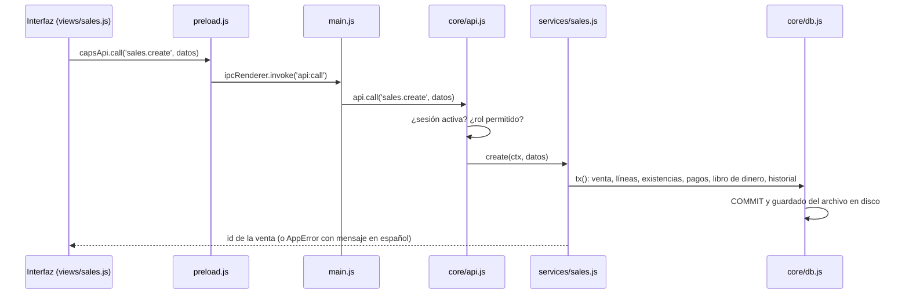

# Arquitectura

CAPS Shop es una aplicación de escritorio **Electron** con base de datos **SQLite** (a través de **sql.js**, SQLite compilado a WebAssembly, sin módulos nativos). Funciona sin internet en una sola computadora.

## Capas

```
src/
  core/        Núcleo: reglas del negocio y base de datos. No depende de Electron.
    api.js       Punto de entrada único: tabla de operaciones con sus permisos
    db.js        Envoltura de sql.js: consultas, transacciones y guardado en disco
    schema.js    Esquema y migraciones (PRAGMA user_version)
    util.js      Fechas, redondeo, validaciones, errores (AppError), estados de cuenta y períodos
    services/
      common.js    Configuración, historial (audit), libro de dinero (ledger), cambios de existencia
      users.js     Usuarios, contraseñas, inicio de sesión y configuración
      products.js  Productos, ajustes, movimientos y resumen de inventario
      purchases.js Proveedores, compras, pagos, anulación y cuentas por pagar
      sales.js     Clientes, ventas, abonos, devoluciones, anulación y cuentas por cobrar
      finance.js   Gastos, otros ingresos y caja
      reports.js   Ganancias, flujo de dinero, dashboard, más vendidos e historial
  main/        Proceso principal de Electron
    main.js      Ventana, IPC, carpeta de datos, fotos, respaldos, CSV/PDF e impresión
    preload.js   Puente seguro: expone window.capsApi a la interfaz
  renderer/    Interfaz (HTML, CSS y JavaScript sin framework ni compilación)
    index.html   Carga los scripts en orden
    styles.css   Estilos (negro y rojo de la marca)
    js/lib.js    Utilidades: html seguro, formatos, tablas, modales, gráficos, exportar
    js/app.js    Inicio de sesión, menú y navegación (objeto App)
    js/views/*.js  Una pantalla o grupo de pantallas por archivo; cada una se registra con App.register
test/core.test.js  Pruebas del núcleo (node --test)
build/             Íconos del instalador
.github/workflows/build-windows.yml  CI: pruebas + instalador de Windows + publicación en Releases
```

**Regla de dependencias:**

```
renderer → window.capsApi → (IPC) → main → core
```

- La interfaz **nunca** accede a la base ni a archivos directamente.
- El núcleo no conoce Electron. Por eso se prueba con Node puro y se puede reutilizar en un servidor (objetivo O2).

## Flujo de una operación (ejemplo: una venta)



- **Permisos:** `api.js` define para cada operación los roles permitidos (`ALL` o `ADMIN`). El usuario de la sesión vive en el proceso principal y se vuelve a leer de la base en cada llamada. Si fue desactivado, se cierra la sesión.
- **Errores:** las validaciones lanzan `AppError`, cuyo mensaje se muestra tal cual al usuario. Cualquier otro error se muestra como "Error inesperado: …".
- **Transacciones:** cada operación que escribe corre dentro de `db.tx()`. Si algo falla, no se guarda nada (ROLLBACK). Las transacciones se pueden anidar: solo la exterior confirma y guarda.
- **Libro de dinero:** todo cobro o pago llama a `ledger()` (`common.js`), que registra la entrada o salida. Si es en efectivo, la asocia a la caja abierta o la rechaza si la caja está cerrada.
- **Existencias:** todo cambio pasa por `changeStock()` (`common.js`), que valida que no quede negativa y registra el movimiento.
- **Historial:** las operaciones llaman a `audit()`, que guarda usuario, acción, entidad y detalle.

## Datos en disco

Carpeta de datos: `%APPDATA%\CAPS Shop\data`. En pruebas se cambia con la variable `CAPSSHOP_DATA`.

| Elemento | Detalle |
|---|---|
| `capsshop.db` | Archivo SQLite. Se reescribe completo después de cada transacción: primero en `.tmp` y luego se renombra, para no dejar archivos a medias |
| `fotos/` | Imágenes de productos (JPEG reducido a 600 px). La base guarda solo el nombre del archivo |
| `respaldos/` | Copia diaria automática al abrir el programa; se conservan 30 |

## Seguridad

- **Ventana:** `contextIsolation`, `sandbox` y sin `nodeIntegration`. La interfaz solo ve `window.capsApi`.
- **Contenido:** CSP en `index.html` (`script-src 'self'`). Todo texto dinámico pasa por `html`/`esc` (`lib.js`) antes de insertarse.
- **Contraseñas:** scrypt con sal por usuario (`users.js`).
- **Instancias:** una sola por computadora (`requestSingleInstanceLock`), para no escribir la base dos veces.

## Límites actuales

Estos límites explican por qué la versión 1.0.0 **no está lista para producción en red** ([Objetivos](../producto/objetivos.md)).

| Límite | Dónde | Consecuencia | Objetivo |
|---|---|---|---|
| La base vive en memoria de un solo proceso | `db.js` (sql.js) | No se puede compartir entre computadoras | O2 |
| Una sola sesión de usuario por instancia | `api.js` (`current`) | En red hará falta una sesión por computadora | O2 |
| Se reescribe el archivo completo en cada operación | `db.save()` | El costo crece con el tamaño de la base; sin medir | O2, O3 |
| Sin registro de errores en archivo | `main.js` usa `console.error` | Sin diagnóstico en la tienda | O3 |
| Interfaz sin pruebas automáticas ni linter | `renderer/` | Regresiones visuales sin detectar | O3 |
| Scripts globales sin módulos ni compilación | `renderer/js` | Sencillo, pero sin verificación de tipos ni aislamiento | Revisar en O2/O3 si crece |
| Respaldos sin fotos y en el mismo disco | `main.js` (`autoBackup`, `backup:*`) | Riesgo de pérdida | O4 |
| Sin firma ni actualización automática | `package.json` (`build`) | Advertencia de Windows e instalación manual | O4 |
