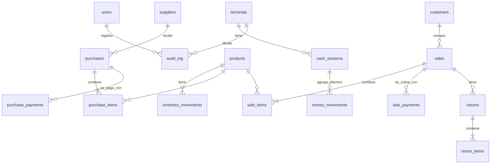

# Modelo de datos

- **Motor:** SQLite a través de `node:sqlite`, en modo WAL (`src/core/db.js`). Es el mismo formato de archivo que escribía la versión 1.0.0 con sql.js, así que la base se abre tal cual.
- **Esquema y migraciones:** `src/core/schema.js`. La versión se guarda en `PRAGMA user_version`; la actual es la **3**.
  - **1:** esquema inicial (versión 1.0.0).
  - **2:** computadoras en red. Tabla `terminals`, y columna `terminal_id` en `cash_sessions` y `audit_log`. Las cajas existentes pasan a la PC principal (id 1).
  - **3:** índices de las tablas de detalle (`sale_items`, `sale_payments`, `purchase_items`, `purchase_payments`, `returns`, `return_items`), más `purchases(supplier_id)` y `audit_log(action)`. Con 3 años de datos, la lista de ventas bajó de 16 s a 34 ms ([Rendimiento](rendimiento.md)).
- **Migraciones:** al abrir la base, `migrate()` aplica en orden las que falten, dentro de una transacción: si una falla, no queda nada a medias. **Toda migración nueva se agrega al final de la lista `MIGRATIONS`; nunca se editan las ya publicadas.**
- **Base más nueva que el programa:** no se abre. Sale **"Esta base de datos es de una versión más nueva de CAPS Shop…"**, para que una versión vieja no la dañe.
- **Fechas:** texto en hora local. Formato `AAAA-MM-DD` en las columnas `date` y `due_date`, y `AAAA-MM-DD HH:MM:SS` en `created_at` y similares.
- **Montos:** números reales redondeados a 2 decimales. El costo de producto usa 4 decimales.

## Relaciones

`money_movements` también referencia de forma genérica, con `ref_type` y `ref_id`, la venta, el abono, la compra, el pago, el gasto, el ingreso, la devolución o la caja que lo originó.

## Tablas

| Tabla | Qué guarda | Columnas clave |
|---|---|---|
| `users` | Usuarios | `username` (único, sin distinguir mayúsculas), `role` (`admin` \| `vendedor`), `password_hash`, `password_salt`, `must_change`, `active` |
| `settings` | Configuración clave/valor | Claves y valores por defecto en `DEFAULT_SETTINGS` (`common.js`) |
| `products` | Productos | `sku` (único), `barcode` (único si existe), `photo` (archivo), `cost`, `price_retail`, `price_wholesale`, `stock`, `min_stock`, `active` |
| `inventory_movements` | Cada cambio de existencia | `type`, `qty` (con signo), `stock_before`, `stock_after`, `unit_cost`, `ref_type`/`ref_id`, `note`, `user_id` |
| `suppliers` | Proveedores | `name`, contacto, `active` |
| `customers` | Clientes | `name`, contacto, `document`, `active` |
| `purchases` | Compras | `supplier_id`, `date`, `due_date`, `invoice_ref`, `payment_type` (`contado` \| `credito`), `total`, `paid`, `balance`, `status`, anulación (`voided_at`, `voided_by`, `void_reason`) |
| `purchase_items` | Líneas de compra | `product_id`, `qty`, `unit_cost`, `subtotal` |
| `purchase_payments` | Pagos a proveedores | `purchase_id`, `amount`, `method`, `date`, `voided` |
| `sales` | Ventas | `customer_id`, `date`, `sale_type` (`detalle` \| `mayor`), `payment_type`, `subtotal`, `discount`, `total`, `cost_total`, `paid`, `change_given`, `returned_total`, `balance`, `due_date`, `status`, anulación |
| `sale_items` | Líneas de venta | `description`, `qty`, `unit_price`, `line_discount`, `net_total` (con el descuento general repartido), `unit_cost`, `returned_qty` |
| `sale_payments` | Cobros de ventas | `sale_id`, `customer_id`, `amount`, `method`, `kind` (`inicial` \| `abono`), `voided` |
| `returns` / `return_items` | Devoluciones | `total`, `cost_total` (0 si no se reingresó), `credit_applied`, `refund_amount`, `refund_method`, `restock`, `reason` |
| `expenses` / `incomes` | Gastos y otros ingresos | `category`, `description`, `date`, `amount`, `method`, `voided` |
| `terminals` | Computadoras de la tienda. La 1 es la PC principal | `name` (único, sin distinguir mayúsculas), `active`, `last_seen_at` |
| `cash_sessions` | Aperturas y cierres de caja, una por PC | `terminal_id`, `opened_at`, `opened_by`, `opening_amount`, `closed_at`, `closed_by`, `expected_amount`, `counted_amount`, `difference`, `status` (`abierta` \| `cerrada`) |
| `money_movements` | **Libro de dinero**: toda entrada y salida | `date`, `direction` (`in` \| `out`), `amount`, `method`, `category`, `ref_type`/`ref_id`, `session_id` (solo efectivo con caja abierta), `user_id` |
| `audit_log` | Historial | `created_at`, `user_id`, `terminal_id` (PC desde la que se hizo), `action`, `entity`, `entity_id`, `details` (JSON) |

## Estados

| Entidad | Valores |
|---|---|
| Venta y compra (`status`) | `pendiente`, `parcial`, `pagado`, `anulada`. "Vencido" no se guarda: se calcula (saldo > 0 y `due_date` < hoy) |
| Producto (calculado) | `agotado` (stock ≤ 0), `bajo` (stock ≤ mínimo), `ok` |
| Caja | `abierta`, `cerrada` (una abierta a la vez **por computadora**) |
| Computadora (`terminals.active`) | 1 activa, 0 desactivada: no puede entrar ni operar |

## Tipos de movimiento

**Inventario** (`inventory_movements.type`): `inicial`, `compra`, `venta`, `devolucion`, `ajuste`, `entrada`, `salida`, `anulacion_venta`, `anulacion_compra`.

**Dinero** (`money_movements.category`):

| Entran (`in`) | Salen (`out`) |
|---|---|
| `venta`, `abono_cliente`, `otro_ingreso`, `deposito_caja`, `anulacion_compra`, `anulacion_gasto` | `compra`, `pago_proveedor`, `gasto`, `devolucion`, `retiro_caja`, `anulacion_venta`, `anulacion_ingreso` |

**Historial** (`audit_log.action`): `inicio_sesion`, `cambio_contrasena`, `crear_usuario`, `editar_usuario`, `editar_configuracion`, `crear_producto`, `editar_producto`, `cambio_precio`, `ajuste_inventario`, `crear_proveedor`, `editar_proveedor`, `registrar_compra`, `pago_proveedor`, `anular_compra`, `crear_cliente`, `editar_cliente`, `registrar_venta`, `abono_cliente`, `devolucion`, `anular_venta`, `registrar_gasto`, `anular_gasto`, `registrar_ingreso`, `anular_ingreso`, `apertura_caja`, `cierre_caja`, `retiro_caja`, `entrada_caja`, `conectar_pc`, `editar_pc`.

## Datos derivados (no se guardan)

Se calculan al consultar (`reports.js`, `products.summary`):
- ventas netas, costo de lo vendido y ganancias;
- valor del inventario;
- saldos de clientes y proveedores (suma de `balance`);
- efectivo esperado de cada caja abierta, y el efectivo de la tienda (suma de las cajas de todas las PCs activas);
- productos más vendidos.
