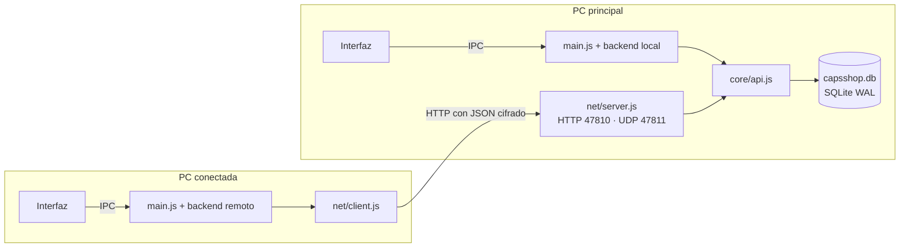

# Red: varias computadoras

Documento de diseño del objetivo [O2](../producto/objetivos.md#o2-varias-computadoras-en-red). Las decisiones que lo originan son DT-13, DT-14 y DT-15 ([Decisiones](../producto/decisiones.md)). Cómo se usa: [manual, página 13](../manual/13-varias-computadoras.md).

## Modelo

Una **PC principal** guarda la base de datos y atiende a las demás por la red local. Las otras computadoras, llamadas **terminales** en el código, usan el mismo programa en modo conectado y no guardan datos.

**Por qué funciona sin cambiar las reglas de negocio:**
- Toda la lógica pasa por la tabla `METHODS` de `src/core/api.js`, así que la red solo transporta llamadas a esa tabla.
- El núcleo es **síncrono** y solo el proceso de la PC principal toca la base. Node atiende una petición a la vez, de modo que las operaciones de todas las PCs se ejecutan en fila, cada una en su transacción (`db.tx`).
- Por eso, dos ventas simultáneas de la última gorra nunca pasan las dos: la segunda recibe **Existencia insuficiente**. Lo comprueba `test/network.test.js`.

**La interfaz no cambia de forma de trabajar:** sigue llamando a `window.capsApi`. `src/main/backend.js` decide si la llamada se ejecuta en el mismo proceso (local) o se envía a la principal (remoto).

## Configuración de cada PC

`config.json` en la carpeta de datos (`%APPDATA%\CAPS Shop\data`):

| Modo | Contenido |
|---|---|
| `principal` | `share` (compartir en la red), `key` (clave de conexión), `server_id` (identificador único de esta instalación) |
| `terminal` | `terminal_id` y `name` (esta PC en la principal), `key`, `server` (`host`, `port`, `server_id`, `name`) |

**Primer arranque:**

| Situación | Resultado |
|---|---|
| Hay `capsshop.db` y no hay `config.json` (actualización desde 1.0.0) | Principal con `share: false`. Nada cambia hasta que el administrador activa la red |
| No hay datos ni configuración (instalación nueva) | Pantalla **Configurar esta computadora** (`views/setup.js`) |

Al guardar la configuración, el programa se reinicia. Con `CAPSSHOP_NO_RELAUNCH=1` solo se cierra: lo usan las pruebas automáticas.

## Protocolo

HTTP con JSON, puerto TCP **47810**. `src/net/server.js` implementa el servidor, `src/net/client.js` el cliente y `src/net/secure.js` el cifrado.

| Ruta | Cifrada | Contenido (descifrado) | Respuesta |
|---|---|---|---|
| `GET /v1/hello` | No | — | `version`, `server_id`, `name` (PC principal), `business_name` |
| `POST /v1/pair` | Sí | `name` | `{ id, name }` de la PC (la registra, o reutiliza la que tiene ese nombre si está activa) |
| `POST /v1/login` | Sí | `username`, `password`, `terminal` | `{ token, user }` |
| `POST /v1/logout` | Sí | `token` | — |
| `POST /v1/call` | Sí | `token`, `name`, `params`, `request_id` | Resultado de la operación `name` de `METHODS` |
| `POST /v1/foto` | Sí | `name` | `{ type, data }` (imagen en base64) o `null` |

**Formato:**
- **Rutas cifradas:** el cuerpo es `{ iv, data }` (AES-256-GCM). Dentro van el contenido de la tabla, más `ts` (hora) y `nonce`.
- **Respuesta:** al descifrarla es `{ ok: true, data }` o `{ ok: false, error, code }`, igual que por IPC, y repite el `nonce`. El mensaje de `AppError` llega tal cual a la pantalla.
- **Llave:** se deriva de la clave de conexión y del `server_id` ([Seguridad](seguridad.md#red-cifrada)). **La clave nunca viaja.**

**Errores antes de descifrar** (sin cifrar y con código HTTP):

| HTTP | Código | Causa |
|---|---|---|
| 409 | `VERSION` | La cabecera `X-Caps-Version` no es **igual** a la versión de la principal |
| 401 | `KEY` | El mensaje no se pudo descifrar: la otra PC tiene otra clave, o alguien alteró el mensaje |
| 429 | `RATE` | Demasiados intentos con clave incorrecta desde esa IP |

**Error dentro de la respuesta cifrada:** `CLOCK`, si la hora del mensaje difiere más de 10 minutos de la de la principal.

**Descubrimiento (botón Buscar):**
- La terminal envía `CAPS-SHOP-DISCOVER` por UDP al puerto **47811**: a `255.255.255.255` y a la dirección de difusión de cada red.
- La principal contesta con su nombre, puerto y `server_id`.

**Cambio de dirección:** si la dirección guardada deja de responder, el cliente vuelve a buscar la principal por su `server_id`. Si la encuentra en otra dirección, actualiza `config.json`.

## Sesiones

- `createApi` guarda las sesiones en memoria: `token → { user, terminal }`.
- Cada operación recibe `ctx = { db, user, terminal }`.

**Vencimiento:** tras 12 horas sin actividad.

**Cuándo se cierran todas:**
- al restaurar un respaldo (`closeAll`);
- al reiniciar la principal.

La terminal recibe entonces `AUTH` y vuelve a la pantalla de entrada con **Su sesión terminó. Vuelva a entrar.**

**En cada llamada se comprueba:**
- que el usuario siga activo;
- que su rol tenga permiso;
- que la PC siga activa (código `TERMINAL`).

**Última actividad de la PC:** `terminals.last_seen_at` se actualiza a lo sumo una vez por minuto.

## Caja por computadora

Decisión DT-14:
- `cash_sessions.terminal_id` indica de qué PC es cada caja. Puede haber **una abierta por PC**.
- `ledger()` (`services/common.js`) asocia el efectivo a la caja abierta de `ctx.terminal`. Si esa caja está cerrada y se exige caja abierta, rechaza el movimiento.
- El dashboard y el flujo de dinero suman el efectivo de todas las PCs activas: lo esperado si la caja está abierta, o lo contado en el último cierre si está cerrada.

## Qué pasa si falla algo

| Situación | Comportamiento |
|---|---|
| La principal está apagada o la red caída | Cada intento espera como máximo 4 s para conectar. El cliente reintenta 2 veces y luego busca la principal. Si no la encuentra, lanza el código `OFFLINE`. La interfaz muestra **Sin conexión con la PC principal** y reintenta cada 5 s. No hay modo sin conexión (DT-15) |
| Se corta la conexión durante una venta | El cliente reintenta con el **mismo `request_id`**. Si la principal ya la había registrado, devuelve el mismo resultado sin repetirla (guarda los resultados 5 minutos). Solo si la conexión llegó a abrirse y no hubo respuesta (15 s), avisa **No se pudo confirmar la operación…**; si nunca conectó, la operación no llegó y el aviso es **Sin conexión** |
| La principal se reinicia | Se pierden las sesiones: todas las PCs vuelven a entrar. Los datos no se pierden: cada operación ya se escribió en disco |
| Corte de luz en la principal | SQLite en modo WAL con `synchronous=FULL`: lo confirmado queda en disco y lo que estaba a medias se descarta |
| El puerto 47810 está ocupado | La principal sigue funcionando sola y muestra el error en Configuración → Red |

## Seguridad

- **Sin la clave** solo se puede consultar `hello`, que no tiene datos del negocio.
- **Límite de intentos:**
  - 10 claves incorrectas por minuto desde una IP la bloquean un minuto;
  - 5 contraseñas incorrectas por minuto, por IP y usuario, bloquean el inicio de sesión.
- **Fotos:** solo nombres de archivo válidos, sin rutas.
- **Por la red nadie entra como la PC principal** (`terminal` 1): su caja solo se usa desde ella.
- **Una PC desactivada** no se reactiva al volver a conectarse con su nombre: solo el administrador la activa.
- **Reconfigurar una PC conectada sin sesión** (desde la pantalla de entrada) solo permite volver a conectarla, no convertirla en principal.
- **Una petición mal formada** (URL o nombre de foto inválidos) recibe un error y no detiene el servidor.
- **Permisos:** se comprueban en la principal, igual que antes. Una terminal no puede saltárselos.
- **Tráfico cifrado y autenticado** con la clave de conexión (AES-256-GCM, llave derivada con scrypt). Quien mire la red no ve contraseñas, datos ni la clave. Detalle en [Seguridad](seguridad.md#red-cifrada) (DT-17).
- **Clave de 10 caracteres** (unos 50 bits), por ejemplo `K7M2P-9QXA4`. Cámbiela si alguien ajeno la conoce.
- **Hora:** todas las PCs deben tener la fecha y hora de Windows bien puestas, con menos de 10 minutos de diferencia.
- **Firewall de Windows:** la primera vez que la principal comparte, Windows pregunta. Hay que permitir **Redes privadas**. El instalador todavía no crea la regla ([O4](../producto/objetivos.md#o4-instalación-y-operación)).

## Pruebas

| Archivo | Qué comprueba |
|---|---|
| `test/terminals.test.js` | Caja por PC, sesiones independientes, renombrar y desactivar PCs |
| `test/network.test.js` | Servidor real en `127.0.0.1`: clave, versión, permisos, bloqueo de intentos, **40 ventas simultáneas desde 2 PCs con existencia 30**, reintento sin duplicar, fotos, descubrimiento, cambio de dirección, "sin conexión", corte a mitad de una operación, **tráfico capturado sin secretos**, mensaje alterado y hora desfasada |
| `test/ui/network.test.js` | Dos instancias reales de la app: configurar la PC conectada, vender, ver la venta y la caja en la principal, fotos por la red, sin conexión y reconexión |
| `test/migration.test.js` | La base de la 1.0.0 (`test/fixtures/v1.0.0.db`) abre sin perder datos |

**Prueba manual con dos PCs en una sola máquina:** ver [Desarrollo y publicación](desarrollo-y-publicacion.md#probar-varias-computadoras-en-una-sola-máquina).
