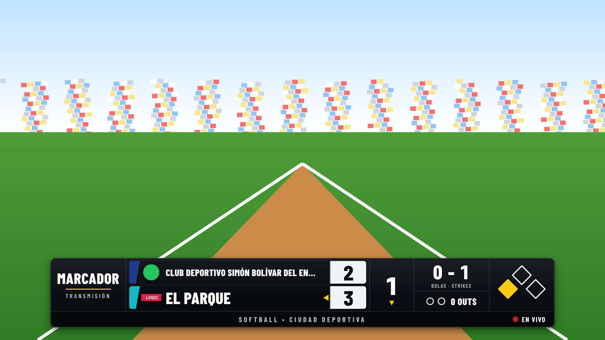
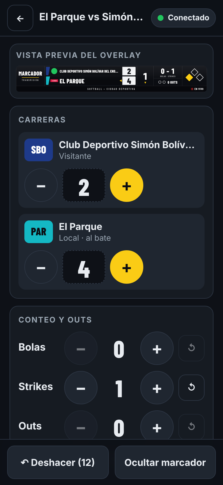
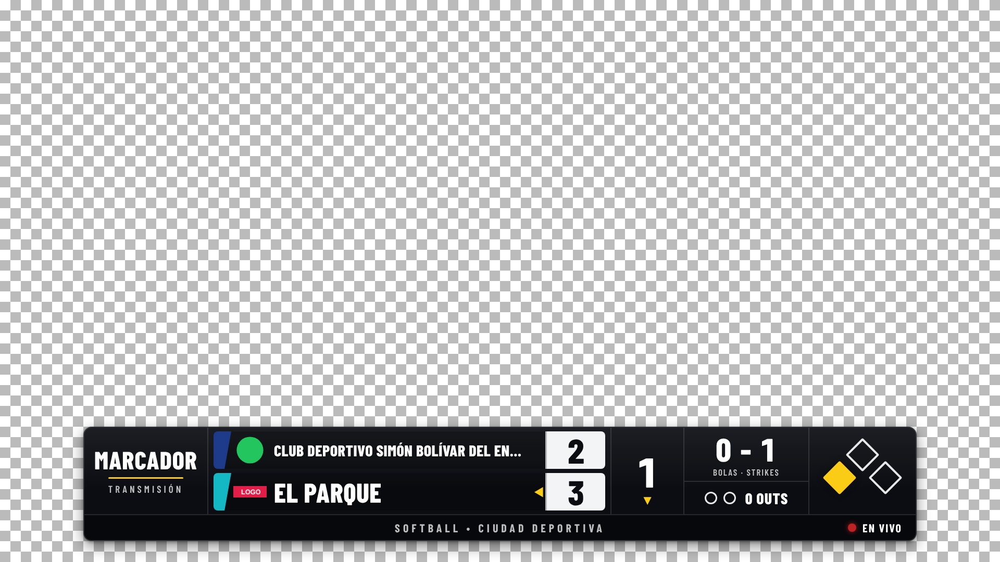

# Marcador en vivo

Marcador para transmisiones de **softball y béisbol**. Se controla desde el celular y se muestra en OBS como un overlay transparente que se actualiza solo, en menos de un segundo.



| Panel de control (375 px) | Overlay sobre fondo de cuadros (transparencia) |
|---|---|
|  |  |

- **Panel** (`/control/<id>`): requiere iniciar sesión.
  - Carreras, inning, conteo, outs y bases, con estado del partido.
  - Mostrar u ocultar el marcador en el overlay.
  - Deshacer (persistente) y reinicio con confirmación.
  - Logos de equipos y de la transmisión, colores y vista previa en vivo.
- **Overlay** (`/overlay/<slug>`): público y de solo lectura.
  - Fondo transparente para OBS.
  - Escalable con `?scale=` y posicionable con `?pos=`.
- **Estudio en vivo** (`/estudio/<id>`): transmite a YouTube desde el celular, con el marcador **dentro del video**. Ver la [sección 6](#6-transmitir-a-youtube-desde-el-celular-estudio-en-vivo).

**Tecnología:** Next.js 16 (App Router) + TypeScript, y Supabase (Postgres, Auth, Realtime y Storage). Se despliega en Vercel.

---

## 1. Ejecutar el proyecto localmente

Necesitas **Node.js 20.9 o superior** (recomendado 22).

```bash
cd marcador
npm install
cp .env.example .env.local     # y completa los dos valores (paso 2)
npm run dev
```

Abre <http://localhost:3000>: te lleva al inicio de sesión.

> Abre la app con `localhost`, no con `127.0.0.1`. En modo desarrollo, Next.js 16 bloquea sus scripts si la abres desde otro origen.

### Opción sin cuenta: Supabase local (Docker)

Si tienes Docker, puedes levantar todo Supabase en tu computadora. La migración y los datos de ejemplo se aplican solos.

```bash
npx supabase start          # la primera vez descarga las imágenes (varios minutos)
npx supabase status         # muestra API URL y Publishable key
```

1. Copia `API URL` en `NEXT_PUBLIC_SUPABASE_URL` y `Publishable key` en `NEXT_PUBLIC_SUPABASE_PUBLISHABLE_KEY`, dentro de `.env.local`.
2. Usuario de ejemplo: **demo@marcador.local** / **demo-marcador-2026**.
3. Ya tiene creado el partido de ejemplo: El Parque contra Simón Bolívar, softball a 6 innings.

Para volver a empezar desde cero: `npx supabase db reset`.

### Pruebas

| Comando | Qué verifica | Necesita |
|---|---|---|
| `npm test` | Reglas del juego, validación, escalado del overlay, contraste y rechazo de claves secretas | Nada |
| `npm run test:db` | RLS, CHECK, versión, deshacer, aislamiento por slug, Realtime y Storage, usando solo la clave pública | Supabase **local** (`supabase start`) |
| `npm run test:e2e` | Los 9 criterios de aceptación en un navegador real; guarda capturas en `tests/e2e/salida/` | Supabase local y la app corriendo (`npm run build && npm start`) |
| `npm run test:relay` | Intermediario: clave nunca expuesta, sesión obligatoria, origen permitido, argumentos de ffmpeg, avisos de error | Nada (`cd relay && npm install` una vez) |
| `npm run test:estudio` | Estudio de punta a punta: cámara simulada → intermediario → receptor RTMP local. Revisa 720p/30 fps, audio, marcador en el video, cambios desde otro dispositivo, reconexión y fin (`MIME=mp4` usa el formato de Safari) | Supabase local, la app corriendo y `ffmpeg` |
| `./scripts/probar-seguridad.sh` | Con `curl` y la clave pública: toda escritura sin sesión es rechazada | Cualquier proyecto (local o nube) |
| `npm run lint` / `npm run typecheck` | Calidad del código | Nada |

---

## 2. Supabase: qué crear y qué copiar

1. **Crea la cuenta y el proyecto.**
   - Entra a <https://supabase.com> → *Start your project* → crea una organización.
   - Luego *New project*.
   - Guarda la contraseña de la base de datos (no la necesita la app).
   - Si ya tienes un proyecto, puedes usarlo: todo lleva el prefijo `marcador_` y no toca tus tablas (por ejemplo, una tabla `games` existente).
2. **Aplica las migraciones**, que crean tablas, CHECK, RLS, RPC, triggers, Realtime y el bucket de logos. Elige una de dos formas:
   - **Desde el panel de Supabase:** *SQL Editor* → *Create a new snippet* (no una consulta de *Logs*). Pega y ejecuta con *Run*, en este orden:
     1. [`supabase/migrations/20261006120000_marcador.sql`](supabase/migrations/20261006120000_marcador.sql)
     2. [`supabase/migrations/20261006180000_marcador_sin_anonimos.sql`](supabase/migrations/20261006180000_marcador_sin_anonimos.sql)
     3. [`supabase/migrations/20261008120000_marcador_conteo_automatico.sql`](supabase/migrations/20261008120000_marcador_conteo_automatico.sql)
   - **Con la CLI:** `npx supabase login`, luego `npx supabase link --project-ref TU_REF` y después `npx supabase db push`.
3. **Copia las dos variables.** En el panel del proyecto, el botón **Connect** (arriba) → *App Frameworks* → *Next.js* las muestra con estos nombres exactos:

   | Variable | Dónde está | Ejemplo |
   |---|---|---|
   | `NEXT_PUBLIC_SUPABASE_URL` | *Project Settings → Data API → Project URL* | `https://abcd1234.supabase.co` |
   | `NEXT_PUBLIC_SUPABASE_PUBLISHABLE_KEY` | *Project Settings → API Keys → Publishable key* | `sb_publishable_…` |

   - También sirve la clave **anon** antigua (empieza con `eyJ…`), en `NEXT_PUBLIC_SUPABASE_ANON_KEY`.
   - **Nunca** copies la *secret key* (`sb_secret_…`) ni la *service_role*: esta app no las usa en ningún lado. Si alguna llega a una variable `NEXT_PUBLIC_*`, la app se niega a arrancar.
4. **Crea tu usuario.** Ve a *Authentication → Users → Add user → Create new user*, escribe correo y contraseña, y marca **Auto Confirm User**.
   - Así no dependes del correo de confirmación: el servidor de correo incluido en Supabase tiene un límite bajo de envíos.
   - Si nadie más debe crear cuentas, desactiva *Authentication → Sign In / Providers → Allow new users to sign up*.
5. **(Opcional) URL de la app para los correos.** Solo hace falta si las cuentas se crean desde el botón *Crear cuenta* del panel, que envía un correo de confirmación. En *Authentication → URL Configuration* agrega `https://TU-APP.vercel.app/**` en *Redirect URLs*.
   - **No cambies *Site URL* si el proyecto lo comparte otra app** (por ejemplo, la web de una liga): sus correos dejarían de llevar a su sitio. Con usuario y contraseña creados en el panel de Supabase no hace falta nada de esto.

---

## 3. Publicar en Vercel (para controlar desde el celular)

1. Entra a <https://vercel.com> con tu cuenta de GitHub → **Add New… → Project** → importa el repositorio `CS-SHOP`.
2. En **Root Directory** elige **`marcador`**. *Framework Preset* debe decir *Next.js*.
3. En **Environment Variables** agrega `NEXT_PUBLIC_SUPABASE_URL` y `NEXT_PUBLIC_SUPABASE_PUBLISHABLE_KEY`, con los valores del paso 2.
4. **Deploy.** Al terminar tendrás una URL como `https://marcador-tuyo.vercel.app`.
5. Si usas el botón *Crear cuenta*, vuelve a Supabase y agrega esa URL en *Redirect URLs* (punto 5 del paso 2).
6. Cada vez que hagas *push* a la rama principal, Vercel publica la nueva versión.

En el celular, abre `https://marcador-tuyo.vercel.app/control`, inicia sesión y toca **Crear partido de ejemplo**. Para tenerlo a mano como una app: menú del navegador → *Agregar a la pantalla de inicio*.

---

## 4. URLs

| Para | URL | Ejemplo |
|---|---|---|
| Mis partidos | `/control` | `https://marcador-tuyo.vercel.app/control` |
| Panel de un partido | `/control/<id del partido>` | `https://marcador-tuyo.vercel.app/control/354aeaa1-30af-40d4-b9a1-402194c220c6` |
| Overlay para OBS | `/overlay/<slug>` | `https://marcador-tuyo.vercel.app/overlay/ASFx2HVHSMqH8UdhFipAOg` |

El panel muestra la URL del overlay con un botón **Copiar URL del overlay**. El *slug* es aleatorio (22 caracteres, 122 bits), así que nadie puede adivinarlo ni recorrer los partidos.

### Parámetros del overlay

| Parámetro | Valores | Por defecto |
|---|---|---|
| `scale` | Factor de tamaño respecto a un cuadro de 1920 × 1080 (0.1 a 3) | `1` (1600 × 220 px) |
| `pos` | `top-left`, `top-center`, `top-right`, `center`, `bottom-left`, `bottom-center`, `bottom-right` | `bottom-center` |
| `margin` | Distancia al borde, en px de un cuadro de 1080p | `40` |

Ejemplos:

- `…/overlay/ASFx2HVHSMqH8UdhFipAOg?scale=0.8&pos=top-left`
- `…/overlay/ASFx2HVHSMqH8UdhFipAOg?scale=0.6&pos=bottom-center&margin=24`

El marcador se dibuja sobre un lienzo fijo de 1600 × 220 y se escala con un solo factor. Nunca se deforma ni se sale del cuadro: si el tamaño pedido no cabe, se reduce.

---

## 5. Agregarlo en OBS

1. En la escena: **Fuentes → + → Navegador** (*Browser*). Ponle un nombre, por ejemplo "Marcador".
2. Configura la fuente:
   - **URL:** la URL del overlay (con `?scale=` o `?pos=` si quieres).
   - **Ancho:** `1920`. **Alto:** `1080`.
   - **CSS personalizado:** bórralo y déjalo **vacío**. La página ya trae su fondo transparente.
   - **Apagar la fuente cuando no sea visible:** desmarcado, para que siga conectada.
   - **Actualizar el navegador cuando la escena se active:** opcional.
3. Acepta. El marcador queda transparente encima del video y estira la fuente a todo el lienzo.
4. Para comerciales o repeticiones, usa **Ocultar marcador** en el panel. El overlay se desvanece y vuelve sin tocar OBS.

**Cuándo usar "Actualizar caché de la página actual"** (en las propiedades de la fuente):

- Después de publicar una **nueva versión de la app** en Vercel, para cargar el código nuevo.
- Si el overlay se ve viejo o con otro diseño tras un cambio de código.

**No hace falta** para cambios de marcador, equipos, colores o logos: llegan solos en tiempo real. Si OBS pierde internet, el overlay conserva el último marcador, muestra un aviso discreto "RECONECTANDO" en la franja inferior y se pone al día al volver la conexión.

---

## 6. Transmitir a YouTube desde el celular (Estudio en vivo)

```
Celular (Estudio)                          Tu computadora (intermediario)              YouTube
cámara + micrófono ─► video 1280×720 ─►  túnel HTTPS ─► ffmpeg (H.264 + AAC) ─► RTMPS ─► directo
con el marcador dibujado dentro          gratis de        con tu clave de
(se actualiza en vivo desde el panel)    Cloudflare       transmisión (solo aquí)
```

- **El marcador va dentro del video** que recibe YouTube, no encima de la vista previa. La vista previa del Estudio es exactamente lo que sale.
- **El navegador no envía RTMP.** Envía el video por una conexión segura (WebSocket) al **intermediario**, un programa pequeño que corre en tu computadora y lo reenvía a YouTube por **RTMPS**.
- **La clave de YouTube vive solo en el intermediario**, en un archivo privado `.env`. No pasa por el celular, no está en Vercel ni en Supabase, y no aparece en los mensajes.
- **Solo tu cuenta puede transmitir.** El intermediario verifica tu sesión con Supabase y solo acepta los correos que pongas en `ALLOWED_EMAILS`.
- **Costo: 0.** El túnel rápido de Cloudflare no pide cuenta, y ffmpeg y el intermediario son gratuitos. Lo único que usas es tu internet y los datos del celular (unos **1,3 GB por hora**).

### Qué necesitas

| Dónde | Requisito |
|---|---|
| Computadora | Windows (el ZIP portátil, sin instalar nada), o Windows, Mac o Linux con [Node.js](https://nodejs.org) 20.12 o superior. Encendida, **sin suspenderse**, y con internet durante todo el partido. Basta con unos 5 Mbps de subida. |
| iPhone | Safari en iOS 16.4 o superior. Funciona desde iOS 14.5, pero sin mantener la pantalla encendida sola. |
| Android | Chrome actualizado. |
| YouTube | Canal con las emisiones en vivo activadas. La primera vez YouTube pide verificar el teléfono y puede tardar hasta 24 horas. |

### Paso 1. Crear el directo en YouTube (no listado, para probar)

1. Abre [YouTube Studio](https://studio.youtube.com) → **Crear → Emitir en vivo**.
2. En **Emitir**, crea una emisión con visibilidad **No listado**.
3. En **Configuración de la emisión**, copia la **Clave de transmisión**. No la compartas: con ella cualquiera podría emitir en tu canal.

### Paso 2. Preparar el intermediario (una sola vez)

**Windows sin instalar nada (recomendado):**

1. Descarga [marcador-intermediario-windows.zip](https://github.com/kelvinjose14/CS-SHOP/releases/download/intermediario-windows/marcador-intermediario-windows.zip). Trae Node.js, ffmpeg y cloudflared dentro.
2. Clic derecho → **Extraer todo**.
3. En la carpeta, doble clic en **CONFIGURAR.bat**: pega la clave de YouTube, escribe tu correo y pulsa Enter en lo demás.
4. Para cada partido, doble clic en **INICIAR.bat**: se abre el código QR para el celular. No cierres la ventana negra mientras transmites.

Si Windows muestra "Windows protegió su PC", toca **Más información → Ejecutar de todas formas**. En una computadora de empresa, la política o la red pueden impedirlo: pregunta a quien la administra.

**Con Node.js instalado (Windows, Mac o Linux):**

En la computadora, descarga este repositorio (botón **Code → Download ZIP** en GitHub y descomprímelo, o `git clone`). Luego, en una terminal:

```bash
cd CS-SHOP/marcador/relay
npm install            # descarga ffmpeg y cloudflared (unos 100 MB, solo la primera vez)
npm run configurar     # te pide la clave de YouTube y tu correo; los guarda en relay/.env
```

`npm run configurar` ya trae la URL y la clave pública de Supabase del marcador publicado. Si usas otro proyecto, cámbialas ahí.

### Paso 3. Antes de cada partido

1. **Computadora:** en `CS-SHOP/marcador/relay`, ejecuta `npm start`.
   - Aparece un **código QR** y un enlace `https://marcador-one.vercel.app/estudio?relay=wss://….trycloudflare.com`.
   - Deja esa ventana abierta. **El enlace cambia cada vez** que ejecutas `npm start`.
2. **Celular:** escanea el QR, inicia sesión y elige el partido.
   - Otra forma: en el panel, toca **Abrir Estudio en vivo** y pega la dirección del túnel en **Intermediario**.
3. Toca **Activar cámara y micrófono** y acepta los permisos. Se usa la cámara trasera por defecto.
   - Si quieres otra cámara u otro micrófono, elígelos en **Cámara y micrófono**.
4. Comprueba que **Estado → Intermediario** diga **Listo**.
5. Ajusta **Marcador en el video**: mostrar u ocultar, posición y tamaño.
6. Pon el celular **en horizontal**, idealmente en un trípode y con el cargador conectado.
7. Toca **Iniciar transmisión**.
   - **YouTube: Recibiendo · 30 fps · … kbps** confirma que el video sale de tu computadora hacia YouTube.
   - En YouTube Studio la vista previa aparece en unos 10 a 20 segundos.

**Durante el partido:**

- **La pizarra está dentro del Estudio**: el mismo celular que transmite tiene los botones de carreras, conteo, outs, bases, inning, estado, deshacer y mostrar/ocultar. En horizontal, la cámara queda fija a la izquierda y la pizarra se desplaza a la derecha. No hace falta salir de la página.
- **Opcional: otra persona puede llevar el marcador** desde su celular: que abra `/control/<id>` (el enlace está en el Estudio) e inicie sesión **con la misma cuenta**. Cada cambio aparece en el video en menos de un segundo.
- **Silenciar micrófono** deja el audio en silencio sin cortar la transmisión.
- La **duración** y el **estado real** se ven arriba y en la tarjeta **Estado**:
  - Transmisión.
  - YouTube.
  - Envío desde el celular: avisa si la red va lenta.
  - Intermediario.
  - Marcador.
  - Pantalla.

**Al terminar:**

1. Toca **Finalizar transmisión…** y confirma.
2. En YouTube Studio, toca **Finalizar emisión**. Si no lo haces, YouTube cierra el directo solo al rato.
3. En la computadora, `Ctrl+C` cierra el intermediario.

### Interrupciones: qué pasa y qué no

- **El celular debe quedar desbloqueado y con la página del Estudio abierta.** No hay transmisión en segundo plano.
  - Si bloqueas la pantalla, recibes una llamada o cambias de app, el sistema detiene la cámara y el video se corta.
  - Al volver a la página, el Estudio recupera la cámara y el micrófono y reanuda solo. En YouTube se verá un corte.
- La pantalla se mantiene encendida sola mientras transmites (*Wake Lock*). Si el Estado dice *Desactiva el bloqueo automático a mano*, hazlo en los ajustes del celular.
- **Si se cae internet** (en el celular o en la computadora), el Estudio muestra *Reconectando… (intento N)* y reintenta solo cada 1, 2, 4… hasta 10 segundos. Al volver la red sigue la misma transmisión, con la misma duración.
  - YouTube mantiene el directo abierto durante cortes breves.
- **Si la red del celular no da abasto**, el Estudio baja la calidad del envío (2,5 → 1,5 → 0,9 Mbps). YouTube sigue recibiendo 720p a 30 fps.
- **Si abres el Estudio en un segundo celular** y transmites desde ahí, ese toma el control y el primero recibe un aviso. Nunca llegan dos señales a YouTube.

### Si algo no funciona

| Mensaje | Qué hacer |
|---|---|
| Intermediario: **No responde** | ¿Sigue abierta la ventana de `npm start`? El enlace cambia cada vez: escanea el QR nuevo. |
| **Falta configurar: YOUTUBE_STREAM_KEY…** | Ejecuta `npm run configurar` en la computadora y luego `npm start` otra vez. |
| **Tu cuenta no está autorizada** | El correo con el que iniciaste sesión no está en `ALLOWED_EMAILS` (`npm run configurar`). |
| **YouTube cerró o rechazó la conexión** | La clave es incorrecta o es de otra emisión. Cópiala de nuevo desde YouTube Studio. |
| `quick tunnel provisioning failed` | Cloudflare no dio un túnel; vuelve a intentar. Los túneles rápidos no tienen garantía. Si falla seguido, una alternativa gratuita es [Tailscale](https://tailscale.com) (*Tailscale Funnel*): `TUNNEL=off` y publicas el puerto 8787 con HTTPS por tu cuenta. |
| **Permiso denegado** (cámara) | iPhone: Ajustes → Safari → Cámara/Micrófono → Permitir. Android: candado de la barra de direcciones → Permisos. |
| **Gira el celular a horizontal** | El video de YouTube es horizontal: en vertical se recorta arriba y abajo. |

### Compatibilidad: qué está probado

| Navegador / pieza | Estado |
|---|---|
| Chromium de escritorio con cámara y micrófono simulados → intermediario → receptor RTMP local (hace de YouTube) | **Probado**: `npm run test:estudio` (27/27), con el formato de Chrome (WebM) y el de Safari (MP4) |
| Señal recibida | **Probado**: H.264 1280×720 a 30 fps, AAC 44,1 kHz con sonido, cámara y marcador visibles, cambios del marcador hechos desde otro dispositivo, reconexión tras un corte de la salida y fin con confirmación |
| Clave y seguridad del intermediario | **Probado**: la clave no sale en mensajes ni registros; sin sesión válida o desde otro sitio, no transmite (`npm run test:relay`, 14/14) |
| **Safari de iPhone** y **Chrome de Android** reales | **Pendiente**: hay que probarlos en un teléfono real. Se usan las funciones que ambos soportan (cámara, lienzo, MediaRecorder MP4/WebM, WebSocket y Wake Lock), y está prevista la compatibilidad (MP4 en Safari, video en la página para iOS). |
| Túnel rápido de Cloudflare | **Pendiente**: el entorno de desarrollo bloquea la conexión con Cloudflare. Pruébalo en tu computadora. |
| Envío real a YouTube por RTMPS | **Pendiente**: el entorno de desarrollo no llega a YouTube y la prueba necesita tu clave. Haz el directo no listado del paso 1. |

### Prueba con un directo no listado (lista de control)

1. Paso 1 con visibilidad **No listado**, y luego los pasos 2 y 3.
2. En YouTube Studio deben verse, en unos 20 s, la cámara del celular y el marcador abajo.
3. Habla cerca del celular: el medidor del Estudio se mueve y el audio se oye en YouTube Studio, con unos 10 a 20 s de retraso.
4. Desde otro celular, con el panel y la misma cuenta, suma una carrera: el marcador cambia en el video.
5. Toca **Silenciar micrófono**: en YouTube deja de oírse.
6. Bloquea el celular 5 s y vuelve a abrirlo: el Estudio dice *Reconectando…* y luego reanuda.
7. **Finalizar transmisión…** → confirma → **Finalizar emisión** en YouTube Studio.

---

## Cómo está hecho

### Estructura

```
marcador/
├─ app/(panel)/                 login, /control, /control/[gameId], /auth/callback (layout raíz del panel)
├─ app/(overlay)/overlay/[slug] overlay público (layout raíz propio: html y body transparentes)
├─ app/(panel)/estudio/         Estudio en vivo: cámara, marcador dentro del video y envío al intermediario
├─ lib/studio/                  dibujo del marcador en el lienzo, composición, envío y reconexión
├─ relay/                       intermediario (Node + ffmpeg + túnel): celular → RTMPS → YouTube
├─ components/scoreboard/       marcador 1600 × 220 compartido por el overlay y la vista previa
├─ components/control/          piezas del panel (carreras, conteo, bases, formularios, logos…)
├─ lib/game/                    tipos, reglas puras y cola de acciones con control de versión
├─ lib/realtime/                suscripción con reconexión y relectura del estado
├─ lib/supabase/                clientes (navegador, servidor) y protección de la clave pública
├─ proxy.ts                     renueva la sesión y protege /control y /estudio
├─ supabase/migrations/         esquema completo
├─ supabase/seed.sql            datos de ejemplo (solo local)
└─ tests/                       unit/, integration/, e2e/
```

### Modelo de datos (y cambios respecto al pedido)

- **`marcador_games`:** un partido por fila. Contiene:
  - Configuración: deporte, innings programados y automatismos.
  - Equipos local y visitante: nombre, abreviatura, color y logo.
  - Apariencia: nombre, subtítulo y logo de la transmisión, sede, color de acento y de fondo.
  - Estado del juego.
  - `slug`, `version`, `undo_count` y fechas.
- **`marcador_history`:** snapshot del estado del juego antes de cada acción (últimos 200), guardado por un trigger en el servidor.

Cambios respecto al pedido:

1. **Prefijo `marcador_`** en tablas, funciones, bucket y canales. Así el marcador puede vivir en un proyecto de Supabase que ya tenga, por ejemplo, una tabla `games` de una liga, sin chocar con ella.
2. **Equipos dentro de la fila del partido**, no en una tabla aparte. Cada partido tiene su propio par de equipos, un cambio es un solo evento de tiempo real, y una sola `version` protege todo.
3. **Bases en tres columnas** (`on_first`, `on_second`, `on_third`) en lugar de un arreglo, para validarlas y actualizarlas de forma simple.
4. **"Mostrar/ocultar" no entra en el historial de deshacer.** Ocultar el marcador para un comercial no es una jugada, y deshacer no debe volver a mostrarlo al aire por sorpresa.
5. **Topes técnicos:** carreras de 0 a 999 e inning de 1 a 99. Los extras no tienen límite práctico.
6. **Orden del overlay según la convención de las transmisiones:** visitante arriba y local abajo. Un ◀ marca al equipo al bate mientras el partido está *En juego*.

### Reglas y concurrencia

- **Reglas puras y doble validación.** Cada botón es una función pura (estado → cambios) en `lib/game/rules.ts`. Los mismos rangos están en la base como **CHECK**.
- **Versión obligatoria.** Toda escritura debe traer `version = actual + 1`; un trigger lo exige. El panel además filtra por la versión que leyó: si otro controlador escribió antes, se rechaza.
- **Conflictos visibles.** Ante un rechazo, el panel recarga el estado real y avisa: *"Otro controlador cambió el marcador al mismo tiempo…"*. Nadie sobrescribe a nadie en silencio.
- **Toques rápidos sin conflictos.** Las acciones se encolan y se envían una por una, y la pantalla muestra el resultado de inmediato.
- **Formularios.** Al guardar, se verifica que nadie haya cambiado esos mismos campos mientras editabas.
- **Automatismos** (cada uno con su interruptor en el panel):
  - **Conteo, activado por defecto:**
    - 4.ª bola → base por bolas: el bateador va a primera y avanzan solo los corredores forzados; con bases llenas entra una carrera del equipo al bate.
    - 3.er strike → out; si es el tercero, cambia la mitad del inning.
    - En ambos casos el conteo vuelve a 0-0.
  - **3.er out → cambiar mitad**, desactivado por defecto.
  - Fuera de eso no se deducen avances ni carreras: los hits, robos y carreras se marcan a mano.

### Seguridad

- **RLS en `marcador_games`:** solo el dueño autenticado lee y escribe. El rol `anon` no tiene ningún permiso sobre la tabla.
- **Sesiones anónimas:** si el proyecto tiene activado *Anonymous sign-ins* (por ejemplo, para los visitantes de otro sitio en el mismo proyecto), esas sesiones no pueden crear, modificar ni borrar partidos, ni subir logos. Hace falta una cuenta real.
- **`marcador_history`:** solo la lee el dueño. Solo la escribe el trigger y solo la consume `marcador_undo_last()`, que verifica dueño y versión.
- **Overlay:** lee con `marcador_get_overlay(slug)`, que exige el slug exacto y devuelve solo campos públicos. No expone `id`, `owner_id`, historial ni automatismos.
- **Realtime:** la base publica cada cambio con *Broadcast from Database* en dos canales **privados**:
  - `marcador-overlay:<slug>`: datos públicos.
  - `marcador-game:<id>`: fila completa, solo para el dueño.

  No hay política de INSERT en `realtime.messages`, así que **nadie puede inyectar un marcador falso** desde un navegador.
- **Storage:** bucket `marcador-logos` de lectura pública. Acepta PNG, SVG y WebP de hasta 2 MB. Cada usuario sube solo a su carpeta `<user_id>/`, y los SVG se limpian de scripts antes de subir.
- **Claves:** en el navegador solo se usa la clave pública. Ninguna parte del código usa la *service_role* o la *secret key*.
- **Clave de YouTube:** solo en `relay/.env`, en la computadora del intermediario. Ese archivo está fuera de git y `npm run configurar` lo deja legible solo por tu usuario. El intermediario la quita de cualquier mensaje o registro, y su ruta `/estado` dice si falta, nunca cuál es.
- **Intermediario:** acepta video solo desde el sitio del marcador (origen permitido) y solo con una sesión válida de un correo de `ALLOWED_EMAILS`. Admite una transmisión a la vez.
